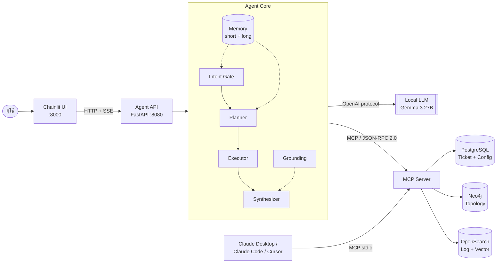
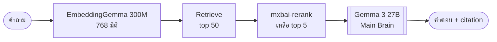
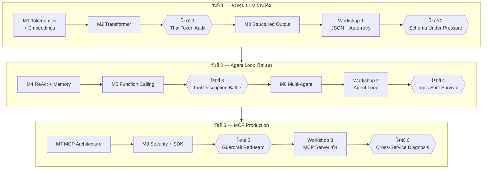

# AI × IP-MPLS Workshop — 3 วัน (Developer Focused)

Workshop สอนพัฒนา **AI Agent + MCP Server** สำหรับงานดูแลโครงข่าย IP-MPLS
โดยเน้นการเขียนโค้ดเองตั้งแต่ระดับกลไก ไม่พึ่ง framework สำเร็จรูป

> **เป้าหมายปลายทาง**: ภายในบ่ายวันที่ 3 ผู้เรียนจะมี MCP Server ของตัวเองที่ต่อกับ
> PostgreSQL + Neo4j + OpenSearch และมี AI Agent ที่วางแผนเองว่าจะดึงข้อมูลจากที่ไหนบ้าง
> พร้อม UI ที่ใช้งานได้จริง และต่อเข้ากับ Claude Desktop / Claude Code / Cursor ได้

---

## 1. Quick Start

```bash
cp .env.example .env
```

```bash
docker compose -f docker/docker-compose.yml --env-file .env up -d
```

```bash
docker compose -f docker/docker-compose.yml --env-file .env up seeder
```

```bash
docker compose -f docker/docker-compose.yml --env-file .env run --rm seeder python verify.py 
```

เปิดใช้งาน:

| บริการ | URL | ใช้ทำอะไร |
|---|---|---|
| Chainlit (ของผู้เรียน) | http://localhost:8000 | UI ที่ผู้เรียนสร้างเอง |
| Agent API (ของผู้เรียน) | http://localhost:8080/docs | REST API ของ agent |
| **Demo (แอปสำเร็จรูป)** | http://localhost:8100 | ตัวอย่างปลายทาง ใช้เปิดคอร์ส |
| **pgAdmin** | http://localhost:5050 | ดูข้อมูลใน PostgreSQL |
| OpenSearch Dashboards | http://localhost:5601 | ดู log |
| Neo4j Browser | http://localhost:7474 | ดู topology |
| MailHog | http://localhost:8025 | ดูอีเมลที่ agent ส่ง |

> **pgAdmin**: ล็อกอินด้วย `workshop@example.local` / `workshop` (ตั้งค่าได้ใน `.env`)
> มี server ลงทะเบียนไว้แล้ว 2 ตัว — ตัวเต็มสิทธิ์ (`mpls`) และ **ตัวอ่านอย่างเดียวที่ MCP ใช้จริง** (`mcp_reader`)
> ลองรัน `UPDATE` ด้วยบัญชี `mcp_reader` เพื่อเห็นว่า guardrail ระดับสิทธิ์ทำงานอย่างไร (ใช้ใน Module 8)

---

## 2. สถาปัตยกรรมระบบ



### บทบาทของฐานข้อมูลทั้ง 3

| ระบบ | เก็บอะไร | ตอบคำถามแนวไหน |
|---|---|---|
| **PostgreSQL** | Ticket, Config อุปกรณ์, Circuit, Customer | "มี ticket อะไรค้างอยู่" / "MTU ตั้งไว้เท่าไหร่" |
| **Neo4j** | Topology, ISIS/CDP neighbor, Interface | "อุปกรณ์นี้ต่อกับอะไร" / "ถ้าล่มกระทบใคร" |
| **OpenSearch** | Log อุปกรณ์ + Vector (semantic search) | "มี error อะไร" / "เคยเจอปัญหาแบบนี้ไหม" |

**คำถามที่ดีที่สุดคือคำถามที่ตอบด้วยแหล่งเดียวไม่ได้** — นั่นคือเหตุผลที่ต้องมี Agent วางแผน

---

## 3. Model Stack



| บทบาท | โมเดล | หมายเหตุ |
|---|---|---|
| Main brain | `openai/gpt-4o-mini` | ใช้ตอนส่งงาน / เดโม |
| Iteration | `openai/gpt-4o-mini` | ใช้ระหว่างทำ lab ให้วนแก้เร็ว |
| Embedding | `openai/text-embedding-3-small` | 1536 มิติ — ตรงกับ production |
| Rerank | `mxbai-rerank` | ลด hallucination |

ทุกตัวคุยผ่าน **OpenAI-compatible protocol** (Ollama หรือ vLLM) → เปลี่ยนโมเดลได้โดยไม่แก้โค้ด

---

## 4. โครงสร้างหลักสูตร



### โจทย์ 6 ข้อ

| โจทย์ | เมื่อไหร่ | เรื่อง | เวลา |
|---|---|---|---|
| 1 | วันที่ 1 ปิดช่วงเช้า | Thai Token Audit | 20 นาที |
| 2 | วันที่ 1 ปิดท้ายวัน | Schema Under Pressure | 30 นาที |
| 3 | วันที่ 2 ปิดช่วงเช้า | Tool Description Battle | 25 นาที |
| 4 | วันที่ 2 ปิดท้ายวัน | Topic Shift Survival | 30 นาที |
| 5 | วันที่ 3 ปิดช่วงเช้า | Guardrail Red-team | 25 นาที |
| 6 | วันที่ 3 ปิดท้าย WS3 | Cross-Service Diagnosis | 30 นาที |

---

## 5. โครงสร้างโฟลเดอร์

```
.
├── instructions/       เอกสารการสอนทั้งหมด (.md)  ← เริ่มอ่านที่นี่
├── data/               ชุดคำถาม, เหตุการณ์จำลอง, log ตัวอย่าง
├── docker/             infra ทั้งหมด (compose + seed + loader)
├── apps/
│   ├── mcp-server/     MCP Server (แกนของวันที่ 3)
│   ├── agent-api/      Agent เป็น REST API
│   ├── chainlit-ui/    UI
│   └── demo-app/       แอปสำเร็จรูปสำหรับเดโม
├── tests/              ตรวจงานตัวเองได้ทันที
├── eval/               วัดผลคุณภาพคำตอบ (BLEU/ROUGE/LLM-judge)
└── solutions/          เฉลย ⚠️ อ่านก่อนลอง = เสียโอกาสเรียนรู้
```

---

## 6. เริ่มเรียนที่ไหน

**เปิด [index.md](index.md)** — หน้าแผนที่หลักสูตรฉบับเต็ม
มีลิงก์ไปทุกเอกสารเรียงตามเวลาจริง ตั้งแต่ก่อนอบรมจนถึงวันที่ 3 รวมเฉลยและเอกสารอ้างอิง

---

## 7. คำสั่งที่ใช้บ่อย

| คำสั่ง | ทำอะไร |
|---|---|
| `docker compose -f docker/docker-compose.yml --env-file .env up -d ต่อด้วย docker compose -f docker/docker-compose.yml --env-file .env up seeder` | เปิดระบบทั้งหมด + seed อัตโนมัติ |
| `docker compose -f docker/docker-compose.yml --env-file .env run --rm seeder python verify.py` | ตรวจว่าข้อมูลครบทั้ง 3 ฐาน |
| `docker compose -f docker/docker-compose.yml --env-file .env run --rm seeder python seed.py --purge` | สร้างข้อมูลใหม่ให้ timestamp สดใหม่ (**ทำเช้าวันเดโม**) |
| `docker compose -f docker/docker-compose.yml --env-file .env run --rm loader python load_logs.py` | โหลด log จาก `data/logs/incoming/` เข้า OpenSearch |
| `uv run uvicorn apps.agent-api.main:app --reload --port 8080` / `uv run chainlit run apps/chainlit-ui/app.py --port 8000 -w` | รัน Agent API / Chainlit ของผู้เรียน |
| `docker compose -f docker/docker-compose.yml --env-file .env --profile demo up -d mcp-demo` | เปิดแอปสำเร็จรูป (โหมดจริง) |
| `$env:DEMO_MODE="replay"; docker compose -f docker/docker-compose.yml --env-file .env --profile demo up -d mcp-demo` | เปิดแอปสำเร็จรูป (โหมด replay ไม่ต้องมี LLM) |
| `docker compose -f docker/docker-compose.yml --env-file .env down` / `docker compose -f docker/docker-compose.yml --env-file .env down -v` | ปิดระบบ / ล้างข้อมูลทั้งหมด |

---

## 8. ความสัมพันธ์กับโครงการ MPLS LLM

Workshop นี้เป็น **แบบจำลองย่อส่วนของสถาปัตยกรรม production จริง** — ทุกชิ้นที่สร้างในห้อง
มีคู่ของมันในระบบจริง เพื่อให้การติดตามผลวันที่ 30/60/90 มีของให้ตรวจ

| Workshop | Production |
|---|---|
| 10 อุปกรณ์ 2 พื้นที่ | 2,600+ อุปกรณ์ทั่วประเทศ |
| Log 2,000 บรรทัด | 29 GB/วัน |
| Gemma 3 27B | GPT-OSS 120B |
| Chainlit | NMS NEX Integration |
| MailHog | Telegram Alert |
| `docker compose -f docker/docker-compose.yml --env-file .env run --rm seeder python verify.py` | Health Check ทั้ง 3 ฐาน |

อ่านรายละเอียดที่ [instructions/reference/production-mapping.md](instructions/reference/production-mapping.md)
