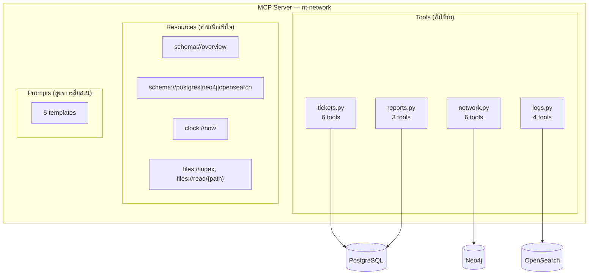
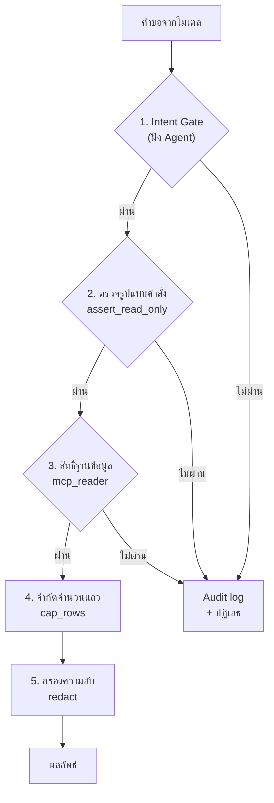

# คู่มือ Tool ทั้งหมดของ MCP Server

> เอกสารนี้ใช้สอน **Module 5 (Function Calling & Tool Definition)** และ **โจทย์ที่ 3**
> ไม่ได้อธิบายแค่ว่า tool ทำอะไร แต่อธิบายว่า **ทำไมถึงเขียน description แบบนั้น**

---

## 1. ภาพรวม



**หลักการแบ่ง**: Tool คือ *สิ่งที่โมเดลเรียกเพื่อให้เกิดอะไรขึ้น* ส่วน Resource คือ *สิ่งที่โมเดลอ่านเพื่อเข้าใจโลกก่อนลงมือ*

---

## 2. ตาราง Tool ทั้งหมด

| Tool | แหล่ง | ใช้เมื่อ | **ห้ามใช้เมื่อ** |
|---|---|---|---|
| `search_tickets` | PG | อยากรู้ว่ามีใคร**แจ้ง**อะไรไว้บ้าง | อยากรู้ว่าอุปกรณ์**กำลังเป็นอะไร** → ใช้ `search_logs` |
| `get_ticket` | PG | ต้องการอ่านบทสนทนาเต็มของเคส | แค่อยากได้ภาพรวม → ใช้ `search_tickets` |
| `search_tickets_semantic` | PG | หาเคสในอดีตที่**อาการคล้ายกันแต่เขียนคนละคำ** | กรองตามสถานะ/พื้นที่/วันที่ → ใช้ `search_tickets` (เร็วกว่าและแม่นกว่า) |
| `get_device_config` | PG | อยากรู้ว่าอุปกรณ์**ถูกตั้งค่าไว้อย่างไร** | อยากรู้ว่ามันทำอะไรอยู่ → ใช้ `search_logs` |
| `list_devices` | PG | ไม่แน่ใจว่าอุปกรณ์ที่ผู้ใช้พูดถึงมีจริงไหม | — |
| `get_circuits_by_device` | PG | แปลง "อุปกรณ์ล่ม" เป็น "**ลูกค้ากี่ราย**" | — |
| `get_device_neighbors` | Neo4j | อยากรู้ว่าต่อกับอะไร / หา peer ของ adjacency | — |
| **`get_upstream_devices`** | Neo4j | **หาจุดร่วมของอุปกรณ์หลายตัว** ← tool ที่สำคัญที่สุด | — |
| `get_downstream_devices` | Neo4j | ประเมินขอบเขตผลกระทบก่อนปิดซ่อม | — |
| `get_path_between` | Neo4j | อยากรู้ว่า traffic วิ่งผ่านอะไรบ้าง | — |
| `get_site_topology` | Neo4j | ดูภาพรวมของพื้นที่หนึ่ง | วินิจฉัย adjacency → adjacency ข้ามพื้นที่ได้ |
| `search_devices_semantic` | Neo4j | ผู้ใช้อธิบายบทบาทแต่ไม่รู้ชื่ออุปกรณ์ | รู้ชื่ออยู่แล้ว → เรียกตรงๆ แม่นกว่า |
| `search_logs` | OS | อยากเห็น log จริงที่อุปกรณ์รายงาน | ถามว่า "กี่ครั้ง / ตัวไหนเยอะสุด" → ใช้ `count_log_events` |
| `count_log_events` | OS | นับ จัดอันดับ ดูแนวโน้ม | อยากอ่านข้อความ log จริง → ใช้ `search_logs` |
| `search_docs_semantic` | OS | "ปกติเราแก้ปัญหานี้ยังไง" | อยากรู้ว่า**เกิดอะไรขึ้น** → ใช้ `search_logs` |
| `calculate_health_score` | OS | หาอุปกรณ์ที่กำลังเสื่อม**ก่อน**มีคนแจ้ง | — |
| `list_report_scripts` | — | ดูว่ารันรายงานอะไรได้บ้าง | — |
| `run_report_script` | — | รันรายงานที่อยู่ใน allowlist | ต้องการรันคำสั่งอื่น → **ถูกปฏิเสธเสมอ** |
| `generate_report` | PG | สร้างไฟล์รายงานเพื่อส่งต่อ | — |

---

## 3. บทเรียนเรื่องการเขียน Tool Description

### 3.1 กฎที่ได้ผลที่สุด — บอกว่า "เมื่อไหร่ห้ามใช้"

โมเดลเลือก tool ผิดเพราะ **ขาดข้อห้าม** มากกว่าเพราะคำอธิบายไม่ชัด

❌ **แบบที่ไม่ดี**
```
search_tickets: ค้นหา ticket ในระบบ
search_logs: ค้นหา log ในระบบ
```
คำถาม *"อุปกรณ์นี้มีปัญหาอะไร"* → โมเดลเดาสุ่ม เพราะทั้งคู่ฟังดูใช้ได้

✅ **แบบที่ดี**
```
search_tickets: ...ใช้เพื่อรู้ว่ามีอะไรถูก "แจ้ง" เข้ามาบ้าง
  อย่าใช้เพื่อดูว่าอุปกรณ์กำลังทำอะไรอยู่ เพราะปัญหาจำนวนมากไม่เคยมีใครแจ้งเลย
  ถ้าต้องการพฤติกรรมจริงของอุปกรณ์ ให้ใช้ search_logs
```

### 3.2 บอกว่า "คืนอะไร" ไม่ใช่ "ทำงานอย่างไร"

โมเดลไม่ต้องรู้ว่าเราใช้ HNSW index หรือ aggregation แบบไหน แต่ต้องรู้ว่าจะได้อะไรกลับไปเพื่อวางแผนขั้นถัดไป

### 3.3 ฝังความรู้เชิงปฏิบัติลงใน description

`search_logs` มีประโยคนี้:

> *"log ที่ดูรุนแรงไม่ได้แปลว่าเป็นเหตุเสียเสมอไป งาน maintenance สร้าง log ที่หน้าตาเหมือนกันทุกประการ ตรวจ ticket ประเภท maintenance ก่อน"*

ประโยคเดียวนี้ป้องกันข้อผิดพลาดที่อันตรายที่สุดของ scenario S4 ได้ — **ถูกกว่าการเพิ่ม tool ใหม่มาก**

### 3.4 `get_upstream_devices` — ตัวอย่างการออกแบบที่ดี

Tool นี้ไม่ได้แค่คืนรายการ upstream แต่ **คำนวณจุดร่วมให้เลย** พร้อมฟิลด์ `interpretation` เป็นภาษาคน

เหตุผล: ถ้าคืนแค่ raw path โมเดลต้องหา intersection เอง ซึ่งเป็นงานที่โมเดลทำพลาดบ่อย
งานคำนวณที่ตรงไปตรงมาแบบนี้ควรอยู่ในโค้ด ไม่ใช่ใน context

> **หลักการทั่วไป**: ถ้างานหนึ่งเขียนเป็นโค้ดได้แน่นอน อย่าปล่อยให้โมเดลทำ

---

## 4. Tool Annotations (MCP spec รุ่นใหม่)

ทุก tool ประกาศ annotation ไว้ ซึ่ง client อย่าง Claude Desktop ใช้ตัดสินใจว่าต้องขออนุญาตผู้ใช้ก่อนไหม

| Annotation | ความหมาย | ในโปรเจกต์นี้ |
|---|---|---|
| `readOnlyHint` | ไม่แก้ไขอะไร | `true` ทุกตัว ยกเว้น `generate_report` |
| `destructiveHint` | ลบหรือทับข้อมูล | `false` ทุกตัว |
| `idempotentHint` | เรียกซ้ำได้ผลเดิม | `true` เกือบทุกตัว |
| `openWorldHint` | ไปแตะระบบภายนอก | `false` ทุกตัว — ข้อมูลไม่ออกนอกองค์กร |

`openWorldHint: false` ทั้งหมด สอดคล้องกับเป้าหมายของโครงการที่ต้องกันข้อมูลวงจรลูกค้าไม่ให้รั่วไหลออกสู่สาธารณะ

---

## 5. Guardrail ที่บังคับใช้จริง



**สิ่งที่ต้องพิสูจน์ในโจทย์ที่ 5**: ปิดชั้นใดชั้นหนึ่งออก ระบบต้องยังปลอดภัยอยู่

ชั้นที่สำคัญที่สุดคือชั้นที่ 3 — **สิทธิ์ระดับฐานข้อมูล** เพราะเป็นชั้นเดียวที่ prompt injection เอาชนะไม่ได้ไม่ว่าจะเก่งแค่ไหน

---

## 6. ทำไมเป็น Server เดียวไม่ใช่ 3 Server

| | Server เดียว (ที่เลือก) | แยก 3 Server |
|---|---|---|
| Config ฝั่ง client | ครั้งเดียว | 3 ครั้ง |
| โมเดลเห็น tool | ครบทุกตัวพร้อมกัน | เห็นทีละกลุ่ม |
| วางแผนข้ามระบบ | **ทำได้** | ทำได้ยากมาก |
| แยก deploy | ทำไม่ได้ | ทำได้ |

คำถามอย่าง *"ทำไมลูกค้าหลายรายถึงเน็ตหลุด"* ต้องใช้ทั้ง 3 ระบบต่อกันเป็นลูกโซ่ — ถ้าโมเดลเห็น tool ไม่ครบพร้อมกัน มันจะวางแผนแบบนั้นไม่ได้เลย
