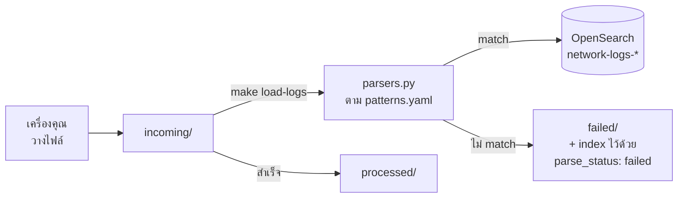

# โฟลเดอร์ log



| โฟลเดอร์ | หน้าที่ |
|---|---|
| `incoming/` | **วางไฟล์ log ตรงนี้** แล้วสั่ง `make load-logs` |
| `samples/` | ไฟล์ตัวอย่าง 4 รูปแบบ ใช้เรียนและใช้ทดสอบ parser |
| `processed/` | ไฟล์ที่โหลดสำเร็จถูกย้ายมาที่นี่พร้อม timestamp |
| `failed/` | บรรทัดที่ parse ไม่ได้ ถูกแยกมาให้ตรวจ |
| `patterns.yaml` | นิยาม regex ของแต่ละรูปแบบ log — **เพิ่มรูปแบบใหม่ที่นี่ ไม่ต้องแก้โค้ด** |

## วิธีใช้

```bash
cp data/logs/samples/*.log data/logs/incoming/
```

```bash
make load-logs
```

## ถ้า log เก่ากว่าวันเดโม

ปัญหาคลาสสิก: log ที่ export มาเมื่อ 3 เดือนก่อน พอถามว่า "24 ชั่วโมงที่ผ่านมามีอะไรบ้าง" จะไม่เจออะไรเลย

```bash
make load-logs SHIFT=now
```

คำสั่งนี้เลื่อนเวลา**ทั้งไฟล์**ให้บรรทัดล่าสุดมาอยู่ที่ปัจจุบัน โดยยังรักษาระยะห่างระหว่างเหตุการณ์ไว้เหมือนเดิม — ทำให้ log จริงเอามาเดโมได้ทันที

## ไฟล์ตัวอย่างทั้ง 4

| ไฟล์ | รูปแบบ | ใช้สอนอะไร |
|---|---|---|
| `01-cisco-ios-APE-NBI-03.log` | Cisco IOS syslog | รูปแบบมาตรฐาน + เห็น pattern ของ interface flapping (S1) |
| `02-huawei-vrp-PE-BKK-02.log` | Huawei VRP | vendor คนละเจ้าใช้ format คนละแบบ (S2) |
| `03-rfc5424-CR-BKK-01.log` | RFC 5424 | รูปแบบจาก collector สมัยใหม่ |
| `04-mixed-and-broken.log` | ปนกัน + เสีย | **สำคัญที่สุด** — มีบรรทัดที่ parse ไม่ได้ 3 บรรทัด |

## ทำไมไฟล์ที่ 4 ถึงสำคัญ

งาน ingestion จริงไม่เคยได้ข้อมูลสะอาด ไฟล์นี้มีทั้งบรรทัดไม่มี timestamp, binary ปนมาจากการโอนไฟล์ไม่ครบ และ format ของ collector เจ้าอื่น

ตัวโหลด **จะไม่ทิ้งบรรทัดเหล่านี้เงียบๆ** แต่จะ index เข้าไปพร้อมติดป้าย `parse_status: failed` และเขียนสำเนาไว้ที่ `failed/`

ลองค้นดูว่ามีกี่บรรทัดที่ parse ไม่ได้:

```bash
curl -s 'localhost:9200/network-logs-*/_count' -H 'Content-Type: application/json' -d '{"query":{"term":{"parse_status":"failed"}}}'
```

แล้วเพิ่ม pattern ใหม่ใน `patterns.yaml` เพื่อรองรับ format ที่ยังขาด — นี่คือวงจรการทำงานจริงของงาน log ingestion
