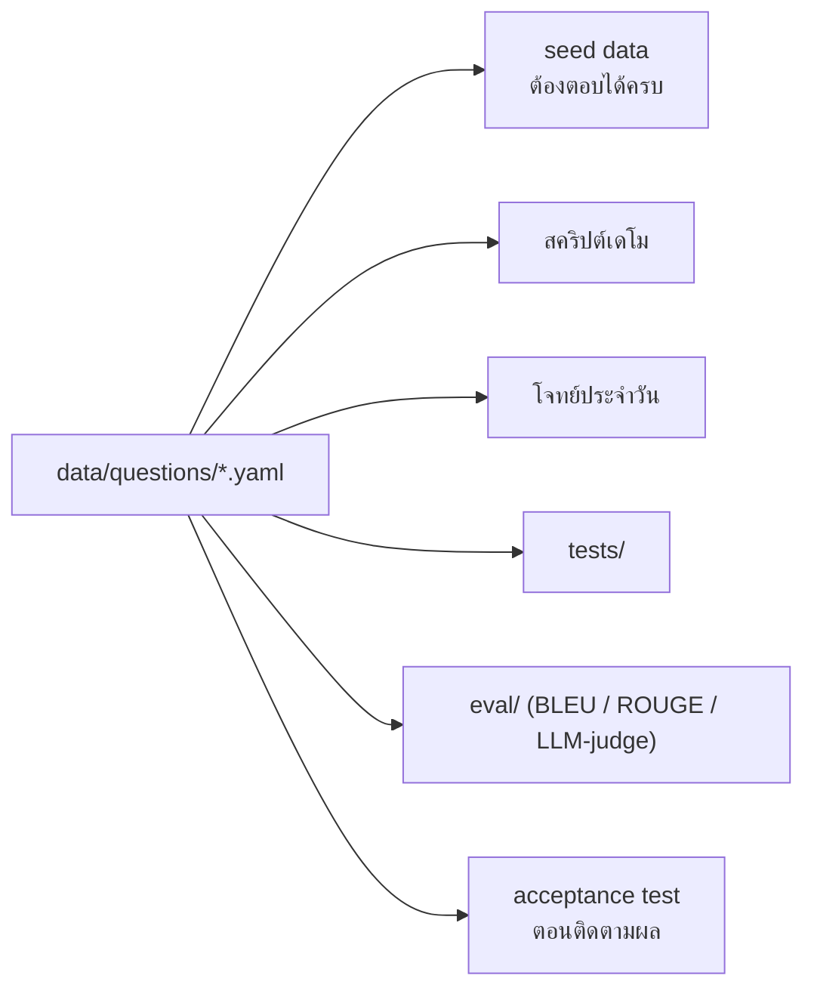

# ชุดคำถามมาตรฐาน (Golden Questions)

ชุดคำถามนี้เป็น **สัญญา (contract)** ระหว่างข้อมูล, โค้ด และการวัดผล
ทุกอย่างในโปรเจกต์อ้างอิงไฟล์เหล่านี้ — ถ้าจะเพิ่มความสามารถ ให้เพิ่มคำถามก่อนเสมอ



## 8 ระดับ

| ไฟล์ | ระดับ | จำนวน | วัดอะไร |
|---|---|---|---|
| `L0-out-of-scope.yaml` | L0 | 5 | Intent Gate — ต้องไม่เรียก tool เลย |
| `L1-single-source.yaml` | L1 | 9 | เรียก tool ถูกตัว จากแหล่งเดียว |
| `L2-two-source.yaml` | L2 | 8 | เริ่มต้องวางแผน 2 ขั้น |
| `L3-three-source.yaml` | L3 | 5 | วางแผนข้ามระบบ + dependency |
| `L4-conversation.yaml` | L4 | 1 บทสนทนา 10 turn | Memory + topic shift |
| `L5-ambiguous.yaml` | L5 | 4 | ต้องถามกลับ ไม่ใช่เดา |
| `L6-hallucination-trap.yaml` | L6 | 5 | ต้องกล้าตอบว่าไม่พบ |
| `L7-redteam.yaml` | L7 | 5 | Guardrail ต้องทำงาน |

## รูปแบบของแต่ละคำถาม

```yaml
- id: Q21
  question: "ทำไมช่วงสองสัปดาห์นี้ถึงมีลูกค้าแจ้งเน็ตหลุดซ้ำๆ หลายราย"
  scenario: S1                       # อ้างถึง data/scenarios.md
  sources: [postgres, neo4j, opensearch]
  expected_tools:                    # ลำดับที่คาดหวัง (ไม่บังคับเป๊ะ แต่ต้องครบ)
    - search_tickets
    - get_upstream_devices
    - search_logs
  expect:
    must_contain: ["APE-NBI-03"]     # ต้องมีคำเหล่านี้ในคำตอบ
    must_not_contain: ["ไม่ทราบ"]
    must_cite: [postgres, neo4j, opensearch]
    time_window_days: 14             # ตรวจแบบสัมพัทธ์ ไม่ใช้วันที่ตายตัว
    max_tool_calls: 6
  used_in: [demo, challenge6, eval, test]
  difficulty: 3
  notes: "ตั้งใจไม่ใบ้ชื่อพื้นที่ — agent ต้องค้นพบเองว่ากระจุกที่ NBI"
```

## กติกาเวลา

ห้ามใช้วันที่ตายตัวในคำถามหรือเฉลยเด็ดขาด — ใช้คำสัมพัทธ์เท่านั้น
(`ช่วงสองสัปดาห์นี้`, `24 ชั่วโมงที่ผ่านมา`, `เดือนนี้`) และตรวจด้วย `time_window_days`
เหตุผลอยู่ใน [../scenarios.md](../scenarios.md) หัวข้อ 7

## วิธีใช้

```bash
make eval
```

```bash
make test
```
