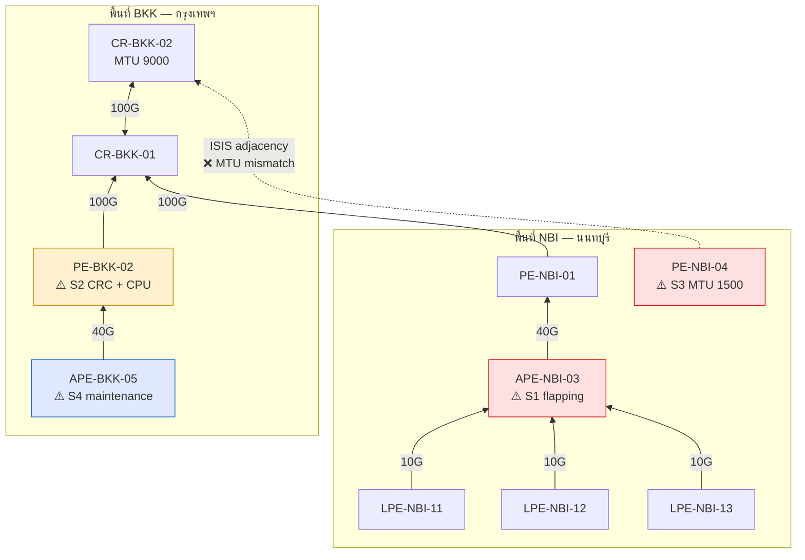
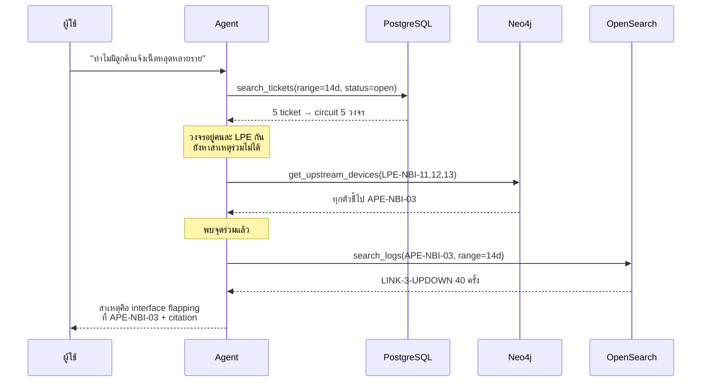
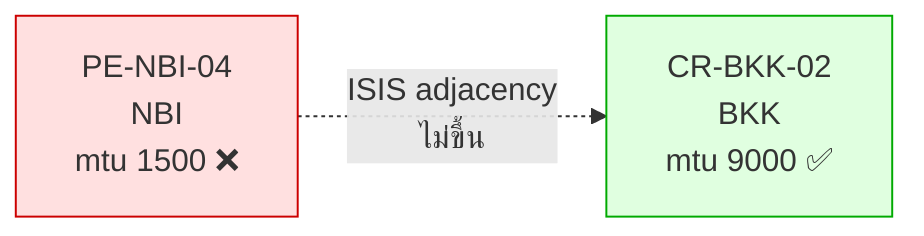
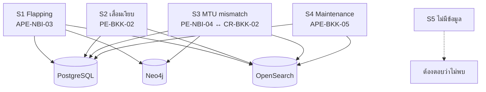
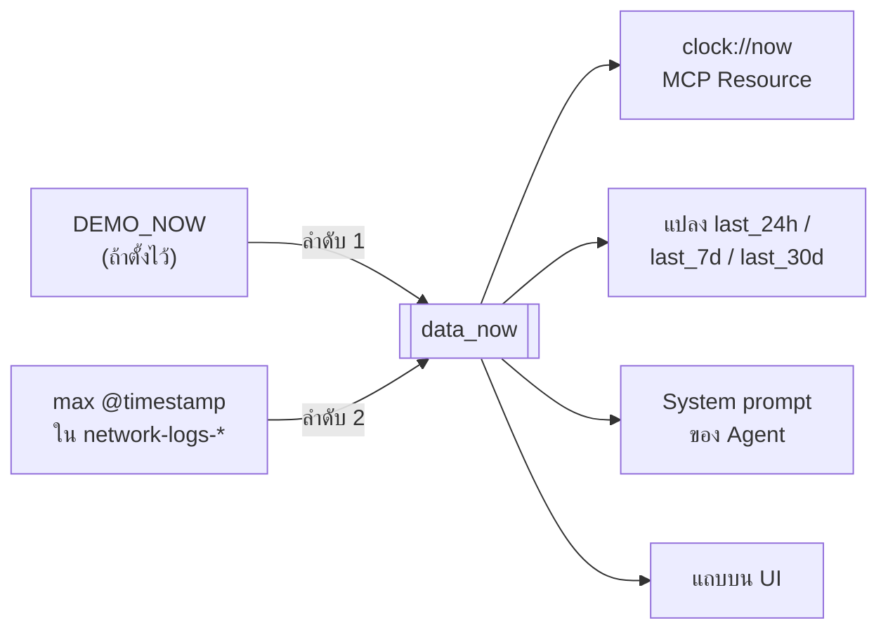
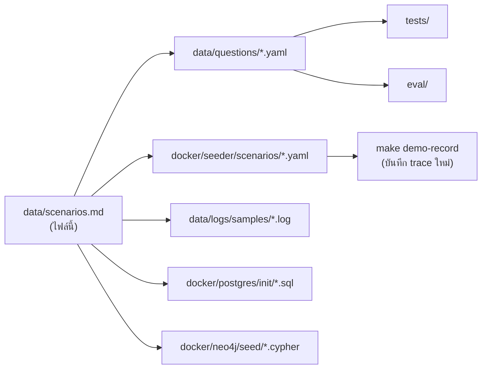

# เหตุการณ์จำลองในชุดข้อมูล (Scenario Bible)

> ⚠️ **เอกสารสำหรับวิทยากรและผู้พัฒนาเท่านั้น — ห้ามให้ผู้เรียนอ่านก่อนทำโจทย์**
> ไฟล์นี้คือ "เฉลย" ของโลกข้อมูลทั้งหมด ทั้ง seed script, ชุดคำถาม, test และ eval
> ต้องอ้างอิงไฟล์นี้เป็นแหล่งความจริงเดียว (single source of truth)

---

## 1. หลักการออกแบบ

1. **เขียนเฉลยก่อน แล้วค่อยสร้างข้อมูลให้เฉลยเป็นจริง** — ไม่ใช่สร้างข้อมูลสุ่มแล้วหวังว่าจะมีคำถามที่น่าสนใจ
2. **ต้องมีคำถามที่ตอบด้วยแหล่งเดียวไม่ได้** — ไม่งั้น Agent ไม่มีเหตุผลต้องวางแผนหลายขั้น
3. **ต้องมีคำถามที่คำตอบคือ "ไม่มีข้อมูล"** — ถ้าทุกคำถามมีคำตอบ เราวัด hallucination ไม่ได้
4. **เวลาเป็นแบบสัมพัทธ์เสมอ** — ไม่มีวันที่ตายตัวในข้อมูลหรือในเฉลย (ดูหัวข้อ 7)
5. **ทุกอุปกรณ์ต้องมีบทบาทในเรื่อง** — ไม่มีอุปกรณ์ที่ใส่มาเพื่อให้ดูเยอะ

---

## 2. โลกของข้อมูล

### 2.1 ย่อส่วนจาก production

| | Production จริง (NT) | Workshop | เหตุผล |
|---|---|---|---|
| อุปกรณ์ | 2,600+ | **10** | ให้ผู้เรียนถือทั้งระบบไว้ในหัวได้ |
| พื้นที่ | ทั่วประเทศ | **2** (BKK, NBI) | พอให้มีเคสข้ามพื้นที่ |
| Log | 29 GB/วัน | **2,000 บรรทัด / 30 วัน** | ~200 บรรทัด/อุปกรณ์ อ่านด้วยตาได้ |
| Ticket | ประวัติจริง | **120 ใบ / 90 วัน** | |
| Circuit | หลายหมื่น | **35** | ลูกค้าเยอะกว่าอุปกรณ์ — เหมือนของจริง |

> ความต่างเมื่อขึ้น scale จริงอยู่ใน [instructions/day3/scale-notes.md](../instructions/day3/scale-notes.md)

### 2.2 อุปกรณ์ทั้ง 10 ตัว

| # | อุปกรณ์ | Role | พื้นที่ | บทบาทในเรื่อง |
|---|---|---|---|---|
| 1 | `CR-BKK-01` | Core | BKK | Core หลัก / ปลายทางของคำถามหา path |
| 2 | `CR-BKK-02` | Core | BKK | Core สำรอง + **คู่ ISIS adjacency ของ S3** |
| 3 | `PE-BKK-02` | PE | BKK | **S2** เสื่อมเงียบ (CRC ไต่ขึ้น + CPU สูง) |
| 4 | `APE-BKK-05` | APE | BKK | **S4** log แรงแต่เป็นงานบำรุงรักษาที่แจ้งไว้ |
| 5 | `PE-NBI-01` | PE | NBI | uplink ของ `APE-NBI-03` |
| 6 | `APE-NBI-03` | APE | NBI | **S1 ตัวการ** — interface flapping |
| 7 | `LPE-NBI-11` | LPE | NBI | S1 ลูกค้ากลุ่ม 1 |
| 8 | `LPE-NBI-12` | LPE | NBI | S1 ลูกค้ากลุ่ม 2 |
| 9 | `LPE-NBI-13` | LPE | NBI | S1 ลูกค้ากลุ่ม 3 |
| 10 | `PE-NBI-04` | PE | NBI | **S3** MTU ตั้งไม่ตรงกับ `CR-BKK-02` |

**BKK 4 ตัว · NBI 6 ตัว**

### 2.3 Topology



**ข้อสังเกตที่ทำให้โจทย์มีความหมาย**

- `LPE-NBI-11/12/13` เป็นคนละตัวกัน แต่ **uplink ไป `APE-NBI-03` ตัวเดียวกัน** → เป็น single point of failure ที่ Agent ต้องค้นพบเอง
- `PE-NBI-04` อยู่ NBI แต่ adjacency ไปที่ `CR-BKK-02` ที่ BKK → **ดูฝั่งเดียววินิจฉัยไม่ได้**

### 2.4 การไหลของการวินิจฉัย



---

## 3. เหตุการณ์ทั้ง 5

### S1 — Interface Flapping (เหตุการณ์หลัก ใช้เดโมและโจทย์ที่ 6)

| | |
|---|---|
| **อุปกรณ์** | `APE-NBI-03` |
| **ต้องใช้แหล่ง** | PostgreSQL + Neo4j + OpenSearch (ครบ 3) |
| **สอนเรื่อง** | การหา root cause ที่ต้องเชื่อมโยงข้ามระบบ |
| **ใช้ใน** | เดโมคำถามที่ 2, Q21, Q22, โจทย์ที่ 6 |

**เรื่องย่อ** — ลูกค้า 5 รายแจ้งว่าอินเทอร์เน็ตหลุดเป็นช่วงๆ ในรอบ 2 สัปดาห์
แต่ละรายอยู่คนละ LPE จึงดูเหมือนไม่เกี่ยวกัน ทีมงานปิด ticket ไปแล้วบางใบเพราะ "ทดสอบแล้วปกติ"
ความจริงคือทั้ง 3 LPE uplink ไปที่ `APE-NBI-03` ตัวเดียวกัน ซึ่งมี interface flapping

**ข้อมูลที่ต้องฝัง**

| แหล่ง | รายละเอียด |
|---|---|
| PostgreSQL | 5 ticket ในช่วง 14 วันล่าสุด · ผูกกับ circuit บน `LPE-NBI-11/12/13` · severity `medium`–`high` · 2 ใบปิดแล้วด้วยเหตุผล "ทดสอบแล้วปกติ" |
| Neo4j | `LPE-NBI-11/12/13 -[:UPLINK_TO]-> APE-NBI-03` |
| OpenSearch | `APE-NBI-03` มี `LINK-3-UPDOWN` **40 รอบ** กระจายใน 14 วัน แต่ละรอบตามด้วย `ISIS-5-ADJCHANGE` และ `LDP-5-NBRCHG` (~8 บรรทัด/รอบ = 320 บรรทัด) |

**เฉลย** — สาเหตุคือ interface `Te0/1/2` ของ `APE-NBI-03` flapping
หลักฐาน: ช่วงเวลาที่ ticket ถูกเปิด **ตรงกับ** ช่วงที่เกิด link down ทุกครั้ง

**กับดักที่ตั้งใจวางไว้** — ถ้า Agent ดูแค่ ticket จะสรุปว่า "เป็นปัญหาฝั่งลูกค้าแต่ละราย" เพราะ ticket ไม่มีคำว่า APE อยู่เลย

---

### S2 — Silent Degradation (เสื่อมเงียบ)

| | |
|---|---|
| **อุปกรณ์** | `PE-BKK-02` |
| **ต้องใช้แหล่ง** | OpenSearch + PostgreSQL (config) |
| **สอนเรื่อง** | Proactive detection / Health Score |
| **ใช้ใน** | Q16, Q19, Q20, Health Score tool |

**เรื่องย่อ** — `PE-BKK-02` มีค่า CRC error เพิ่มขึ้นเรื่อยๆ และ CPU สูงขึ้นตลอด 30 วัน
แต่ **ยังไม่มี ticket แม้แต่ใบเดียว** เพราะยังไม่กระทบลูกค้าถึงขั้นแจ้ง

**ข้อมูลที่ต้องฝัง**

| แหล่ง | รายละเอียด |
|---|---|
| OpenSearch | `%LINEPROTO`/`CRC` error เพิ่มจาก ~2 ครั้ง/วัน (วันที่ -30) เป็น ~25 ครั้ง/วัน (วันที่ -1) · `CPU utilization high` ปรากฏถี่ขึ้นในช่วง 7 วันหลัง (รวม 280 บรรทัด) |
| PostgreSQL | `PE-BKK-02` **ไม่มี ticket** ในช่วง 30 วัน (ตั้งใจ) |

**เฉลย** — เป็นอุปกรณ์ที่ "น่าเป็นห่วงที่สุด" แม้ไม่มีใครแจ้ง
Health Score ต้องต่ำกว่าตัวอื่น เพราะให้น้ำหนักกับ **แนวโน้ม** ไม่ใช่แค่จำนวนสะสม

**กับดัก** — Agent ที่นับ error รวมอย่างเดียวจะไม่เห็นว่ามันแย่ลง ต้องดูแนวโน้มตามเวลา

---

### S3 — Config Drift ข้ามพื้นที่

| | |
|---|---|
| **อุปกรณ์** | `PE-NBI-04` ↔ `CR-BKK-02` |
| **ต้องใช้แหล่ง** | PostgreSQL (config) + Neo4j (adjacency) + OpenSearch (log) |
| **สอนเรื่อง** | log บอกอาการ แต่ **config บอกสาเหตุ** |
| **ใช้ใน** | Q08, Q17, Q22b |

**เรื่องย่อ** — หลังงานเปลี่ยนอุปกรณ์ ISIS adjacency ระหว่าง `PE-NBI-04` กับ `CR-BKK-02` ไม่ขึ้น
สาเหตุคือ MTU สองฝั่งไม่เท่ากัน



**ข้อมูลที่ต้องฝัง**

| แหล่ง | รายละเอียด |
|---|---|
| PostgreSQL | `device_configs`: `PE-NBI-04` interface `Te0/0/1` → `mtu 1500` · `CR-BKK-02` interface `Te0/0/3` → `mtu 9000` |
| Neo4j | `PE-NBI-04 -[:ISIS_NEIGHBOR {state:"Down"}]-> CR-BKK-02` |
| OpenSearch | `ISIS-4-ADJREJECT` / `ADJ_MTU_MISMATCH` ซ้ำทุก ~30 นาที ในช่วง 7 วันล่าสุด (180 บรรทัด) |

**เฉลย** — MTU mismatch (1500 vs 9000) ต้องแก้ที่ `PE-NBI-04`

**กับดัก** — เป็นเคส **ข้ามพื้นที่** ถ้า Agent จำกัดการค้นที่ NBI อย่างเดียวจะไม่เห็นฝั่ง BKK และตอบไม่ได้

---

### S4 — Planned Maintenance (ล่อให้ตื่นตูม)

| | |
|---|---|
| **อุปกรณ์** | `APE-BKK-05` |
| **ต้องใช้แหล่ง** | OpenSearch + PostgreSQL (ticket ประเภท maintenance) |
| **สอนเรื่อง** | Grounding — ห้ามสรุปจาก log อย่างเดียว |
| **ใช้ใน** | Q18, Q23 |

**เรื่องย่อ** — `APE-BKK-05` มี log ระดับ critical จำนวนมากในคืนหนึ่ง
ดูผิวเผินเหมือนเหตุเสียร้ายแรง แต่ความจริงเป็นงานอัปเกรด firmware ที่แจ้งไว้ล่วงหน้า

**ข้อมูลที่ต้องฝัง**

| แหล่ง | รายละเอียด |
|---|---|
| OpenSearch | ช่วง `-3 วัน 22:00` ถึง `-3 วัน 02:00` มี `SYS-5-RELOAD`, `LINK-3-UPDOWN`, `OSPF-5-ADJCHG` รวม 150 บรรทัด |
| PostgreSQL | ticket ประเภท `maintenance` สถานะ `closed` ครอบคลุมช่วงเวลาเดียวกันเป๊ะ · หัวข้อ "แผนงานอัปเกรด firmware APE-BKK-05" |

**เฉลย** — ไม่ใช่เหตุเสีย ต้องตอบว่าเป็นงานบำรุงรักษาตามแผน พร้อมอ้างอิงเลข ticket

**กับดัก** — Agent ที่ไม่เช็ค ticket ก่อนสรุปจะรายงานผิดว่าเป็น incident รุนแรง
นี่คือกรณี hallucination ที่อันตรายที่สุด เพราะ **มีข้อมูลจริงรองรับแต่ตีความผิด**

---

### S5 — ข้อมูลที่ไม่มีอยู่จริง (Anti-Hallucination)

| | |
|---|---|
| **สอนเรื่อง** | ต้องกล้าตอบว่า "ไม่พบข้อมูล" |
| **ใช้ใน** | Q29–Q33 |

| กับดัก | สิ่งที่ถาม | สิ่งที่ต้องตอบ |
|---|---|---|
| อุปกรณ์ไม่มีจริง | `PE-CNX-99` | ไม่พบอุปกรณ์นี้ในระบบ + บอกว่ามีอุปกรณ์อะไรบ้าง |
| พื้นที่ไม่มีในระบบ | ticket ที่เชียงใหม่ | ระบบครอบคลุมเฉพาะ BKK และ NBI |
| นอกช่วงเวลา | log ปีที่แล้ว | ข้อมูลมีเพียง 30 วันย้อนหลัง (อ่านจาก `clock://now`) |
| ไม่มี metric ประเภทนั้น | CPU ตอนนี้กี่ % | ระบบมีแต่ log ไม่มี real-time metric |
| ข้อมูลไม่ครบในฟิลด์ | ใครแก้ ticket และใช้เวลากี่นาที | ตอบเท่าที่มี ไม่เติมเอง |

---

## 4. ตารางสรุป: เหตุการณ์ × แหล่งข้อมูล



| เหตุการณ์ | PostgreSQL | Neo4j | OpenSearch | ระดับความยาก |
|---|:---:|:---:|:---:|---|
| S1 Flapping | ✅ | ✅ | ✅ | ★★★ |
| S2 เสื่อมเงียบ | ✅ | — | ✅ | ★★ |
| S3 MTU mismatch | ✅ | ✅ | ✅ | ★★★ |
| S4 Maintenance | ✅ | — | ✅ | ★★ |
| S5 ไม่มีข้อมูล | — | — | — | ★ |

---

## 5. งบประมาณ Log 2,000 บรรทัด

| ส่วน | บรรทัด | อุปกรณ์ | หมายเหตุ |
|---|---:|---|---|
| Baseline ปกติ | 900 | ทุกตัว | info/notice ทั่วไป ให้ดูเหมือนของจริง |
| **S1** flapping | 320 | `APE-NBI-03` | 40 รอบ × ~8 บรรทัด |
| **S2** เสื่อมเงียบ | 280 | `PE-BKK-02` | ความถี่ไต่ขึ้นตามเวลา |
| **S3** MTU mismatch | 180 | `PE-NBI-04` | ซ้ำทุก 30 นาที 7 วัน |
| **S4** maintenance | 150 | `APE-BKK-05` | กระจุกในคืนเดียว |
| error ประปราย | 170 | ตัวอื่นๆ | ไม่ให้ "ตัวที่แย่ที่สุด" ชัดเกินไป |
| **รวม** | **2,000** | | |

---

## 6. ข้อมูลอื่นที่ต้องมี

### 6.1 PostgreSQL

| ตาราง | จำนวน | หมายเหตุสำคัญ |
|---|---|---|
| `sites` | 2 | BKK, NBI |
| `devices` | 10 | ตามตารางข้อ 2.2 |
| `device_configs` | 10 | **`PE-NBI-04` ต้องมี MTU 1500** |
| `interfaces` | ~28 | 2–4 ต่ออุปกรณ์ |
| `customers` | 30 | segment: Enterprise / SME / Government |
| `circuits` | 35 | service_type: MPLS-VPN / Internet / Leased Line |
| `tickets` | 120 | รวมประเภท `maintenance` · **ห้ามมี ticket ของ `PE-BKK-02`** |
| `ticket_messages` | ~350 | **ไทยปนอังกฤษ** สำหรับ Module 1 |

> `tickets.embedding vector(768)` — **ไม่ seed** ผู้เรียนสร้างเองใน Lab 1

### 6.2 Neo4j

```
(:Site)         2
(:Device)       10
(:Interface)    ~28
(:Circuit)      35
(:Customer)     30
```

ความสัมพันธ์: `LOCATED_AT`, `HAS_INTERFACE`, `CONNECTED_TO`, `UPLINK_TO`, `ISIS_NEIGHBOR`, `CDP_NEIGHBOR`, `SERVED_BY`, `OWNS`

### 6.3 OpenSearch

| Index | เนื้อหา |
|---|---|
| `network-logs-*` | 2,000 บรรทัดตามงบข้อ 5 |
| `network-docs` | runbook/คู่มือแปลงเป็น Markdown แล้ว embed (ใช้กับ Q14 และ lab ingestion) |

---

## 7. ทำให้ข้อมูลไม่ผูกกับวันที่จริง

**ปัญหา** — seed วันนี้ แต่เดโมอีก 3 สัปดาห์ คำถาม "24 ชั่วโมงที่ผ่านมา" จะไม่เจออะไรเลย
และตัว LLM เองก็ไม่รู้ว่าวันนี้วันที่เท่าไหร่

**ทางแก้** — ให้คำว่า "ตอนนี้" ถูกนิยามโดย **ข้อมูล** ไม่ใช่นาฬิกาเครื่อง



**กติกา 4 ข้อ**

1. Seeder เก็บเหตุการณ์เป็น `at_hours_ago` ไม่ใช่วันที่ → seed เมื่อไหร่ข้อมูลก็สดเสมอ
2. Tool รับช่วงเวลาแบบสัมพัทธ์ (`last_24h`, `last_7d`, `last_30d`) ไม่รับวันที่ absolute
3. คำถามและเฉลยห้ามมีวันที่ตายตัว — ใช้ `time_window_days` แทน
4. `make reseed` ทุกเช้าวันเดโม + แสดง "ข้อมูล ณ ..." บน UI

**สำหรับ test ที่ต้องการผลคงที่**: ตั้ง `DEMO_NOW` และ `SEED_RANDOM_SEED=42`

---

## 8. เชื่อมโยงกับ production จริง

| Workshop | Production (NT) |
|---|---|
| S1 Flapping | หา root cause ร่วมของ ticket หลายใบ — ลด Troubleshooting Time |
| S2 เสื่อมเงียบ | Equipment Health Check / Health Score |
| S3 MTU mismatch | ตรวจ config drift เทียบ ISIS/CDP neighbor |
| S4 Maintenance | Real-time Log Alert ที่ต้องไม่แจ้งเตือนผิด (false positive) |
| S5 ไม่มีข้อมูล | Hallucination reduction ที่ ground กับ Neo4j + PostgreSQL |

---

## 9. เมื่อแก้ไขไฟล์นี้ ต้องแก้ตามที่ไหนบ้าง



**เช็คลิสต์หลังแก้ scenario**
- [ ] แก้ `data/questions/*.yaml` ให้เฉลยตรงกัน
- [ ] แก้ `docker/seeder/scenarios/*.yaml`
- [ ] `make reseed && make verify`
- [ ] `make test`
- [ ] `make demo-record` (ถ้าใช้โหมด replay)
