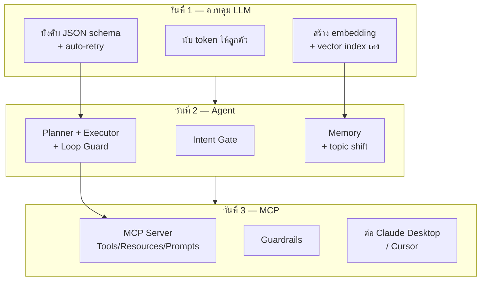
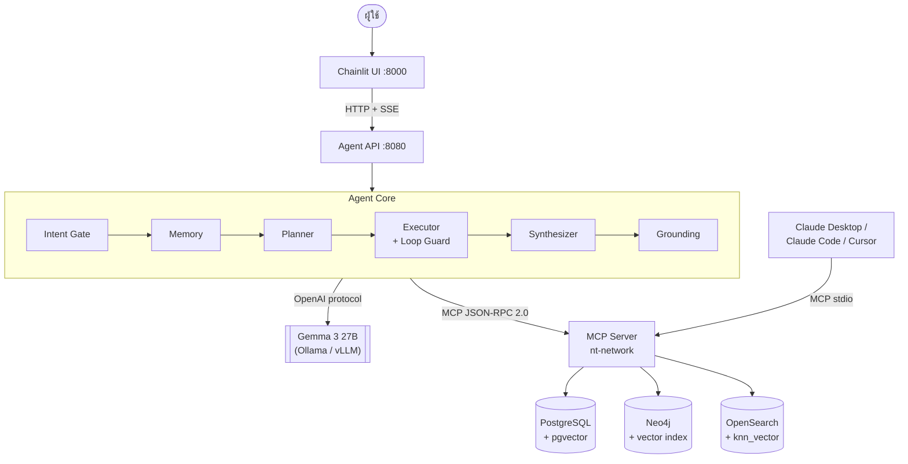
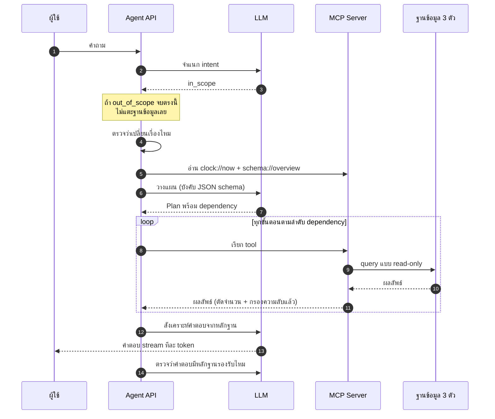

# 00 · ภาพรวมสถาปัตยกรรมและตารางเวลา

---

## 1. สิ่งที่จะสร้างตลอด 3 วัน

**ทุกชิ้นของวันก่อนหน้าถูกใช้ต่อในวันถัดไป** ไม่มีอะไรที่ทำแล้วทิ้ง

---

## 2. สถาปัตยกรรมปลายทาง

### จุดที่ควรสังเกต

- **Agent ไม่เคยคุยกับฐานข้อมูลโดยตรง** ทุกอย่างผ่าน MCP → server ตัวเดียวใช้ได้ทั้งกับ Agent API และกับ Claude Desktop
- **มี vector search ทั้ง 3 ฐาน** ซึ่งเป็นบทเรียนเปรียบเทียบของวันที่ 3
- **Grounding อยู่หลัง Synthesizer** ตรวจคำตอบก่อนถือว่าจบ

---

## 3. การไหลของหนึ่งคำถาม

---

## 4. ตารางเวลา

### วันที่ 1 — Deep Dive LLMs & Structured Outputs

| เวลา | เนื้อหา | ไฟล์ |
|---|---|---|
| 09:00–10:30 | **Module 1** Tokenomics & Vector Embeddings | [day1/module1](day1/module1-tokenomics-embeddings.md) |
| 09:50–10:30 | ↳ Lab 1: สร้าง vector column เอง | [day1/lab1](day1/lab1-add-vector-column.md) |
| 10:45–11:35 | **Module 2** Transformer Architecture | [day1/module2](day1/module2-transformer.md) |
| 11:35–12:00 | **โจทย์ที่ 1** Thai Token Audit | [day1/challenge1](day1/challenge1-thai-token-audit.md) |
| 13:00–14:30 | **Module 3** API ขั้นสูง + Structured Output | [day1/module3](day1/module3-structured-output.md) |
| 14:45–16:00 | **Workshop 1** JSON + Auto-retry | [day1/workshop1](day1/workshop1-json-autoretry.md) |
| 16:00–16:30 | **โจทย์ที่ 2** Schema Under Pressure | [day1/challenge2](day1/challenge2-schema-under-pressure.md) |

### วันที่ 2 — Agent Loops & Custom Tooling

| เวลา | เนื้อหา | ไฟล์ |
|---|---|---|
| 09:00–10:30 | **Module 4** ReAct + Memory | [day2/module4](day2/module4-react-memory.md) |
| 10:45–11:35 | **Module 5** Function Calling & Tool Definition | [day2/module5](day2/module5-function-calling.md) |
| 11:35–12:00 | **โจทย์ที่ 3** Tool Description Battle | [day2/challenge3](day2/challenge3-tool-description-battle.md) |
| 13:00–13:45 | **Module 6** Multi-Agent & Orchestration | [day2/module6](day2/module6-multi-agent.md) |
| 13:45–14:30 | Lab 2: Intent Gate · Lab 3: Context Memory | [day2/lab2](day2/lab2-intent-gate.md) · [lab3](day2/lab3-context-memory.md) |
| 14:45–16:00 | **Workshop 2** Agent Loop เขียนเอง | [day2/workshop2](day2/workshop2-agent-loop.md) |
| 16:00–16:30 | **โจทย์ที่ 4** Topic Shift Survival | [day2/challenge4](day2/challenge4-topic-shift-survival.md) |

### วันที่ 3 — Production MCP Development

| เวลา | เนื้อหา | ไฟล์ |
|---|---|---|
| 09:00–10:15 | **Module 7** สถาปัตยกรรม MCP + JSON-RPC | [day3/module7](day3/module7-mcp-architecture.md) |
| 10:15–10:30 | Lab 4: ดู JSON-RPC จริง | [day3/lab4](day3/lab4-jsonrpc-inspect.md) |
| 10:45–11:35 | **Module 8** Security & SDK | [day3/module8](day3/module8-security-sdk.md) |
| 11:35–12:00 | **โจทย์ที่ 5** Guardrail Red-team | [day3/challenge5](day3/challenge5-guardrail-redteam.md) |
| 13:00–15:00 | **Workshop 3** สร้าง MCP Server จริง | [day3/workshop3a](day3/workshop3a-mcp-server.md) → [3d](day3/workshop3d-connect-clients.md) |
| 15:00–15:30 | **โจทย์ที่ 6** Cross-Service Diagnosis | [day3/challenge6](day3/challenge6-cross-service-diagnosis.md) |
| 15:30–16:30 | สรุปและแบ่งงาน MPLS LLM | [day3/wrap-up](day3/wrap-up-mpls-llm.md) |

---

## 5. Model Stack

| บทบาท | โมเดล | เมื่อไหร่ใช้ |
|---|---|---|
| Main brain | `openai/gpt-4o-mini` | ตอนส่งงานและเดโม |
| Iteration | `openai/gpt-4o-mini` | ระหว่างวนแก้โค้ดใน lab (เร็วกว่ามาก) |
| Embedding | `openai/text-embedding-3-small` (1536 มิติ) | Lab 1 และ RAG |
| Rerank | `mxbai-rerank` | Lab วันที่ 3 |

สลับโมเดลเร็วระหว่าง lab: ตั้ง `LLM_MODEL=$LLM_MODEL_FAST` ใน `.env` แล้วรีสตาร์ต `make api`

---

## 6. ข้อมูลที่ใช้ตลอด 3 วัน

| | จำนวน | Production จริง |
|---|---|---|
| อุปกรณ์ | 10 | 2,600+ |
| พื้นที่ | 2 (BKK, NBI) | ทั่วประเทศ |
| Log | 2,000 บรรทัด / 30 วัน | 29 GB/วัน |
| Ticket | 120 ใบ / 90 วัน | ประวัติจริง |

ความต่างเมื่อขึ้น scale จริงอยู่ใน [day3/scale-notes.md](day3/scale-notes.md)
และการเทียบกับระบบ production อยู่ใน [reference/production-mapping.md](reference/production-mapping.md)
