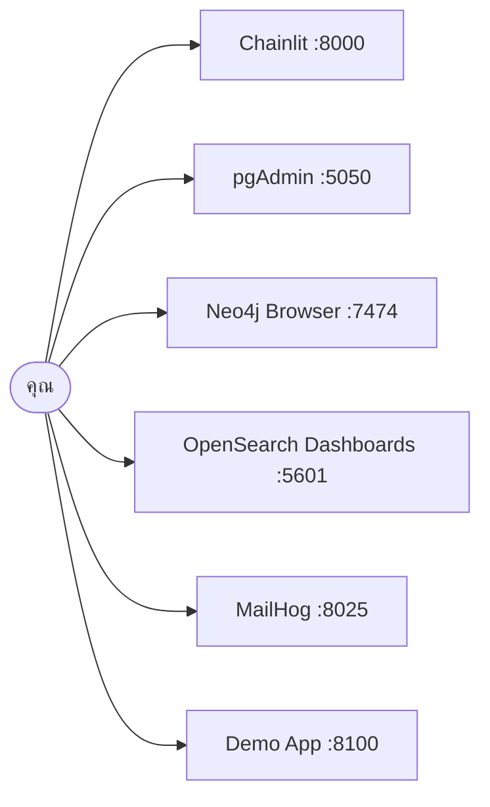

# 00 · ติดตั้งและตรวจสอบระบบ

> ใช้เวลาประมาณ 15 นาที (ถ้า pull image ไว้แล้ว)

---

## 1. เปิดระบบ

```bash
cp .env.example .env
```

แก้ค่า LLM ใน `.env` ให้ตรงกับที่ทีมงานแจ้ง:

```
LLM_BASE_URL=https://openrouter.ai/api/v1
LLM_API_KEY=sk-or-v1-***Your Key***
LLM_MODEL=openai/gpt-4o-mini
```

```bash
docker compose -f docker/docker-compose.yml --env-file .env up -d 
```
```bash
docker compose -f docker/docker-compose.yml --env-file .env up seeder
```

คำสั่งนี้จะเปิดทุกบริการ รอจนพร้อม แล้ว seed ข้อมูลให้อัตโนมัติ (ประมาณ 3-5 นาทีครั้งแรก)

---

## 2. ตรวจสอบ

```bash
docker compose -f docker/docker-compose.yml --env-file .env run --rm seeder python verify.py 
```

ต้องขึ้น `ALL CHECKS PASSED` ตัวอย่างผลลัพธ์:

```
PostgreSQL - tickets, configs, circuits
  [PASS] devices                    expected 10, found 10
  [PASS] S2 PE-BKK-02 has zero tickets  expected 0, found 0
  ...
Neo4j - topology
  [PASS] S1 three LPEs uplink to APE-NBI-03   expected 3, found 3
  ...
```

> `[WARN]` เรื่อง embedding ไม่เป็นไร แปลว่า endpoint ยังต่อไม่ได้
> ระบบอื่นใช้งานได้ปกติ ค่อยเติมทีหลังด้วย `make embed-tickets`

---

## 3. หน้าจอที่เปิดได้



| บริการ | URL | ล็อกอิน |
|---|---|---|
| pgAdmin | http://localhost:5050 | `workshop@example.local` / `workshop` |
| Neo4j Browser | http://localhost:7474 | `neo4j` / `neo4j_dev_password` |
| OpenSearch Dashboards | http://localhost:5601 | ไม่ต้องล็อกอิน |
| MailHog | http://localhost:8025 | ไม่ต้องล็อกอิน |

---

## 4. ดูข้อมูลด้วยตาก่อนเริ่มเรียน

**pgAdmin** — มี server ลงทะเบียนไว้ 2 ตัว ลองรัน:

```sql
SELECT device_id, site_code, role, model FROM devices ORDER BY site_code, role;
```
**pgAdmin** — Password:

```sql
mpls_dev_password
```

**Neo4j Browser** — ดูโครงสร้างที่เป็นหัวใจของโจทย์:

```cypher
MATCH p = (l:Device {role:'LPE'})-[:UPLINK_TO]->(a:Device) RETURN p
```
**Neo4j Browser** — Password:

```cypher
neo4j_dev_password
```

**OpenSearch Dashboards** — Dev Tools แล้วรัน:

```
GET network-logs-*/_search
{"size":5,"sort":[{"@timestamp":"desc"}]}
```

---

## 5. รันแอปของตัวเอง

เปิด 2 terminal:

```bash
uv run uvicorn apps.agent-api.main:app --reload --port 8080
```

```bash
uv run chainlit run apps/chainlit-ui/app.py --port 8000 -w
```

เปิด http://localhost:8000 แล้วลองถาม *"ticket ที่ยังไม่ปิดมีอะไรบ้าง"*

---

## 6. ปัญหาที่พบบ่อย

| อาการ | สาเหตุและวิธีแก้ |
|---|---|
| OpenSearch restart วนไม่จบ | RAM ที่ให้ Docker น้อยเกินไป → เพิ่มเป็น 8 GB |
| `make verify` FAIL ทุกข้อ | seed ยังไม่เสร็จ → `make seed` แล้วรอ |
| Neo4j `ServiceUnavailable` | Neo4j ใช้เวลาบูตนานกว่าตัวอื่น → รอ 30 วินาทีแล้วลองใหม่ |
| ต่อ LLM ไม่ได้ | ตรวจ VPN, ตรวจ `LLM_BASE_URL` ต้องลงท้ายด้วย `/v1` |
| Port ชนกัน | มีบริการอื่นใช้ port อยู่ → แก้ที่ `docker/docker-compose.yml` |
| ข้อมูลดูเก่า | `make reseed` เพื่อสร้าง timestamp ใหม่ |

รายละเอียดเพิ่มเติมที่ [reference/troubleshooting.md](reference/troubleshooting.md)

---

## 7. คำสั่งที่จะใช้บ่อยตลอด 3 วัน

| คำสั่ง | ทำอะไร |
|---|---|
| `docker compose -f docker/docker-compose.yml --env-file .env run --rm seeder python verify.py` | ตรวจว่าข้อมูลครบ |
| `docker compose -f docker/docker-compose.yml --env-file .env run --rm seeder python seed.py --purge` | สร้างข้อมูลใหม่ให้ timestamp สดใหม่ |
| `uv run uvicorn apps.agent-api.main:app --reload --port 8080` / `uv run chainlit run apps/chainlit-ui/app.py --port 8000 -w` | รันแอปของตัวเอง |
| `uv run pytest -v` | ตรวจงานตัวเอง |
| `docker compose -f docker/docker-compose.yml --env-file .env down` | ปิดระบบ (ข้อมูลยังอยู่) |
| `docker compose -f docker/docker-compose.yml --env-file .env down -v` | ล้างทุกอย่างเริ่มใหม่ |
| `docker compose -f docker/docker-compose.yml --env-file .env up -d + docker compose -f docker/docker-compose.yml --env-file .env up seeder` | เปิดระบบทั้งหมด + seed อัตโนมัติ |
| `docker compose -f docker/docker-compose.yml --env-file .env run --rm loader python load_logs.py` | โหลด log จาก `data/logs/incoming/` เข้า OpenSearch |
| `docker compose -f docker/docker-compose.yml --env-file .env --profile demo up -d mcp-demo` | เปิดแอปสำเร็จรูป (โหมดจริง) |
| `$env:DEMO_MODE="replay"; docker compose -f docker/docker-compose.yml --env-file .env --profile demo up -d mcp-demo` | เปิดแอปสำเร็จรูป (โหมด replay ไม่ต้องมี LLM) |

## 8. ตารางเปรียบเทียบ Make กับ Windows PowerShell สามารถรัน cat Makefile เพื่อขอดูคำสั่งต่าง ๆ ได้ หากต้องการติดตั้ง Make รัน make install

---

| Make | Windows PowerShell |
|---|---|
| `make verify` | docker compose -f docker/docker-compose.yml --env-file .env run --rm seeder python verify.py |
| `make reseed` | docker compose -f docker/docker-compose.yml --env-file .env run --rm seeder python seed.py --purge |
| `make api` / `make ui` | uv run uvicorn apps.agent-api.main:app --reload --port 8080 / uv run chainlit run apps/chainlit-ui/app.py --port 8000 -w |
| `make test` | uv run pytest -v |
| `make down` | docker compose -f docker/docker-compose.yml --env-file .env down |
| `make reset` | docker compose -f docker/docker-compose.yml --env-file .env down -v |
| `make up` | docker compose -f docker/docker-compose.yml --env-file .env up -d + docker compose -f docker/docker-compose.yml --env-file .env up seeder |
| `make load-logs` | docker compose -f docker/docker-compose.yml --env-file .env run --rm loader python load_logs.py |
| `make demo` | docker compose -f docker/docker-compose.yml --env-file .env --profile demo up -d mcp-demo |
| `make demo-offline` | $env:DEMO_MODE="replay"; docker compose -f docker/docker-compose.yml --env-file .env --profile demo up -d mcp-demo |
