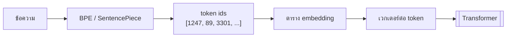
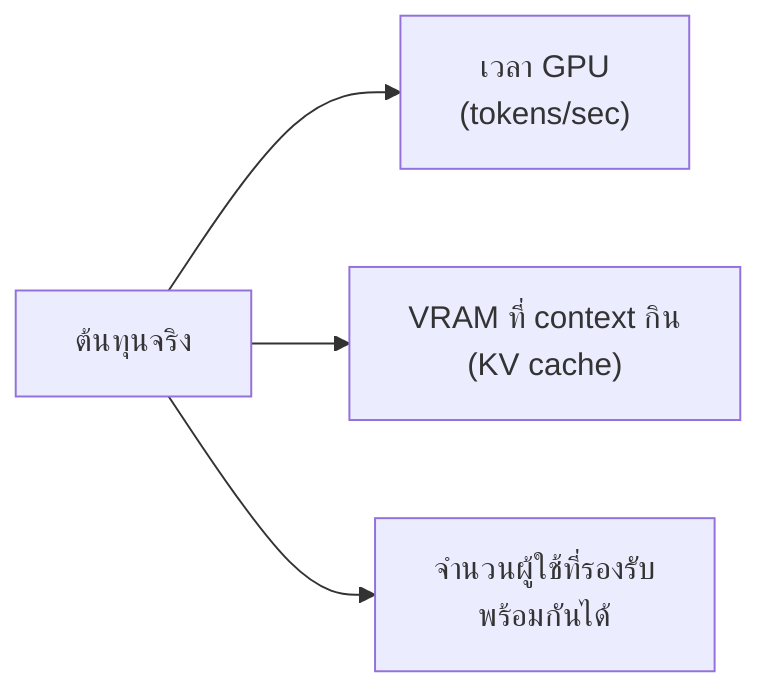
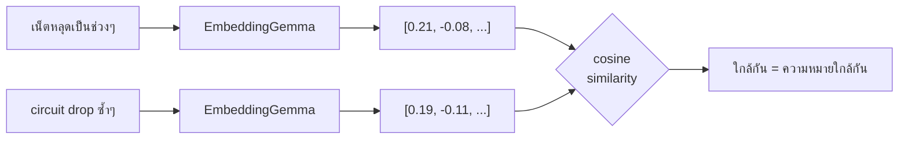

# Module 1 · Tokenomics & Vector Embeddings

**09:00 – 10:30** · เป้าหมาย: เข้าใจว่าโมเดล "เห็น" ข้อความอย่างไร และต้นทุนที่แท้จริงอยู่ตรงไหน

---

## 1. Tokenization — โมเดลไม่ได้เห็นตัวอักษร

โมเดลไม่ได้อ่านข้อความเป็นตัวอักษรหรือเป็นคำ แต่เป็น **token** ที่ได้จากการบีบอัดด้วย Byte-Pair Encoding (BPE)



### BPE ทำงานอย่างไร (ย่อ)

1. เริ่มจากตัวอักษรเดี่ยวทั้งหมดเป็น vocabulary
2. หาคู่ที่อยู่ติดกันบ่อยที่สุดในคลังข้อความ แล้วรวมเป็น token ใหม่
3. ทำซ้ำจนได้ vocabulary ขนาดที่ต้องการ

ผลคือ **คำที่พบบ่อยกลายเป็น token เดียว ส่วนคำที่หายากถูกหั่นเป็นชิ้น**

---

## 2. ปัญหาภาษาไทย ← หัวใจของโมดูลนี้

ภาษาอังกฤษมีช่องว่างคั่นคำ ทำให้ BPE เรียนรู้ขอบเขตคำได้ง่าย ภาษาไทยไม่มี

ผลที่ตามมา:

| | ภาษาอังกฤษ | ภาษาไทย |
|---|---|---|
| ข้อความยาวเท่ากัน | token น้อยกว่า | **token มากกว่าหลายเท่า** |
| 1 คำ | มักเป็น 1 token | มักถูกหั่นเป็น 2-5 token |

**ผลกระทบที่จับต้องได้**
- context window เต็มเร็วกว่า → ประวัติสนทนาสั้นลง
- ค่าใช้จ่าย/เวลา GPU สูงกว่าเมื่อเทียบกับข้อความอังกฤษที่มีเนื้อหาเท่ากัน
- การ chunk เอกสารด้วย "จำนวนตัวอักษร" ให้ผลไม่สม่ำเสมอ

---

## 3. กับดักที่ใหญ่ที่สุด — tokenizer ผูกกับโมเดล

`tiktoken` คือ BPE ของ OpenAI **ใช้นับ token ของ Gemma ไม่ได้** จะได้ตัวเลขที่ผิด และผิดไม่เท่ากันระหว่างไทยกับอังกฤษ

โปรเจกต์นี้จึงมี `apps/agent-api/agent/tokenizer.py` ที่เทียบให้เห็น 3 ทาง:

| วิธีนับ | ได้อะไร |
|---|---|
| `pythainlp.word_tokenize` | จำนวน "คำ" ที่มนุษย์เข้าใจ |
| Gemma tokenizer (SentencePiece) | **จำนวน token ที่โมเดลเห็นจริง** |
| `tiktoken` | ตัวเลขที่ผิด ถ้าเอามาใช้กับ Gemma |

```bash
uv run python -c "
import sys; sys.path.insert(0,'apps/agent-api')
from agent import tokenizer
print(tokenizer.compare('อินเทอร์เน็ตที่สาขานนทบุรีหลุดเป็นช่วงๆ ตั้งแต่เมื่อวาน'))
print(tokenizer.compare('Internet at the Nonthaburi branch keeps dropping since yesterday'))
"
```

> **บทเรียน**: ย้ายโมเดลเมื่อไหร่ ต้องเปลี่ยนวิธีนับ token เมื่อนั้น
> เรื่องนี้จะเจอจริงตอนย้ายจาก Gemma ไป GPT-OSS 120B ใน production

---

## 4. "Cost Optimization" เมื่อ LLM อยู่ในองค์กร

เมื่อรันโมเดลเอง **ไม่มีค่า API ต่อ token** ต้นทุนจริงเปลี่ยนรูปเป็น:



| สิ่งที่ทำ | ผลต่อต้นทุน |
|---|---|
| context ยาวขึ้น 2 เท่า | KV cache โตขึ้น → รองรับผู้ใช้พร้อมกันได้น้อยลง |
| ตัดคำถามนอกขอบเขตตั้งแต่ต้น | ไม่เสีย GPU เลย ← ประหยัดที่สุด |
| ใช้โมเดลเล็กกับงานง่าย | เร็วกว่าหลายเท่า |
| สรุปแล้วตัดความจำเมื่อเปลี่ยนเรื่อง | context เล็กลง → ทุกคนได้เร็วขึ้น |

> นี่คือเหตุผลที่ **Intent Gate** (วันที่ 2) เป็นเรื่องประหยัดทรัพยากร ไม่ใช่แค่เรื่องความปลอดภัย

---

## 5. Embeddings — จากข้อความเป็นพิกัด

Embedding แปลงข้อความทั้งก้อนเป็นเวกเตอร์เดียวในปริภูมิมิติสูง (โปรเจกต์นี้ใช้ **768 มิติ** จาก EmbeddingGemma 300M)

คุณสมบัติที่ทำให้ใช้ประโยชน์ได้: **ข้อความที่ความหมายใกล้กัน จะมีเวกเตอร์ที่ทำมุมแคบต่อกัน**



### ทำไมใช้ cosine ไม่ใช่ระยะทางแบบยุคลิด

โมเดล embedding ถูกฝึกให้ความคล้ายอยู่ที่ **ทิศทาง** ไม่ใช่ขนาดของเวกเตอร์
ใช้ `vector_l2_ops` แทน `vector_cosine_ops` บนข้อมูลชุดเดียวกันจะได้ผลแย่ลงอย่างเห็นได้ชัด

### Semantic search ต่างจาก keyword search อย่างไร

| | Keyword | Semantic |
|---|---|---|
| *"circuit drop ซ้ำๆ"* หา *"เน็ตหลุดเป็นช่วง"* | ❌ ไม่เจอ | ✅ เจอ |
| ค้นหมายเลข ticket ที่รู้แน่นอน | ✅ แม่นและเร็ว | ❌ ไม่จำเป็น |

**ใช้ให้ถูกงาน** — ในระบบนี้ `search_tickets` เป็น keyword/filter ส่วน `search_tickets_semantic` เป็น vector

---

## 6. Vector search ทั้ง 3 ฐาน

โปรเจกต์นี้มี vector search ครบทั้ง 3 ระบบโดยตั้งใจ เพื่อให้เห็นว่าแต่ละตัวเหมาะกับอะไร

| ระบบ | ใช้อะไร | จุดแข็งที่ตัวอื่นไม่มี |
|---|---|---|
| PostgreSQL | `pgvector` + HNSW | กรองด้วยเงื่อนไข relational พร้อม vector ใน query เดียว |
| Neo4j | vector index (5.x) | เจอด้วย semantic แล้ว **เดินกราฟต่อได้ทันที** ใน query เดียว |
| OpenSearch | `knn_vector` | ทน scale + ผสม BM25 ได้ ← **production เลือกตัวนี้** |

เปรียบเทียบจริงในวันที่ 3: [day3/lab5-vector-store-comparison.md](../day3/lab5-vector-store-comparison.md)

---

## 7. ต่อไป

→ [Lab 1: สร้าง vector column ด้วยตัวเอง](lab1-add-vector-column.md)
