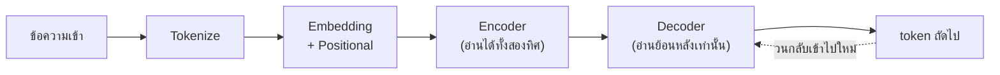
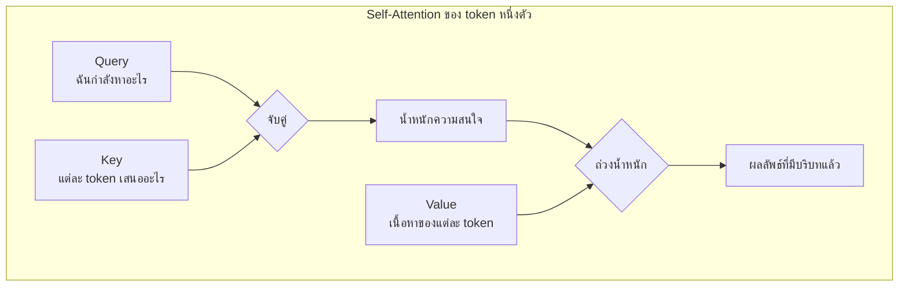
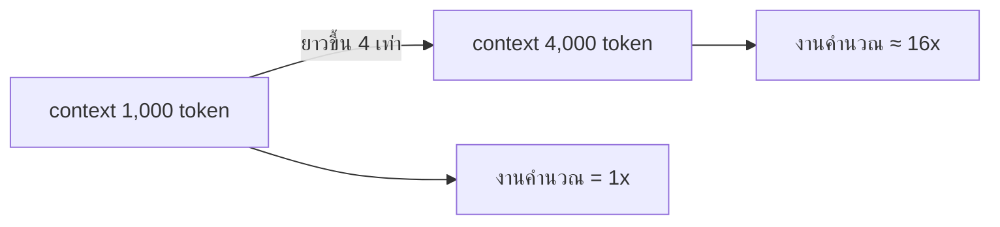
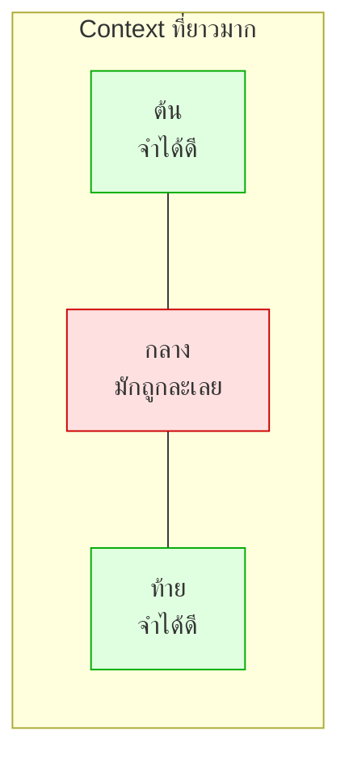

# Module 2 · โครงสร้างการทำงานของ Transformer

**10:45 – 11:35** · เป้าหมาย: เข้าใจว่าทำไมโมเดล "ลืมตรงกลาง" และเรื่องนี้กระทบการออกแบบระบบอย่างไร

---

## 1. โครงสร้าง Encoder–Decoder



| แบบ | ตัวอย่างงาน | ตัวอย่างโมเดล |
|---|---|---|
| Encoder อย่างเดียว | จำแนกประเภท, **embedding** | BERT, EmbeddingGemma |
| Decoder อย่างเดียว | สร้างข้อความ | **Gemma**, GPT |
| Encoder–Decoder | แปลภาษา, สรุปความ | T5 |

**Gemma 3 เป็น decoder-only** สร้าง token ทีละตัว โดยแต่ละตัวเห็นเฉพาะสิ่งที่มาก่อนหน้า

---

## 2. Self-Attention — โมเดลเชื่อมโยงบริบทอย่างไร

ทุก token ถามคำถามเดียวกัน: *"ในบรรดา token ที่มีอยู่ ฉันควรสนใจตัวไหนบ้าง"*



ตัวอย่าง: ประโยค *"adjacency ของ PE-NBI-04 ไม่ขึ้นเพราะ **มัน** ตั้ง MTU ผิด"*
เมื่อประมวลผลคำว่า "มัน" attention จะให้น้ำหนักสูงกับ `PE-NBI-04`

**Multi-head** คือทำแบบนี้พร้อมกันหลายชุด แต่ละชุดเรียนรู้ความสัมพันธ์คนละแบบ (ไวยากรณ์ / การอ้างถึง / ความหมาย)

---

## 3. ต้นทุนที่ตามมา — ทำไม context ยาวถึงแพง

Self-attention เทียบทุก token กับทุก token → ต้นทุน **O(n²)** ต่อความยาว



บวกกับ **KV cache** ที่ต้องเก็บ Key/Value ของทุก token ไว้ใน VRAM ตลอดการสนทนา

> เมื่อ 20 คนใช้ GPU ตัวเดียวกัน คนที่ปล่อยให้ context โตไม่หยุด กำลังกินทรัพยากรของทุกคน

---

## 4. Context Dilution — "ความจำเสื่อมตรงกลาง"

ปรากฏการณ์ที่พบซ้ำในหลายงานวิจัย: เมื่อ context ยาว โมเดลใช้ข้อมูล **ต้น** และ **ท้าย** ได้ดี แต่ข้อมูล **ตรงกลาง** ถูกละเลย



### สาเหตุคร่าวๆ
- attention ถูกเกลี่ยบางลงเมื่อมีคู่แข่งมาก
- รูปแบบตำแหน่งที่โมเดลเห็นตอนฝึกมักสั้นกว่าที่ใช้จริง

### ผลต่อการออกแบบระบบ — 4 ข้อที่ใช้จริงในโปรเจกต์นี้

| หลักการ | ทำที่ไหนในโค้ด |
|---|---|
| context ยาวขึ้นไม่ได้แปลว่าดีขึ้น | `memory.py` ตัดความจำเมื่อเปลี่ยนเรื่อง |
| วางสิ่งสำคัญที่ต้นหรือท้าย ไม่ใช่กลาง | `synthesizer.py` วางหลักฐานท้ายสุดก่อนคำถาม |
| ส่งของน้อยแต่ตรง ดีกว่าส่งเยอะ | `rerank.py` retrieve 50 → เหลือ 5 |
| อย่ายัดผลลัพธ์ดิบทั้งหมดเข้าไป | guardrail `cap_rows` + `count_log_events` |

> **บทเรียนสำคัญที่สุดของโมดูลนี้**: การแก้ปัญหา "โมเดลลืม" ไม่ใช่การเพิ่ม context window
> แต่คือ **การเลือกว่าจะไม่ใส่อะไรเข้าไป**

---

## 5. ทดลองด้วยตัวเอง (10 นาที)

ทดสอบ dilution กับโมเดลที่ใช้จริง:

1. เอา log 200 บรรทัดจาก `data/logs/samples/` มาต่อกัน
2. แทรกประโยคพิเศษไว้ **ตรงกลาง**: `SECRET-CODE-4417`
3. ถามโมเดลว่า `SECRET-CODE คืออะไร`
4. ทำซ้ำโดยย้ายประโยคไปไว้ **ต้น** และ **ท้าย**
5. เทียบว่าตำแหน่งไหนตอบถูก

Code เปิดไฟล์ Log ของระบบเน็ตเวิร์กขึ้นมาอ่าน แล้วนับว่าข้อมูลในไฟล์นั้นมีความยาวทั้งหมดกี่ Token
```bash
uv run python -c "
import sys; sys.path.insert(0,'apps/agent-api')
from agent import tokenizer
text = open('data/logs/samples/01-cisco-ios-APE-NBI-03.log', encoding='utf-8').read()
print('tokens:', tokenizer.count(text))
"
```

---

## 6. ต่อไป

→ [โจทย์ที่ 1: Thai Token Audit](challenge1-thai-token-audit.md)
