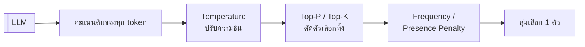
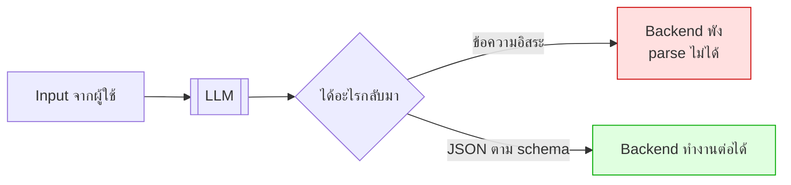
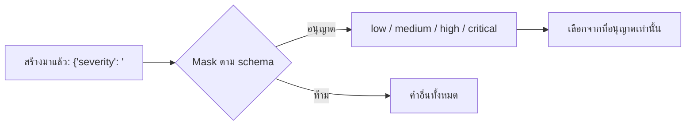
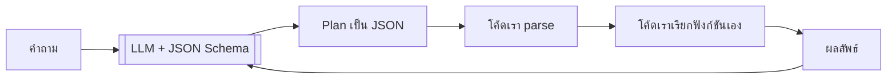
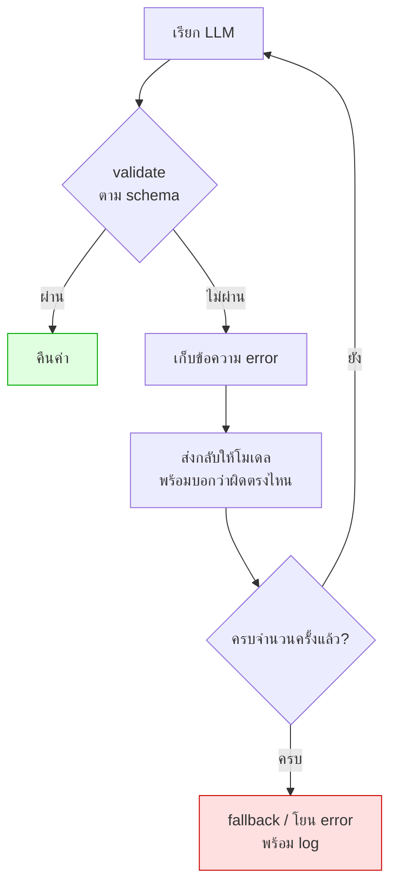

# Module 3 · API ขั้นสูงและ Structured Output

**13:00 – 14:30** · เป้าหมาย: บังคับให้ LLM คืนค่าที่ระบบ parse ได้เสมอ

---

## 1. Parameter ที่มีผลต่อผลลัพธ์



| Parameter | ทำอะไร | ค่าที่ใช้ในโปรเจกต์นี้ |
|---|---|---|
| `temperature` | 0 = เลือกตัวที่มั่นใจที่สุดเสมอ · สูง = สุ่มมากขึ้น | **0.0** สำหรับ plan/intent · **0.3** สำหรับคำตอบ |
| `top_p` | เก็บเฉพาะตัวเลือกที่ความน่าจะเป็นสะสมถึง p | 1.0 (ปล่อยให้ temperature คุม) |
| `top_k` | เก็บ k ตัวแรก | ไม่ใช้ |
| `frequency_penalty` | ลดโอกาสของ token ที่ออกไปแล้วบ่อย | 0 |
| `presence_penalty` | ลดโอกาสของ token ที่เคยออกแล้ว | 0 |
| `max_tokens` | จำกัดความยาว | ตามงาน |

### กฎที่ใช้ได้จริง

| งาน | temperature |
|---|---|
| จำแนกประเภท, สกัดข้อมูล, **วางแผน** | **0.0** |
| ตอบคำถามเชิงเทคนิค | 0.2 – 0.4 |
| เขียนเนื้อหาสร้างสรรค์ | 0.7 – 1.0 |

> **อย่าปรับ temperature และ top_p พร้อมกัน** เลือกคุมตัวใดตัวหนึ่ง ไม่งั้นจะแยกไม่ออกว่าผลที่เปลี่ยนมาจากอะไร

---

## 2. Structured Output — ปัญหาที่ต้องแก้



**สิ่งที่โมเดลชอบทำพัง**
- ครอบด้วย ` ```json ` ทั้งที่สั่งว่าห้าม
- ใส่คำนำ *"นี่คือ JSON ที่คุณขอครับ"*
- มี trailing comma
- ใส่ค่าที่ไม่มีใน enum
- ตอบเป็นภาษาไทยในฟิลด์ที่ต้องเป็น enum ภาษาอังกฤษ

---

## 3. สามระดับของการบังคับ (จากอ่อนไปแข็ง)

| ระดับ | วิธี | ความน่าเชื่อถือ |
|---|---|---|
| 1 | บอกใน prompt ว่า "ตอบเป็น JSON" | ต่ำ |
| 2 | ส่ง JSON Schema ไปใน prompt ด้วย | ปานกลาง |
| 3 | **Guided / constrained decoding** — บังคับที่ระดับการ sample token | **สูงมาก** |

### ระดับ 3 ทำงานอย่างไร

ตอนสร้าง token แต่ละตัว ระบบจะ **ปิด (mask) token ที่จะทำให้ JSON ผิด schema** ออกจากตัวเลือกทั้งหมด



โมเดลจึง **ไม่มีทางสร้าง JSON ที่ผิด schema ได้เลย** เพราะ token ที่ผิดไม่เคยอยู่ในตัวเลือก

| ตัวรัน | รองรับอย่างไร |
|---|---|
| Ollama | `format` รับ JSON Schema |
| vLLM | `guided_json` / `response_format` |
| LiteLLM Proxy | ส่งต่อไปยัง backend |

> ⚠️ **ต้องทดสอบก่อนใช้จริง** ว่า gateway ขององค์กรรองรับ ถ้าไม่รองรับต้องพึ่ง auto-retry (หัวข้อถัดไป)

---

## 4. Gemma ไม่มี native function calling — แล้วทำ Agent ยังไง

Gemma ไม่ได้ออกแบบมาพร้อม function-calling API แบบบางโมเดล

**แต่ไม่เป็นปัญหา** เพราะ tool call ที่แท้จริงก็คือ JSON ที่บอกว่า *"เรียกฟังก์ชันชื่ออะไร ด้วย argument อะไร"*



> **LLM ไม่เคยรันโค้ดเอง** ไม่ว่าจะมี native tool API หรือไม่
> มันแค่ "เลือกชื่อฟังก์ชันและกรอก argument" — ที่เหลือเป็นหน้าที่โค้ดเราเสมอ

นี่คือเหตุผลที่วันที่ 2 ให้เขียน agent loop เอง: เมื่อเข้าใจว่ากลไกจริงคือ JSON + parser การใช้ framework ตัวไหนก็เป็นแค่รายละเอียด

ดูของจริงที่ `apps/agent-api/agent/llm.py` ฟังก์ชัน `complete_structured()`

---

## 5. Auto-retry ที่ฉลาดกว่าการลองใหม่เฉยๆ



**หัวใจคือขั้น D** — การลองใหม่เฉยๆ มักได้ผลผิดแบบเดิม แต่การบอกว่าผิดตรงไหนทำให้โมเดลแก้ถูก

ดูโค้ดจริงใน `complete_structured()`:

```python
conversation += [
    {"role": "assistant", "content": raw[:1000]},
    {"role": "user", "content": f"That did not validate.\nError: {last_error}\nReturn corrected JSON only."},
]
```

---

## 6. ออกแบบ Schema ให้โมเดลทำถูกได้ง่าย

| หลักการ | ตัวอย่างจากโปรเจกต์นี้ |
|---|---|
| ใช้ `Enum` แทน string อิสระ | `IntentLabel` มี 4 ค่า ไม่ใช่ string ว่างเปล่า |
| ใส่ `description` ทุกฟิลด์ | `PlanStep.depends_on` อธิบายว่าเมื่อไหร่ควรใส่ |
| กำหนดขอบเขตตัวเลข | `confidence: float = Field(ge=0, le=1)` |
| ฟิลด์ที่ไม่บังคับต้องมี default | `missing_information: list = Field(default_factory=list)` |
| **หลีกเลี่ยง nested ลึกเกิน 3 ชั้น** | โมเดลพลาดมากขึ้นตามความลึก |

ดูตัวอย่างเต็มที่ `apps/agent-api/schemas.py`

---

## 7. ทดลอง (15 นาที)

```bash
python -c "
import asyncio, sys; sys.path.insert(0,'apps/agent-api')
from agent import llm
from schemas import IntentResult
async def go():
    r = await llm.complete_structured(
        [{'role':'system','content':'Classify the user question.'},
         {'role':'user','content':'ticket ที่นนทบุรีมีอะไรบ้าง'}],
        IntentResult)
    print(r.model_dump_json(indent=2, ensure_ascii=False))
asyncio.run(go())
"
```

ลองตั้ง `LLM_GUIDED_DECODING=false` ใน `.env` แล้วรันซ้ำ 10 ครั้ง เทียบว่าพลาดกี่ครั้ง

---

## 8. ต่อไป

→ [Workshop 1: JSON + Auto-retry](workshop1-json-autoretry.md)
