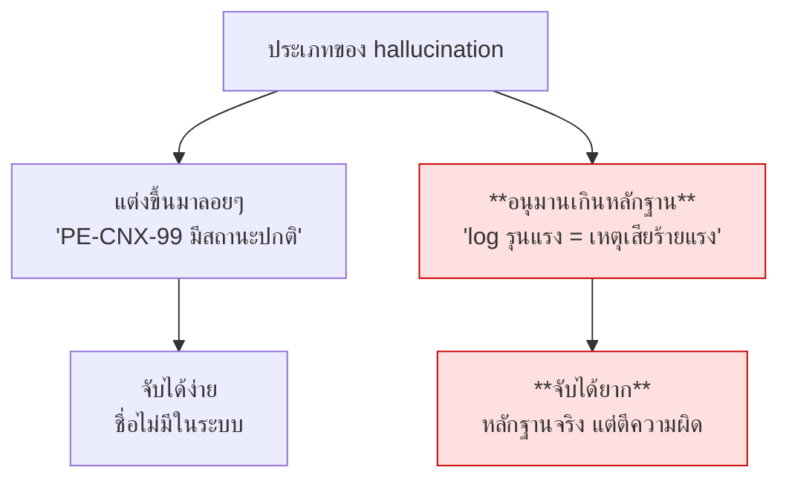

# Lab เสริม · Grounding — ตรวจคำตอบก่อนส่งออก

**20 นาที**

> ตรงกับหัวข้อติดตามผลครั้งที่ 2: *"ตรวจสอบและลดการเกิดข้อมูลที่ผิดพลาด (Hallucination) โดยอ้างอิงความถูกต้องกับโครงสร้างจริงใน Neo4j และประวัติจริงใน PostgreSQL"*

---

## เป้าหมาย

เพิ่มชั้นตรวจสอบว่า **ทุกข้ออ้างในคำตอบมีหลักฐานรองรับจริง** ก่อนส่งให้ผู้ใช้

---

## Hallucination ที่อันตรายที่สุดไม่ใช่การแต่งเรื่องขึ้นมาลอยๆ



scenario **S4** คือกรณีที่สอง — log ที่ดึงมาเป็นของจริงทุกบรรทัด แต่ข้อสรุปผิด

---

## สิ่งที่ต้องทำ

### 1. เขียน verifier

```python
async def verify(answer: str, results: list[StepResult]) -> GroundingVerdict:
    """ตรวจว่าทุกข้ออ้างในคำตอบมีหลักฐานจาก step results รองรับ"""
```

### 2. เกณฑ์ที่ต้องจับให้ได้

| ต้องจับว่าไม่มีหลักฐาน | ไม่ต้องจับ |
|---|---|
| ชื่ออุปกรณ์/เลข ticket/ตัวเลขที่ไม่มีในหลักฐาน | ภาษาที่แสดงความไม่แน่ใจอยู่แล้ว |
| อ้างสาเหตุทั้งที่หลักฐานบอกแค่ว่าเกิดพร้อมกัน | การเรียบเรียงหลักฐานใหม่ด้วยคำอื่น |
| **เรียกว่าเหตุเสียทั้งที่มี ticket maintenance ครอบคลุม** | การสรุปความที่สมเหตุสมผล |
| อ้างช่วงเวลานอกขอบเขตข้อมูล | |

### 3. ทดสอบด้วยคำตอบที่จงใจผิด

```python
bad = "APE-BKK-05 เกิดเหตุเสียร้ายแรง มี ticket TK-99-99999 รายงานไว้ CPU สูงถึง 95%"
```

verifier ต้องจับได้ทั้ง 3 จุด: เหตุเสีย (จริงๆ เป็น maintenance) · ticket ที่ไม่มีจริง · CPU ที่ไม่มีในหลักฐาน

### 4. ตัดสินใจว่าจะทำอะไรเมื่อไม่ผ่าน

| ทางเลือก | เหมาะเมื่อ |
|---|---|
| เตือนผู้ใช้แต่ยังแสดงคำตอบ | ค่าเริ่มต้นที่ดี — โปร่งใสและไม่ปิดกั้น |
| สร้างคำตอบใหม่ | คุณภาพสูงขึ้นแต่ช้าและแพงขึ้นเท่าตัว |
| ปฏิเสธไม่แสดง | เข้มเกินไปสำหรับงานส่วนใหญ่ |

โปรเจกต์นี้เลือกข้อแรก — ดู event `grounding_checked` ใน `main.py`

---
ตัวอย่าง : `uv run apps/agent-api/verifier.py`
---

## เกณฑ์ผ่าน

- [ ] verifier จับคำตอบที่จงใจผิดได้ทั้ง 3 จุด
- [ ] คำตอบที่ถูกต้องต้อง **ไม่** ถูกจับผิด (false positive)
- [ ] ทดสอบกับ Q18 (maintenance) และ Q30 (อุปกรณ์ไม่มีจริง)
- [ ] verifier ล้มเหลวแล้วระบบยังตอบได้ ไม่ crash
- [ ] วัดว่า grounding เพิ่ม latency กี่เปอร์เซ็นต์

---

## โบนัส

1. **ตรวจแบบไม่ใช้ LLM** — ดึงชื่ออุปกรณ์และเลข ticket จากคำตอบด้วย regex แล้วเทียบกับหลักฐานตรงๆ **ถูกกว่าและแม่นกว่าสำหรับกรณีนี้**
2. **วัด Groundedness rate** — รันชุดคำถามทั้งหมดแล้วรายงานเปอร์เซ็นต์ที่ผ่าน
3. **ใช้โมเดลเล็กเป็นผู้ตรวจ** — `gemma3:4b` ตรวจงานของ 27B ได้ไหม ถูกกว่ามาก
