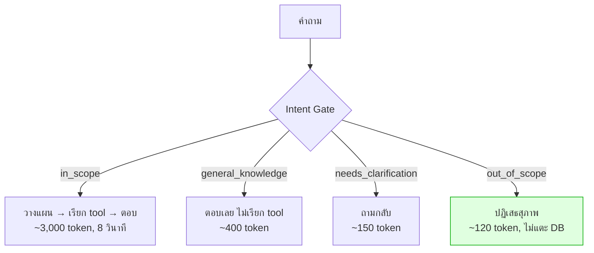
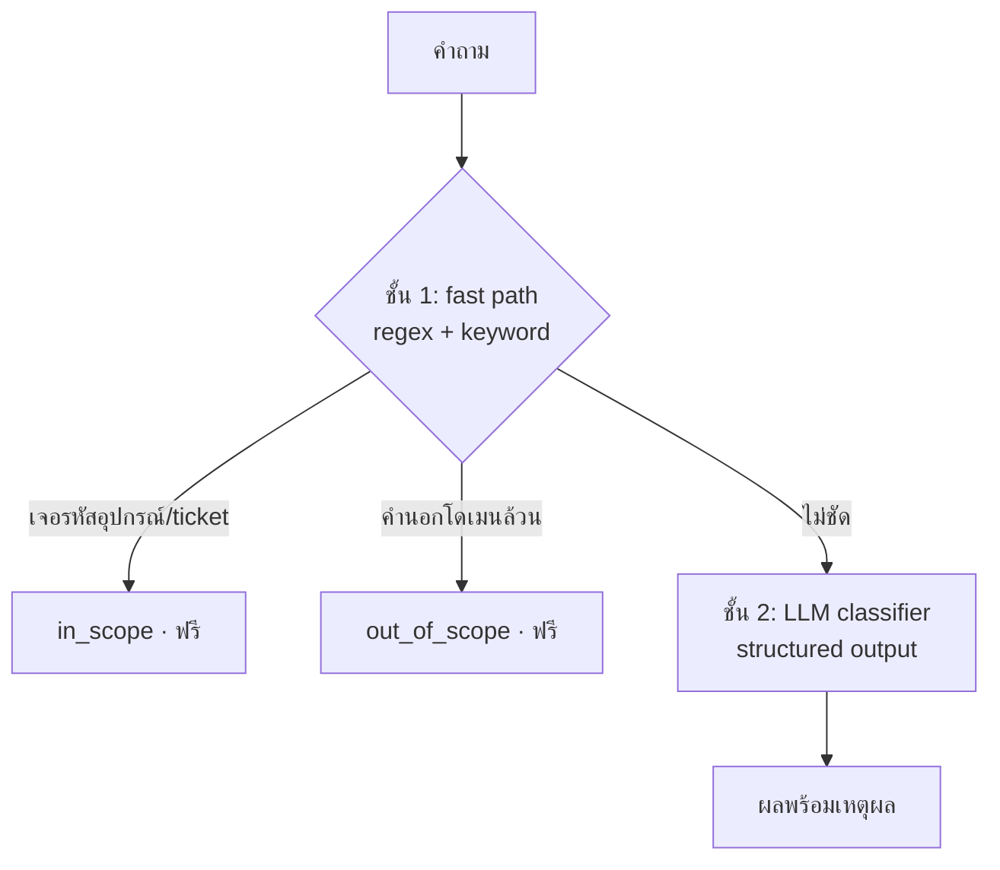

# Lab 2 · Intent Gate

**13:45 – 14:10** (25 นาที)

---

## เป้าหมาย

สร้างชั้นตรวจสอบว่าคำถามอยู่ในขอบเขตหรือไม่ **ก่อนที่จะแตะฐานข้อมูลหรือเสีย GPU**

---

## ทำไมต้องมี



**สามเหตุผล เรียงตามความสำคัญ**

1. ปฏิเสธตั้งแต่ต้น = ฐานข้อมูลไม่ถูกแตะโดยคำถามที่ไม่เกี่ยวข้องเลย
2. โมเดล 27B บน GPU ที่แชร์กัน 20 คน คือทรัพยากรที่หายากที่สุดในห้อง
3. มีที่ให้แยก **"นอกขอบเขต"** ออกจาก **"ยังไม่ชัด"** ซึ่งสองอย่างนี้ควรได้คำตอบคนละแบบ

---

## 4 ประเภท ไม่ใช่ 2

การมองว่าเป็นคำถาม ใช่/ไม่ใช่ เป็นความผิดพลาดที่พบบ่อยที่สุด

| ประเภท | ตัวอย่าง | ระบบทำอะไร |
|---|---|---|
| `in_scope` | *"ticket ที่ NBI มีอะไรบ้าง"* | วางแผนและเรียก tool |
| `general_knowledge` | *"router คืออะไร"* | ตอบความรู้ ไม่เรียก tool |
| `needs_clarification` | *"อุปกรณ์ตัวนี้เป็นยังไง"* | ถามกลับแบบเจาะจง |
| `out_of_scope` | *"วันนี้อากาศเป็นไง"* | ปฏิเสธสุภาพ + บอกขอบเขต |

---

## สถาปัตยกรรม 2 ชั้น



**ชั้น 1 ต้องระวังไม่ให้มั่นใจเกินไป** — คำถามอย่าง *"ส่งรายงาน log ให้ทีมก่อนไปกินข้าว"* มีทั้งคำในโดเมนและนอกโดเมน ต้องไม่ตัดสินว่านอกขอบเขต

---

## สิ่งที่ต้องทำ

### 1. เขียน fast path

```python
def fast_path(message: str) -> IntentResult | None:
    """คืน None ถ้าตัดสินไม่ได้ ให้ชั้น 2 ทำต่อ"""
```

ต้องจับได้อย่างน้อย:
- รหัสอุปกรณ์ `(CR|PE|APE|LPE)-[A-Z]{3}-\d{2}` → `in_scope` ทันที
- หมายเลข ticket `TK-\d{2}-\d{5}` → `in_scope` ทันที
- คำนอกโดเมนล้วน **โดยไม่มีคำในโดเมนปน** → `out_of_scope`

### 2. เขียน LLM classifier

ใช้ `IntentResult` schema จาก `apps/agent-api/schemas.py`
ต้องส่ง conversation history เข้าไปด้วย ไม่งั้นคำถามอย่าง *"แล้ว log ล่ะ"* จะถูกตัดสินว่ากำกวมทั้งที่ไม่ใช่

### 3. เขียนข้อความปฏิเสธที่ดี

```
❌ "ขออภัย ไม่สามารถตอบได้"
✅ "คำถามนี้อยู่นอกขอบเขตครับ ระบบตอบได้เฉพาะ...
    ลองถามเช่น 'ticket ที่ยังไม่ปิดมีอะไรบ้าง'"
```

การปฏิเสธที่ดีต้อง **บอกว่าถามอะไรได้แทน**

---

## ทดสอบ

```bash
uv run pytest tests/test_intent_gate.py
```

ใช้ชุดคำถาม `data/questions/L0-out-of-scope.yaml` และ `L5-ambiguous.yaml`

---

## เกณฑ์ผ่าน

- [ ] L0 ทั้ง 5 ข้อ: `tool_calls == 0`
- [ ] Q05 (*"router คืออะไร"*) ต้องได้ `general_knowledge` **ไม่ใช่ปฏิเสธ**
- [ ] L5 ทั้ง 4 ข้อได้ `needs_clarification` พร้อมระบุว่าขาดอะไร
- [ ] L1 ทั้ง 9 ข้อได้ `in_scope`
- [ ] fast path ตัดสินได้เองอย่างน้อย 50% โดยไม่เรียก LLM
- [ ] ข้อความปฏิเสธมีตัวอย่างคำถามที่ถามได้

---

## โบนัส

1. วัดว่า fast path ประหยัด token ได้กี่เปอร์เซ็นต์จากชุดทดสอบทั้งหมด
2. เพิ่มชั้น embedding: เทียบ similarity กับคำอธิบายโดเมน แทรกระหว่างชั้น 1 กับ 2 — ถูกกว่า LLM แต่ฉลาดกว่า keyword
3. หา false positive: เขียนคำถามที่ควรผ่านแต่ fast path ตัดทิ้ง

---

## สิ่งที่ต้องส่ง

`agent/intent.py` ของตัวเอง + ผล test + สถิติว่า fast path ตัดสินได้กี่ %
