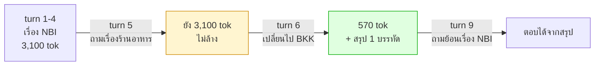

# Lab 3 · Context Memory และการตรวจจับการเปลี่ยนเรื่อง

**14:10 – 14:30** (20 นาที)

---

## เป้าหมาย

ทำให้ขนาด context **ลดลงเมื่อผู้ใช้เปลี่ยนเรื่อง** แทนที่จะโตขึ้นเรื่อยๆ โดยยังตอบเรื่องเก่าได้อยู่

---

## สิ่งที่ต้องเกิดขึ้น



**จุดที่คนพลาดมากที่สุดคือ turn 5** — คำถามนอกขอบเขตไม่ใช่การเปลี่ยนเรื่อง ผู้ใช้แค่แทรกคำถามเล่นๆ การล้าง context ตรงนั้นคือการทำร้ายผู้ใช้

---

## สิ่งที่ต้องทำ

### 1. ตรวจจับการเปลี่ยนเรื่อง — 3 สัญญาณ เรียงจากถูกไปแพง

```python
def detect_topic_shift(self, message: str) -> tuple[bool, str]:
    # 1. ผู้ใช้บอกเอง          — ฟรี
    # 2. entity คนละพื้นที่     — ฟรี
    # 3. cosine similarity ต่ำ  — 1 embedding call
```

**อย่าเริ่มจาก embedding** ถ้าสองสัญญาณแรกตอบได้แล้ว

### 2. สรุปก่อนทิ้ง

เมื่อเปลี่ยนเรื่อง ต้องสรุปเรื่องเก่าเหลือ 1-2 ประโยค **โดยเก็บอุปกรณ์/พื้นที่ที่พูดถึง และข้อสรุปที่ได้** แล้วค่อยทิ้ง detail ทั้งหมด

```
[LPE-NBI-11, APE-NBI-03] พบว่า ticket เน็ตหลุด 3 ใบมี upstream ร่วมกันคือ APE-NBI-03 ซึ่งมี log flapping ตรงกับช่วงเวลา
```

### 3. ประกอบ context ที่ส่งเข้าโมเดล

```
[system] สรุปเรื่องที่คุยไปแล้ว: ...     ← ท้ายๆ ที่โมเดลจำได้ดี
[recent turns ของหัวข้อปัจจุบัน]
[คำถามล่าสุด]                          ← ท้ายสุด
```

โยงกลับ Module 2: วางสิ่งสำคัญไว้ต้นหรือท้าย ไม่ใช่กลาง

### 4. เปิดให้ตรวจสอบได้

```
GET /sessions/{id}/memory
```
### 5. ตรวจสอบ

```
http://localhost:8080/sessions/default/memory
```
default คือค่า sessions โดยสามารถตั้งให้ ID รัน Unique ID ได้โดยเข้าที่ `apps/chainlit-ui/app.py` แก้ไขบรรทัดที่ 73 เปลี่ยนเป็น Code ที่ # ไว้ `session_id = "default"  # session_id = cl.user_session.get("session_id") or "default"`


**สำคัญ** — กลไกความจำมองจากภายนอกไม่เห็น ถ้าไม่มี endpoint นี้ก็ debug ไม่ได้และเรียนรู้ไม่ได้

---

## ทดสอบ

```bash
uv run pytest tests/test_topic_shift.py
```

ใช้บทสนทนา 10 turn จาก `data/questions/L4-conversation.yaml`

---

## เกณฑ์ผ่าน

- [ ] turn 5 (นอกขอบเขต): `tool_calls == 0` และ **context ไม่ถูกล้าง**
- [ ] turn 6 (เปลี่ยนเรื่อง): `context_tokens` **ลดลง** จาก turn 5
- [ ] turn 9 (ย้อนเรื่องเดิม): ตอบได้จากสรุป และเรียก tool ไม่เกิน 1 ครั้ง
- [ ] turn 2-4: ใช้ context เดิมได้ (คำถามที่อ้างถึงสิ่งที่พูดไปแล้ว)
- [ ] กราฟ `context_tokens` ทั้ง 10 turn ต้องไม่โตขึ้นตลอด

---

## โบนัส

1. **หา threshold ที่ดี** — ลอง `MEMORY_TOPIC_SHIFT_THRESHOLD` ที่ 0.4 / 0.55 / 0.7 แล้วดูว่าค่าไหนพลาดน้อยที่สุด (ทั้ง false positive และ false negative)
2. **ต่อ long-term memory** — เมื่อสรุปหัวข้อ ให้เก็บลง `agent_memory` ด้วย `memory_longterm.remember()` แล้วลอง recall ในเซสชันใหม่
3. **กลับมาที่หัวข้อเดิม** — ถ้าผู้ใช้กลับมาเรื่อง NBI อีกครั้งที่ turn 10 ควร restore สรุปเดิมกลับมาเป็นหัวข้อปัจจุบันไหม

---

## สิ่งที่ต้องส่ง

`agent/memory.py` + dump `/memory` ทุก turn + กราฟ context_tokens
