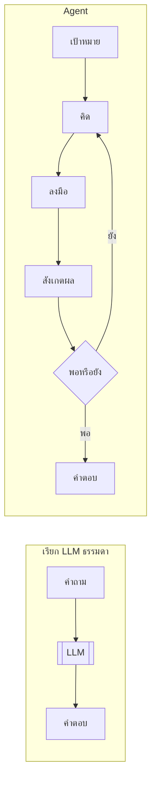
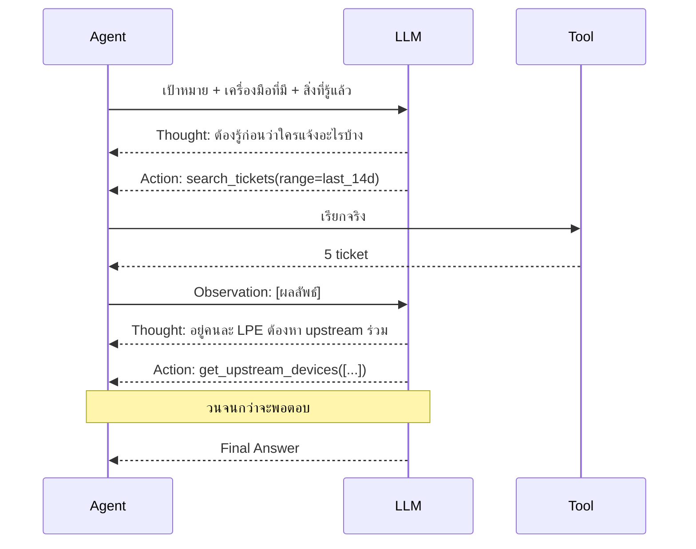
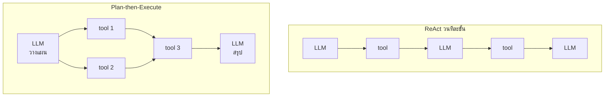
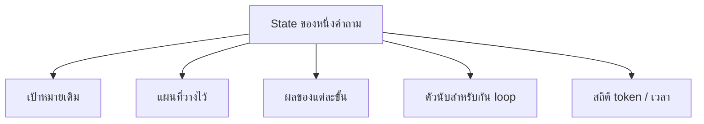
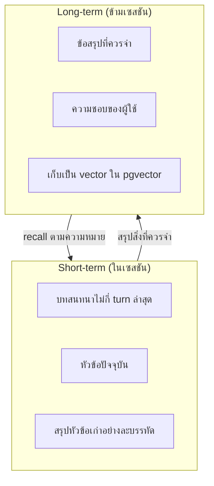
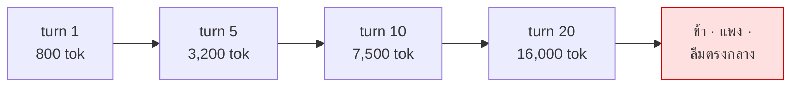
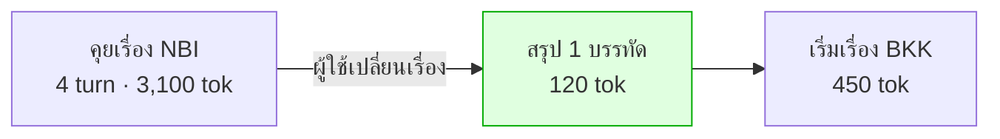

# Module 4 · วิธีคิดของ Agent (ReAct Pattern)

**09:00 – 10:30** · เป้าหมาย: เข้าใจวงจรการคิดของ agent และการจัดการความจำ

---

## 1. Agent ต่างจากการเรียก LLM ธรรมดาอย่างไร

Agent = LLM + **วงจรที่ทำซ้ำได้** + **เครื่องมือ** + **สถานะ**

---

## 2. ReAct — Reasoning and Acting

**หัวใจ**: โมเดลไม่ได้ตอบทันที แต่สลับระหว่าง *คิด* กับ *ทำ* โดยผลของการทำกลับเข้าไปเป็น input ของการคิดรอบถัดไป

---

## 3. ReAct แบบวนทีละขั้น vs วางแผนก่อนแล้วค่อยทำ

โปรเจกต์นี้ใช้แบบ **Plan-then-Execute** ซึ่งต่างจาก ReAct ดั้งเดิม

| | ReAct วนทีละขั้น | **Plan-then-Execute (ที่ใช้)** |
|---|---|---|
| เรียก LLM | ทุกขั้นตอน | 2 ครั้ง (วางแผน + สรุป) |
| ปรับตัวระหว่างทาง | ดีมาก | ต้อง re-plan |
| ทำขนานได้ | ไม่ได้ | **ได้ เพราะรู้ dependency ล่วงหน้า** |
| ตรวจสอบก่อนรัน | ไม่ได้ | **ได้ — validate plan ก่อนแตะฐานข้อมูล** |
| ผู้ใช้เห็นว่าจะทำอะไร | ไม่เห็นจนกว่าจะทำ | **เห็นแผนทั้งหมดก่อน** |

> เหตุผลที่เลือก: บนโมเดล 27B ที่แชร์กัน 20 คน การเรียก LLM ทุกขั้นตอนแพงเกินไป
> และ **การให้ผู้ใช้เห็นแผนก่อนลงมือ** มีค่ามากในงานที่แตะระบบจริง

---

## 4. State Management

Agent ต้องเก็บอะไรระหว่างทำงาน

ในโค้ด: `Plan`, `StepResult`, `LoopGuard`, `LLMStats` ที่ `apps/agent-api/`

**หลักการ**: state ที่ตรวจสอบได้ = ระบบที่ debug ได้ ถ้า state อยู่แต่ในหัวโมเดล เราไม่มีทางรู้ว่ามันคิดอะไรอยู่

---

## 5. Memory — สั้นและยาว

| | Short-term | Long-term |
|---|---|---|
| อยู่ที่ไหน | RAM ของกระบวนการ | pgvector |
| อายุ | จบเซสชันก็หาย | ข้ามเซสชัน |
| ค้นอย่างไร | เรียงตามเวลา | semantic search |
| โค้ด | `apps/agent-api/agent/memory.py` | `apps/agent-api/agent/memory_longterm.py` |

> Long-term memory ใช้ **column เดียวกับที่สร้างเองใน Lab 1** — งานวันแรกกลายเป็นฐานของความจำวันที่สอง

---

## 6. ปัญหาที่ต้องแก้ให้ได้ — Context โตไม่หยุด

**วิธีแก้ที่ผิด**: เพิ่ม context window
**วิธีแก้ที่ถูก**: ตรวจว่าเปลี่ยนเรื่องหรือยัง ถ้าเปลี่ยน ให้สรุปของเก่าเหลือบรรทัดเดียวแล้วทิ้ง detail

### สัญญาณที่ใช้ตรวจ (ถูกไปแพง)

| ลำดับ | สัญญาณ | ต้นทุน |
|---|---|---|
| 1 | ผู้ใช้พูดเองว่า "เปลี่ยนเรื่อง" | ฟรี |
| 2 | entity ที่พูดถึงเป็นคนละพื้นที่ | ฟรี |
| 3 | cosine similarity กับหัวข้อเดิมต่ำ | 1 embedding call |

### ข้อควรระวังที่สำคัญที่สุด

**คำถามนอกขอบเขตไม่ใช่การเปลี่ยนเรื่อง**

ผู้ใช้ที่ถามเรื่องร้านอาหารกลางการสืบสวน ไม่ได้เปลี่ยนหัวข้องาน การล้าง context ตรงนั้นคือการทำร้ายผู้ใช้

ดู turn ที่ 5 ใน `data/questions/L4-conversation.yaml`

---

## 7. ต่อไป

→ [Module 5: Function Calling & Tool Definition](module5-function-calling.md)
