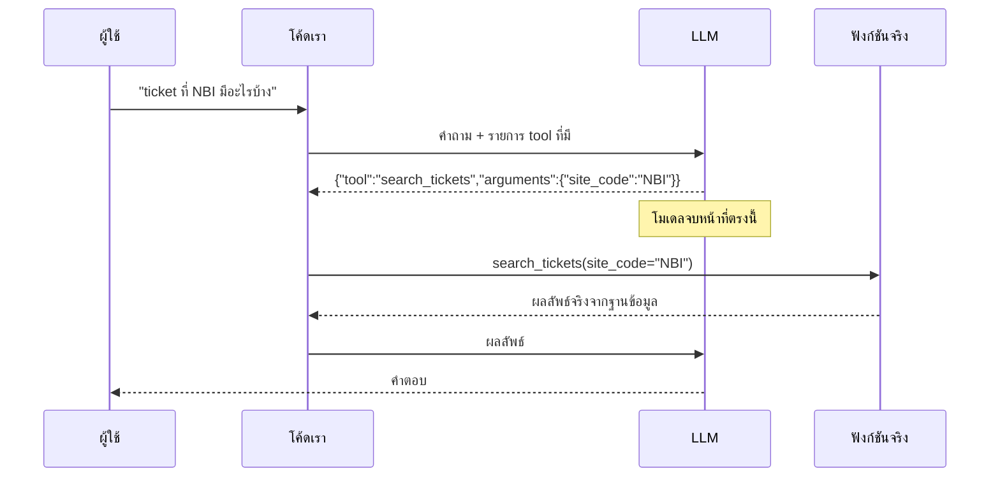
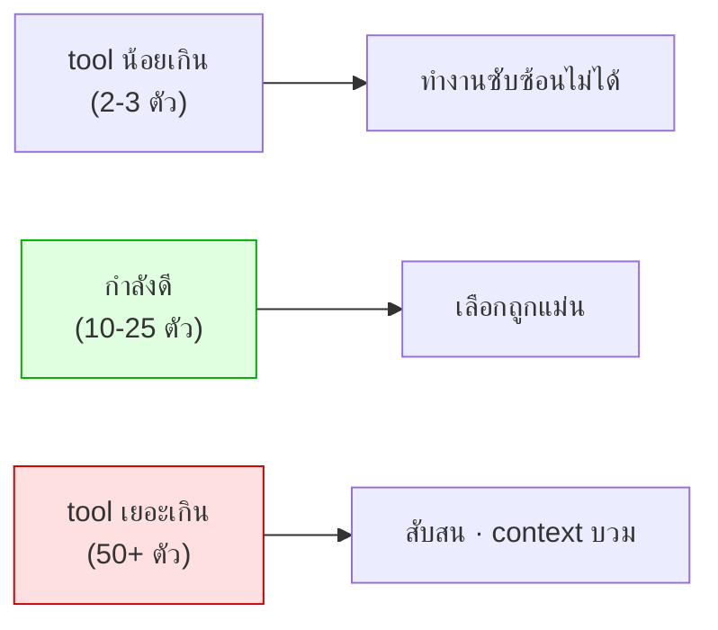

# Module 5 · Function Calling & Tool Definition

**10:45 – 11:35** · เป้าหมาย: เข้าใจกลไกจริงของ function calling และเขียน tool description ที่โมเดลใช้ถูก

---

## 1. ความเข้าใจผิดที่ต้องแก้ก่อน

> **LLM ไม่ได้รันโค้ด**

สิ่งที่โมเดลทำคือ *เลือกชื่อฟังก์ชันและกรอก argument* เป็นข้อความ ที่เหลือเป็นหน้าที่โค้ดเราทั้งหมด



**ผลที่ตามมาซึ่งสำคัญมาก**: ทุกอย่างที่เกิดขึ้นจริงผ่านโค้ดเราเสมอ ดังนั้น**เราคือคนควบคุมความปลอดภัย ไม่ใช่โมเดล** (โยงไป Module 8)

---

## 2. เมื่อโมเดลไม่มี native tool API

Gemma ไม่มี function-calling API ในตัว แต่ไม่เป็นอุปสรรค เพราะ tool call = JSON

| แบบ | ที่มาของ JSON |
|---|---|
| Native tool API | โมเดลคืน `tool_calls` มาให้ |
| **Structured output (ที่ใช้)** | บังคับ schema แล้ว parse เอง |

ทั้งสองแบบ **โค้ดเราเป็นคนเรียกฟังก์ชันเหมือนกัน** ต่างแค่รูปแบบที่ JSON เดินทางมา

---

## 3. Tool Description คือ prompt ที่สำคัญที่สุดในระบบ

โมเดลเลือก tool จาก description อย่างเดียว ไม่ได้เห็นโค้ดข้างใน

### กฎข้อที่ 1 — บอกว่า "เมื่อไหร่ห้ามใช้"

โมเดลเลือกผิดเพราะ **ขาดข้อห้าม** มากกว่าเพราะคำอธิบายไม่ชัด

❌ **แย่**
```
search_tickets: ค้นหา ticket ในระบบ
search_logs: ค้นหา log ในระบบ
```
คำถาม *"อุปกรณ์นี้มีปัญหาอะไร"* → เดาสุ่ม เพราะทั้งคู่ฟังดูใช้ได้

✅ **ดี**
```
search_tickets: ใช้เพื่อรู้ว่ามีอะไรถูก "แจ้ง" เข้ามาบ้าง
  อย่าใช้เพื่อดูว่าอุปกรณ์กำลังทำอะไรอยู่ เพราะปัญหาจำนวนมากไม่มีใครแจ้งเลย
  ถ้าต้องการพฤติกรรมจริงของอุปกรณ์ ให้ใช้ search_logs
```

### กฎข้อที่ 2 — บอกว่า "คืนอะไร" ไม่ใช่ "ทำงานอย่างไร"

โมเดลไม่ต้องรู้ว่าใช้ HNSW หรือ aggregation แบบไหน แต่ต้องรู้ว่าจะได้อะไรกลับมาเพื่อวางแผนขั้นถัดไป

### กฎข้อที่ 3 — ฝังความรู้เชิงปฏิบัติลงไป

`search_logs` มีประโยคนี้:
> *"log ที่ดูรุนแรงไม่ได้แปลว่าเป็นเหตุเสีย งาน maintenance สร้าง log ที่หน้าตาเหมือนกันทุกประการ ตรวจ ticket ประเภท maintenance ก่อน"*

**ประโยคเดียวป้องกันข้อผิดพลาดที่อันตรายที่สุดของ scenario S4** ถูกกว่าการเพิ่ม tool ใหม่มาก

### กฎข้อที่ 4 — งานที่เขียนเป็นโค้ดได้แน่นอน อย่าให้โมเดลทำ

`get_upstream_devices` ไม่ได้คืนแค่ path แต่ **คำนวณจุดร่วมให้เลย** พร้อมฟิลด์ `interpretation`

ถ้าคืน raw path โมเดลต้องหา intersection เอง ซึ่งพลาดบ่อย

---

## 4. ออกแบบ argument ให้พลาดยาก

| หลักการ | ตัวอย่างในโปรเจกต์นี้ |
|---|---|
| ใช้ enum แทน string อิสระ | `severity: critical\|error\|warning\|notice\|info` |
| **ห้ามรับวันที่ absolute** | รับแค่ `last_24h`, `last_7d`, ... |
| มี default ที่สมเหตุสมผล | `range="last_24h"`, `limit=20` |
| จำกัดค่าที่รับได้ | `limit` ถูก clamp ด้วย `clamp_limit()` |

> **ทำไมห้ามวันที่ absolute** — โมเดลไม่รู้ว่าวันนี้วันที่เท่าไหร่
> ทุกวันที่ที่มันคิดขึ้นเอง คือวันที่ที่มันมีโอกาสคิดผิด

---

## 5. Tool Annotations (MCP spec รุ่นใหม่)

| Annotation | ความหมาย | ค่าที่ใช้ |
|---|---|---|
| `readOnlyHint` | ไม่แก้ไขอะไร | `true` ทุกตัว ยกเว้น `generate_report` |
| `destructiveHint` | ลบหรือทับข้อมูล | `false` ทั้งหมด |
| `idempotentHint` | เรียกซ้ำได้ผลเดิม | `true` เกือบทั้งหมด |
| `openWorldHint` | แตะระบบภายนอก | `false` ทั้งหมด |

Client อย่าง Claude Desktop ใช้ค่าเหล่านี้ตัดสินใจว่าต้องถามผู้ใช้ก่อนเรียกไหม

---

## 6. จำนวน tool ที่เหมาะสม



ระบบนี้มี 19 tools อยู่ในช่วงที่ดี

ถ้าจำเป็นต้องมีมากกว่านั้น ค่อยพิจารณา routing แบบ multi-agent (Module 6)

---

## 7. ต่อไป

→ [โจทย์ที่ 3: Tool Description Battle](challenge3-tool-description-battle.md)
