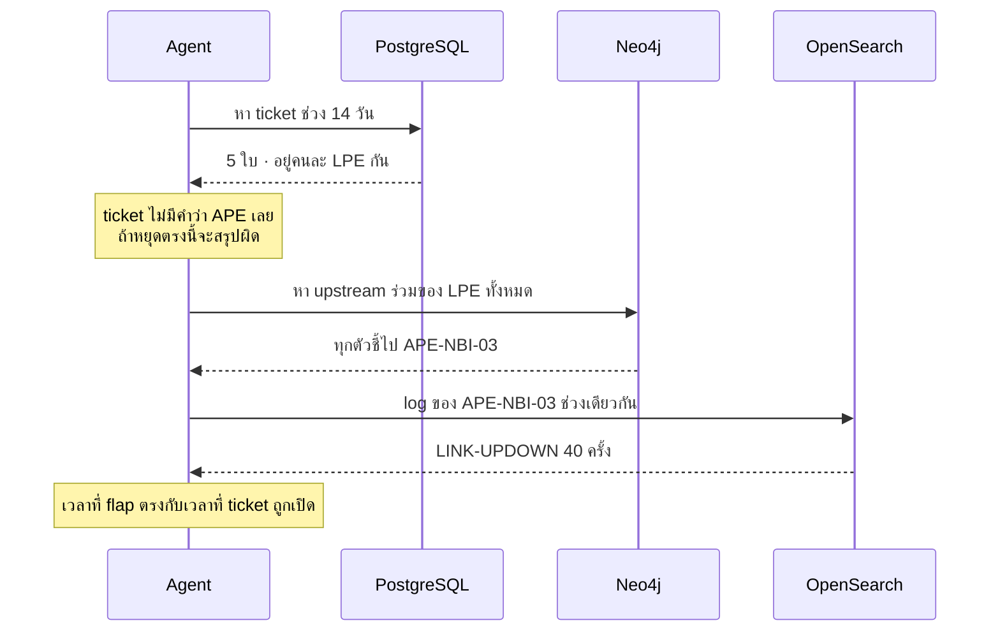

# โจทย์ที่ 6 · Cross-Service Diagnosis

**15:00 – 15:30** (30 นาที) · **โจทย์ใหญ่ที่สุดของทั้งหลักสูตร**

---

## เป้าหมายการเรียนรู้

รวมทุกอย่างจาก 3 วันเข้าด้วยกัน แล้วพิสูจน์ว่าระบบตอบคำถามที่ **ต้องใช้ทั้ง 3 ฐานข้อมูลถึงจะตอบได้** ได้จริง

---

## โจทย์หลัก

> *"ทำไมช่วงสองสัปดาห์นี้ถึงมีลูกค้าแจ้งเน็ตหลุดซ้ำๆ หลายราย"*

**สังเกตว่าคำถามไม่บอกอะไรเลย** — ไม่บอกพื้นที่ ไม่บอกอุปกรณ์ ไม่บอกว่าให้ดูที่ไหน
ระบบต้องค้นพบเองทั้งหมด

---

## สิ่งที่ระบบต้องทำได้

---

## สิ่งที่ต้องส่ง (5 อย่าง)

### 1. Plan ที่ระบบคิดเอง (JSON)

ต้องเห็น `depends_on` ที่ถูกต้อง — ขั้น Neo4j ต้องรอผลจากขั้น PostgreSQL

### 2. ผลจากแต่ละระบบแยกกัน

| ระบบ | ได้อะไรมา |
|---|---|
| PostgreSQL | ticket กี่ใบ อุปกรณ์อะไรบ้าง |
| Neo4j | จุดร่วมคือตัวไหน |
| OpenSearch | log อะไร กี่ครั้ง ช่วงไหน |

### 3. คำตอบสุดท้ายพร้อม citation

ทุกข้อสรุปต้องบอกว่ามาจากระบบไหน

### 4. ตัวเลขต้นทุน

token รวม · จำนวนครั้งที่เรียก LLM · จำนวน tool ที่เรียก · เวลารวม

### 5. ทดสอบคำถามอีก 3 ข้อ

| คำถาม | สิ่งที่ต้องได้ |
|---|---|
| *"ถ้าจะปิด APE-NBI-03 ซ่อม กระทบลูกค้ากี่ราย ใครบ้าง"* | จำนวนแยกตาม segment |
| *"log ที่ APE-BKK-05 เมื่อ 3 วันก่อนเป็นเหตุเสียจริงไหม"* | ต้องตอบว่าเป็น **maintenance** พร้อมเลข ticket |
| *"สถานะของ PE-CNX-99 เป็นยังไง"* | ต้องตอบว่า **ไม่พบ** และบอกว่ามีอุปกรณ์อะไรบ้าง |

---

## เกณฑ์ผ่าน

- [ ] Plan ใช้ครบทั้ง 3 ระบบ และมี dependency ที่ถูกต้อง
- [ ] คำตอบมีคำว่า `APE-NBI-03` และคำว่า `flapping` หรือความหมายเดียวกัน
- [ ] ทุกข้อสรุปมี citation
- [ ] คำถามที่ 2: ตอบว่าเป็น maintenance **ไม่ใช่เหตุเสีย**
- [ ] คำถามที่ 3: ตอบว่าไม่พบ **ไม่แต่งข้อมูลขึ้น**
- [ ] รายงานตัวเลขต้นทุนครบ
- [ ] ไม่มี exception ตลอดการทดสอบ

---

## โบนัส

1. **ทำให้ขั้นที่ไม่ขึ้นต่อกันรันขนาน** แล้ววัดว่าเวลาลดลงกี่เปอร์เซ็นต์
2. **เทียบกับ Claude Desktop** — ถามคำถามเดียวกันผ่าน Claude Desktop เทียบแผนและคำตอบ ต่างกันอย่างไรและทำไม
3. **ทดสอบความคงเส้นคงวา** — รันคำถามเดิม 5 ครั้ง ได้คำตอบเหมือนกันไหม ถ้าไม่ ปรับ temperature เท่าไหร่ถึงคงที่
4. **หาคำถามที่ระบบยังตอบไม่ได้** — แล้ววิเคราะห์ว่าขาด tool อะไร หรือขาดข้อมูลอะไร

---

Hint

- ถ้าระบบหยุดที่ ticket แล้วสรุปว่าเป็นปัญหาฝั่งลูกค้า แสดงว่า planner ยังไม่รู้ว่าต้องหา upstream — เพิ่มความรู้นี้ลงใน system prompt ของ planner (ดู `SYSTEM_PROMPT` ใน `planner.py`)
- ถ้าคำถามที่ 2 ตอบว่าเป็นเหตุเสีย แสดงว่า description ของ `search_logs` ยังไม่ได้เตือนเรื่อง maintenance
- ถ้าคำถามที่ 3 แต่งข้อมูล ให้เพิ่ม `list_devices` เข้าไปในแผนก่อน แล้วบังคับใน system prompt ว่าอุปกรณ์ที่ไม่อยู่ในรายการคือไม่มีอยู่จริง

---

## สิ่งที่ต้องส่ง

Plan JSON + ผลแต่ละระบบ + คำตอบพร้อม citation + ตัวเลขต้นทุน + ผลคำถามอีก 3 ข้อ
