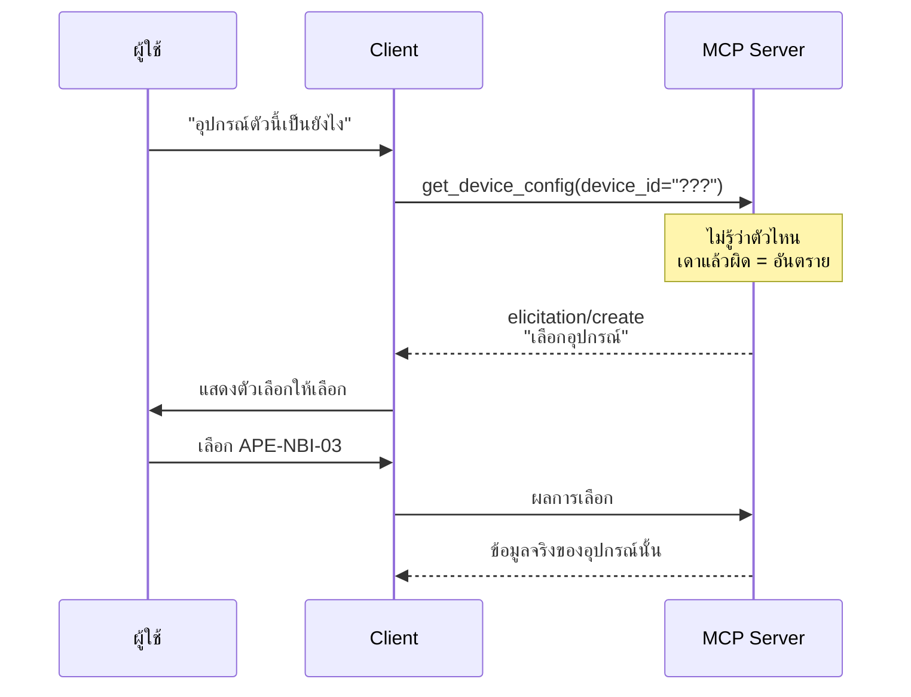

# Lab · Elicitation — เมื่อ Server ถามผู้ใช้กลับ

**20 นาที** · ฟีเจอร์ใหม่ของ MCP spec 2025-06-18

---

## เป้าหมาย

เห็นว่า MCP ไม่ใช่แค่ท่อดึงข้อมูลทางเดียว แต่เป็นโปรโตคอลสองทาง

---

## ปัญหาที่แก้



**ก่อนมี elicitation**: server ต้องคืน error แล้วหวังว่า client จะถามผู้ใช้ให้
**มี elicitation**: server ขอข้อมูลได้โดยตรง ระหว่างที่ tool กำลังทำงาน

---

## เชื่อมกับคำถามหมวด L5

คำถามใน `data/questions/L5-ambiguous.yaml` ทั้ง 4 ข้อคือกรณีที่ต้องถามกลับ

ที่ผ่านมาเราจัดการที่ฝั่ง agent (`intent.py` label `needs_clarification`) — **ซึ่งใช้ได้ แต่จำกัดอยู่แค่แอปของเรา**

Elicitation ทำให้พฤติกรรมเดียวกันนี้ทำงานได้ใน Claude Desktop และ Cursor ด้วย โดยไม่ต้องเขียนเพิ่ม

---

## สิ่งที่ต้องทำ

เพิ่ม tool ที่ถามกลับเมื่อข้อมูลไม่พอ: เพิ่มที่ apps/mcp-server/tools/network.py แล้วทดสอบที่ apps/mcp-server/server.py

```python
def register(mcp) -> None:

    # ... (เครื่องมือตัวอื่นๆ ที่มีอยู่เดิม) ...

    @mcp.tool()
    async def inspect_device(ctx: Context, device_id: str | None = None) -> dict:
        """ตรวจสอบอุปกรณ์ ถ้าไม่ระบุจะถามผู้ใช้ให้เลือก"""
        if not device_id:
            # ดึงรายชื่ออุปกรณ์จาก Neo4j แทน
            rows = neo4j_query("MATCH (d:Device) RETURN d.device_id AS device_id ORDER BY device_id")
            devices = [r["device_id"] for r in rows]
            
            result = await ctx.elicit(
                message="ต้องการตรวจสอบอุปกรณ์ตัวไหน",
                schema={
                    "type": "object",
                    "properties": {"device_id": {"type": "string", "enum": devices}},
                    "required": ["device_id"]
                },
            )
            if result.action != "accept":
                return {"cancelled": True}
            device_id = result.content["device_id"]
            
        # ค้นหารายละเอียดอุปกรณ์
        detail = neo4j_query(
            "MATCH (d:Device {device_id: $id}) RETURN d.device_id AS device_id, d.role AS role",
            id=device_id
        )
        return detail[0] if detail else {"found": False, "device_id": device_id}
```

---

## ทดสอบ

1. ผ่าน MCP Inspector — จะเห็น request `elicitation/create`
2. ผ่าน Claude Desktop — จะเห็น UI ให้เลือกจริง

---

## ข้อควรระวัง

| ประเด็น | เหตุผล |
|---|---|
| **ไม่ใช่ทุก client รองรับ** | ต้องมี fallback เมื่อ client ไม่รองรับ |
| อย่าถามบ่อยเกินไป | ถามทุกครั้งจะน่ารำคาญกว่าเดาแล้วผิดบางครั้ง |
| **ห้ามขอข้อมูลอ่อนไหว** | spec ระบุชัดว่าห้ามใช้ elicitation ขอรหัสผ่านหรือความลับ |
| ต้องรองรับการปฏิเสธ | ผู้ใช้กด cancel ได้เสมอ |

---

## เกณฑ์ผ่าน

- [ ] tool ถามกลับได้เมื่อข้อมูลไม่พอ
- [ ] มี enum ให้เลือก ไม่ใช่ช่องเปล่า
- [ ] รองรับกรณีผู้ใช้ยกเลิก
- [ ] มี fallback เมื่อ client ไม่รองรับ elicitation
