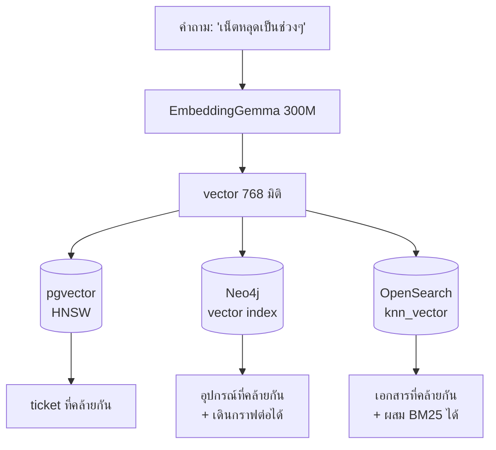

# Lab 5 · เทียบ Vector Store ทั้ง 3 ตัว

**15 นาที** · แทรกในช่วง Workshop 3 หรือช่วงสรุป

---

## เป้าหมาย

เข้าใจว่าทำไม production เลือก OpenSearch เก็บ vector ทั้งที่ pgvector ก็ทำได้

---

## คำถามเดียว 3 ที่

```bash
uv run scripts/compare_vector_stores.py     
```

สคริปต์ยิงคำถามเดียวกันไปทั้ง 3 ระบบแล้วเทียบผล



---

## ตารางเปรียบเทียบ

| | pgvector | Neo4j vector | OpenSearch knn |
|---|---|---|---|
| **จุดแข็งที่ตัวอื่นไม่มี** | กรอง relational + vector ใน query เดียว | **เจอด้วยความหมายแล้วเดินกราฟต่อทันที** | ผสม BM25 + vector · ทน scale |
| ประเภท index | HNSW | HNSW | HNSW (Lucene/FAISS/nmslib) |
| กรองก่อน/หลัง | pre-filter ได้ดี | ทำผ่าน Cypher | post-filter เป็นหลัก |
| ขนาดที่เหมาะ | ล้านแถวต้นๆ | หลักแสน | **สิบล้านขึ้นไป** |
| แยก scale จากฐานหลัก | ไม่ได้ | ไม่ได้ | **ได้** |
| ใน production ของ NT | config + ticket | topology | **vector หลัก** |

---

## ตัวอย่างที่ Neo4j ทำได้คนเดียว
```cypher
:param vec => [i in range(1, 1536) | 0.1]
```
```cypher
CALL db.index.vector.queryNodes('device_embedding', 3, $vec)
YIELD node, score
OPTIONAL MATCH (node)<-[:UPLINK_TO]-(down:Device)
RETURN node.device_id AS id, score, collect(down.device_id) AS downstream
```

*"หาอุปกรณ์ที่ทำหน้าที่รวบรวม traffic แล้วบอกว่ามีอะไรอยู่ใต้มัน"* — จบใน query เดียว
ระบบอื่นต้องยิง 2 รอบและเชื่อมผลเอง

---

## ทำไม production เลือก OpenSearch

| เหตุผล | รายละเอียด |
|---|---|
| ปริมาณ | 29 GB/วัน มี OpenSearch อยู่แล้วสำหรับ log |
| Hybrid search | ผสม BM25 กับ vector ได้ — สำคัญมากเพราะรหัสอุปกรณ์ต้องการ exact match แต่คำบรรยายอาการต้องการ semantic |
| แยก scale | เพิ่ม node ได้โดยไม่แตะฐานข้อมูลหลัก |
| ILM | จัดการวงจรชีวิตข้อมูลได้ในตัว |

> **แต่ pgvector ยังมีที่ของมัน** — long-term memory ของ agent เก็บใน pgvector เพราะข้อมูลน้อยและต้อง join กับตารางอื่น

---

## สิ่งที่ต้องรายงาน

- [ ] ผลอันดับต้นของทั้ง 3 ระบบ ตรงกันหรือไม่
- [ ] เวลาที่ใช้ของแต่ละระบบ
- [ ] เขียนได้ว่าถ้าเลือกได้แค่ตัวเดียวจะเลือกอะไร เพราะอะไร
