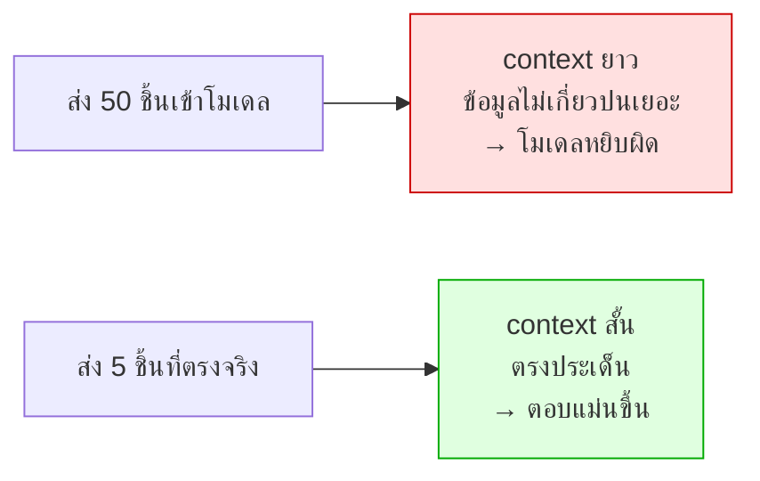

# Lab 6 · Retrieve → Rerank → Generate

**20 นาที**

---

## เป้าหมาย

เข้าใจว่าทำไม production ถึงมี rerank คั่นกลาง และวัดผลว่าช่วยจริงแค่ไหน

---

## Pipeline ของ production


---

## ทำไมต้องมีตัวที่สอง ทั้งที่ embedding ก็จัดอันดับให้แล้ว

| | Bi-encoder (embedding) | Cross-encoder (rerank) |
|---|---|---|
| วิธีทำงาน | เข้ารหัสคำถามกับเอกสาร**แยกกัน** แล้วเทียบ vector | **อ่านทั้งคู่พร้อมกัน** แล้วให้คะแนน |
| ความแม่น | ปานกลาง | **สูง** |
| ความเร็ว | เร็วมาก (ทำ index ล่วงหน้าได้) | ช้า (ต้องคำนวณทุกคู่) |
| ใช้กับ | ค้นจากทั้งคลัง | จัดอันดับผู้เข้ารอบ |

**Bi-encoder ไม่เคยเห็นคำถามกับเอกสารพร้อมกัน** จึงพลาดความสัมพันธ์ที่ต้องอ่านทั้งคู่ถึงจะเห็น

การใช้ทั้งคู่ต่อกันจึงได้ทั้งความเร็วและความแม่น

---

## ผลต่อ Hallucination



> **ส่งข้อมูลน้อยแต่ตรง ดีกว่าส่งเยอะ** — ข้อมูลที่ไม่เกี่ยวข้องไม่ได้เฉยๆ แต่ทำให้โมเดลเข้าใจผิดได้
> เชื่อมกลับ Module 2 เรื่อง content dilution

---

## สิ่งที่ต้องทำ

### 1. เปิด rerank service

```bash
docker compose -f docker/docker-compose.yml --profile llm up -d infinity
```

### 2. ต่อเข้ากับ `search_docs_semantic` apps/mcp-server/tools/logs.py ประมาณบรรทัดที่ 190

```python
@mcp.tool(
        annotations={"title": "Search runbooks and configs by meaning",
                     "readOnlyHint": True, "idempotentHint": True, "openWorldHint": False}
    )
    async def search_docs_semantic(query: str, limit: int = 5,
                                   source_type: str | None = None) -> dict:
        """Search operational documentation by meaning: runbooks and device configs.

        Use for "how do we normally handle this", "has this been documented",
        and for procedure lookups. The documents are written by engineers, so
        ask in terms of the technical symptom rather than the customer wording.

        Do NOT use this to find out what happened - that is search_logs. This
        tool returns knowledge, not events.

        Args:
            query: natural language description of the problem or procedure
            limit: how many chunks to return
            source_type: runbook | config
        """
        limit = guardrails.clamp_limit(limit, "search_docs_semantic", ceiling=20)
        index = settings().doc_index
        vector = embed_query(query)

        filters = [{"term": {"source_type": source_type}}] if source_type else []

        # 1. กำหนดขนาดการดึงข้อมูลแบบกว้าง (Retrieve widely: 50 รายการ)
        retrieval_limit = 50

        if vector is None:
            body = {
                "size": retrieval_limit,
                "query": {"bool": {"must": [{"match": {"content": query}}],
                                   "filter": filters}},
            }
            response = opensearch().search(index=index, body=body)
            passages = [
                {
                    "title": h["_source"]["title"],
                    "source_type": h["_source"].get("source_type"),
                    "device_id": h["_source"].get("device_id"),
                    "content": h["_source"]["content"],
                    "score": h["_score"]
                }
                for h in response["hits"]["hits"]
            ]
        else:
            knn: dict = {"embedding": {"vector": vector, "k": retrieval_limit}}
            if filters:
                knn["embedding"]["filter"] = {"bool": {"filter": filters}}
            response = opensearch().search(
                index=index, body={"size": retrieval_limit, "query": {"knn": knn}}
            )
            hits = response["hits"]["hits"]
            if not hits:
                return {"method": "vector", "results": [],
                        "note": "ยังไม่มี embedding ใน network-docs ให้รัน make reseed"}

            passages = [
                {
                    "title": h["_source"]["title"],
                    "source_type": h["_source"].get("source_type"),
                    "device_id": h["_source"].get("device_id"),
                    "content": h["_source"]["content"],
                    "score": h["_score"],
                }
                for h in hits
            ]

        # 2. ส่งเข้าฟังก์ชัน rerank เพื่อจัดอันดับใหม่และคัดให้เหลือจำนวนเท่ากับ limit
        top = await rerank(query, passages, top_k=limit)

        return guardrails.redact_deep({
            "method": "semantic_reranked",
            "results": top,
        })
```

### 3. วัดผล

รันคำถามชุดเดียวกัน 2 แบบ:

| | ไม่ rerank (top 5 จาก embedding) | มี rerank (50 → 5) |
|---|---|---|
| เอกสารที่ถูกต้องติดอันดับ 1 | | |
| เอกสารที่ถูกต้องอยู่ใน 5 อันดับแรก | | |
| token ที่ส่งเข้าโมเดลหลัก | | |
| เวลารวม | | |
| คำตอบถูกต้องไหม | | |

ใช้คำถาม **Q14** และ **Q17** จาก `data/questions/`

---

## เกณฑ์ผ่าน

- [ ] เรียก rerank service ได้
- [ ] ตารางเปรียบเทียบครบ
- [ ] อธิบายได้ว่า rerank ช่วยหรือไม่ช่วยในเคสไหน
- [ ] ระบบยังทำงานได้เมื่อ rerank service ล่ม (degrade เป็นลำดับเดิม)

---

## โบนัส

1. ลอง `RETRIEVE_TOP_K` ที่ 20 / 50 / 100 — ดึงกว้างขึ้นช่วยเสมอไหม
2. ทำ hybrid: ผสมคะแนน BM25 กับ vector ก่อน rerank
