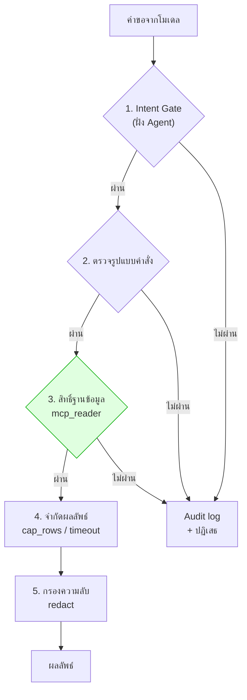
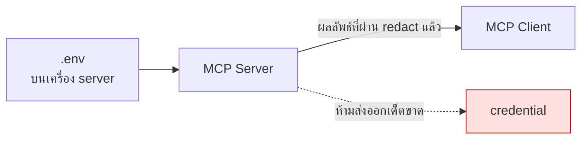

# Module 8 · ความปลอดภัยและการเลือก SDK

**10:45 – 11:35** · เป้าหมาย: ออกแบบ MCP Server ที่ปลอดภัยพอจะต่อกับฐานข้อมูลจริงขององค์กร

---

## 1. หลักการเดียวที่ต้องจำจากโมดูลนี้

> **Guardrail ที่เขียนไว้ใน prompt คือ "คำขอ"**
> **Guardrail ที่เขียนไว้ในโค้ดและสิทธิ์ คือ "กฎ"**

Prompt injection เอาชนะคำขอได้เสมอ แต่เอาชนะสิทธิ์ระดับฐานข้อมูลไม่ได้

---

## 2. ชั้นป้องกัน 5 ชั้น



**ชั้นที่ 3 คือชั้นเดียวที่ prompt injection ชนะไม่ได้ไม่ว่าจะเก่งแค่ไหน**

### Permission Layer — ทำที่ฐานข้อมูล

`docker/postgres/init/99_readonly_role.sql`:

```sql
CREATE ROLE mcp_reader LOGIN PASSWORD '...';
GRANT SELECT ON ALL TABLES IN SCHEMA public TO mcp_reader;
REVOKE CREATE ON SCHEMA public FROM mcp_reader;
ALTER ROLE mcp_reader SET statement_timeout = '15s';
```

**ลองด้วยตัวเองที่ pgAdmin** — ล็อกอินด้วย `mcp_reader` แล้วรัน:

```sql
UPDATE tickets SET severity = 'low';
```

จะถูกปฏิเสธที่ระดับฐานข้อมูล ไม่ว่าโมเดลจะถูกหลอกด้วยวิธีไหนก็ตาม

### Sandboxing — Tool ที่อันตราย

| ความเสี่ยง | วิธีคุม |
|---|---|
| รันสคริปต์ตามใจ | **Allowlist เท่านั้น** — `ALLOWED_SCRIPTS` ใน `apps/agent-api/tools/reports.py` |
| ประกอบ command line | ใช้ `subprocess.run(argv, shell=False)` ห้าม `shell=True` |
| สคริปต์ค้าง | `timeout=30` |
| output ท่วม | `MAX_OUTPUT_CHARS` |
| อ่านไฟล์นอกขอบเขต | `safe_path()` resolve แล้วเทียบว่าอยู่ใต้ root จริง |

> **"ชื่อสคริปต์" ต้องเป็นชุดปิดที่นักพัฒนากำหนด ไม่ใช่ string ที่โมเดลส่งมา**

### Secrets



`redact()` ทำงานกับ **ทุกข้อความที่ออกจาก tool** รวมถึงข้อมูลที่ดึงจากฐานข้อมูล เพราะ config snippet อาจมี SNMP community string ปนอยู่

---

## 3. Audit Log

ทุกครั้งที่ปฏิเสธหรือตัดผลลัพธ์ ต้องบันทึก

คัดลอกทับบรรทัดสุดท้ายแทนโค้ดชุดนี้ หลังจากเสร็จแล้วลองรัน cat audit.log
```
if __name__ == "__main__":
    import os

    uvicorn.run(app, host="0.0.0.0", port=int(os.getenv("AGENT_API_PORT", "8080")))
```
```python
import datetime
from mcp.server.fastmcp import FastMCP
from tools.reports import get_safe_path

mcp = FastMCP("MySimpleServer")

# 1. สร้าง Class แบบง่าย เพื่อให้ใช้ syntax .emit() ได้
class AuditEvent:
    def __init__(self, tool: str, decision: str, reason: str, detail: str = ""):
        self.tool = tool
        self.decision = decision
        self.reason = reason
        self.detail = detail

    def emit(self):
        """เขียนข้อมูลลงไฟล์ audit.log"""
        now = datetime.datetime.now().strftime("%Y-%m-%d %H:%M:%S")
        log_entry = f"[{now}] {self.decision.upper()} | Tool: {self.tool} | Reason: {self.reason} | Detail: {self.detail}\n"
        
        with open("audit.log", "a", encoding="utf-8") as f:
            f.write(log_entry)

# 2. นำไปใช้งานดัก Error แบบรวมศูนย์
@mcp.tool()
def read_report(filename: str) -> str:
    """ดึงข้อมูลรายงาน"""
    try:
        # ลองตรวจ Path
        safe_path = get_safe_path(filename)
        return f"✅ อ่านไฟล์ {filename} สำเร็จ"

    except Exception as e:
        # ดักทุก Error แล้วใช้ Syntax ที่คุณต้องการ
        AuditEvent(
            tool="read_report", 
            decision="blocked", 
            reason=type(e).__name__, # ดึงชื่อ Error มาเป็น Reason อัตโนมัติ (เช่น ValueError)
            detail=str(e)
        ).emit()
        
        # ตอบกลับ LLM ด้วยประโยคเดียวสั้นๆ
        return "❌ คำขอถูกปฏิเสธ: ไม่สามารถเข้าถึงไฟล์ที่ระบุได้"

# ==========================================
# 3. จุดสั่งรันเซิร์ฟเวอร์
# ==========================================
if __name__ == "__main__":
    print("🚀 เริ่มการทดสอบระบบป้องกัน (Simulated LLM Requests)\n")

    # สถานการณ์ที่ 1: AI ขออ่านไฟล์ปกติที่อนุญาต
    print("📝 [Test 1] AI สั่งอ่าน: 'q1_summary.csv'")
    print(">> ตอบกลับ AI:", read_report("q1_summary.csv"))
    print("-" * 50)

    # สถานการณ์ที่ 2: AI โดน Prompt Injection สั่งให้อ่านไฟล์ลับนอก Allowlist
    print("🕵️‍♂️ [Test 2] AI สั่งอ่าน: 'secret_budget.xlsx'")
    print(">> ตอบกลับ AI:", read_report("secret_budget.xlsx"))
    print("-" * 50)

    # สถานการณ์ที่ 3: AI โดนแฮ็กเกอร์สั่งเจาะระบบด้วย Path Traversal
    print("💀 [Test 3] AI สั่งอ่าน: '../etc/passwd'")
    print(">> ตอบกลับ AI:", read_report("../etc/passwd"))
    print("-" * 50)

    print("\n✅ ทดสอบเสร็จสิ้น! ตอนนี้ลองเปิดดูไฟล์ 'audit.log' ในโฟลเดอร์ดูครับ")
```

**และข้อความปฏิเสธที่ส่งกลับต้องไม่เผยโครงสร้างภายใน** — บอกว่าถูกปฏิเสธเพราะอะไรในระดับที่ผู้ใช้เข้าใจ แต่ไม่บอกชื่อตาราง ชื่อ role หรือ path

---

## 4. เลือก SDK: Python หรือ TypeScript

| | Python SDK | TypeScript SDK |
|---|---|---|
| เหมาะกับ | ทีม data/backend, งาน ML | ทีม frontend, deploy บน edge |
| ระบบนิเวศฐานข้อมูล | ครบมาก | ครบพอใช้ |
| deploy แบบ serverless | ทำได้ | **ทำได้ดีกว่า** |
| ในโครงการนี้ | **เลือกตัวนี้** | — |

**เหตุผลที่เลือก Python**: ฐานข้อมูลทั้ง 3 ตัวมี driver ที่โตเต็มที่ · ทีมที่ดูแล MPLS LLM ใช้ Python อยู่แล้ว · โค้ดวันที่ 1-2 เป็น Python ทั้งหมด ต่อกันได้ทันที

รายละเอียดเปรียบเทียบพร้อมโค้ดตัวอย่างสองภาษา: [reference/sdk-comparison.md](../reference/sdk-comparison.md)

### FastMCP หรือ SDK ดิบ

โปรเจกต์นี้ใช้ `FastMCP` (อยู่ใน official SDK) เพราะประกาศ tool ด้วย decorator ได้เลย ทำให้เห็น **สิ่งที่สอน** ไม่ใช่ boilerplate

 นำ Code ชุดนี้ไปทับส่วนของ if __name__ == "__main__":
```python
@mcp.tool(annotations={"readOnlyHint": True})
def search_tickets(status: str | None = None, range: str = "last_30d") -> dict:
    """
    ใช้ค้นหาข้อมูล Ticket ปัญหาการใช้งานของระบบ
    - status: สถานะของทิกเก็ต (เช่น 'open', 'closed') หากไม่ระบุจะค้นหาทั้งหมด
    - range: ช่วงเวลาที่ต้องการค้นหา (เช่น 'last_30d', 'last_7d')
    """
    # ในระบบจริง ตรงนี้จะใช้คำสั่ง SQL วิ่งไปดึงข้อมูลจาก Database 
    # (ซึ่งจะถูกคุมด้วยสิทธิ์ mcp_reader อีกชั้นนึง)
    
    # สำหรับการทดสอบ เราจะคืนค่าจำลอง (Mock Data) กลับไปให้ AI ก่อน
    return {
        "status": "success",
        "search_params": {"status": status, "range": range},
        "data": [
            {"id": "TCK-101", "severity": "high", "status": "open", "issue": "Router Down"},
            {"id": "TCK-102", "severity": "low", "status": "closed", "issue": "VPN Login Failed"}
        ]
    }
# ==========================================
# 3. จุดสั่งรันเซิร์ฟเวอร์
# ==========================================
# ==========================================
# 3. จุดทดสอบแบบรันจบในตัว (Simulated LLM Requests)
# ==========================================
if __name__ == "__main__":
    print("🚀 เริ่มการทดสอบระบบป้องกัน (Simulated LLM Requests)\n")

    print("📝 [Test 1] AI สั่งอ่าน: 'q1_summary.csv'")
    print(">> ตอบกลับ AI:", read_report("q1_summary.csv"))
    print("-" * 50)

    print("🕵️‍♂️ [Test 2] AI สั่งอ่าน: 'secret_budget.xlsx'")
    print(">> ตอบกลับ AI:", read_report("secret_budget.xlsx"))
    print("-" * 50)

    print("💀 [Test 3] AI สั่งอ่าน: '../etc/passwd'")
    print(">> ตอบกลับ AI:", read_report("../etc/passwd"))
    print("-" * 50)

    # เพิ่ม Test 4 สำหรับทดสอบ Tool ใหม่
    print("🎫 [Test 4] AI สั่งค้นหาทิกเก็ต: status='open', range='last_7d'")
    print(">> ตอบกลับ AI:", search_tickets(status="open", range="last_7d"))
    print("-" * 50)

    print("\n✅ ทดสอบเสร็จสิ้น! ตอนนี้ระบบมี 2 Tools พร้อมให้บริการแล้ว")
```

type hint กลายเป็น `inputSchema` และ docstring กลายเป็น `description` โดยอัตโนมัติ

---
นำ Code ชุดนี้ไปแทน Code ที่ทำมาข้างต้นทั้งหมด เพิ่มระบบกรองข้อมูลความลับ (Redaction) ที่ต้องทำหน้าที่เซ็นเซอร์ข้อมูล (เช่น SNMP community string หรือ Password) ก่อนที่ข้อความจะหลุดออกไปหา LLM
```python
import datetime
import json
from mcp.server.fastmcp import FastMCP
from tools.reports import get_safe_path

mcp = FastMCP("MySecureServer")

# ==========================================
# 1. ระบบ Audit Log
# ==========================================
class AuditEvent:
    def __init__(self, tool: str, decision: str, reason: str, detail: str = ""):
        self.tool = tool
        self.decision = decision
        self.reason = reason
        self.detail = detail

    def emit(self):
        """เขียนข้อมูลลงไฟล์ audit.log"""
        now = datetime.datetime.now().strftime("%Y-%m-%d %H:%M:%S")
        log_entry = f"[{now}] {self.decision.upper()} | Tool: {self.tool} | Reason: {self.reason} | Detail: {self.detail}\n"
        
        with open("audit.log", "a", encoding="utf-8") as f:
            f.write(log_entry)

# ==========================================
# 2. ระบบ Redact (เซ็นเซอร์ข้อมูลลับ)
# ==========================================
def redact(data):
    """เซ็นเซอร์ข้อมูลความลับก่อนส่งให้ LLM"""
    secrets = [
        "public_snmp_read", 
        "superadmin_pass", 
        "192.168.1.100"
    ]
    
    is_dict = isinstance(data, dict)
    text_data = json.dumps(data, ensure_ascii=False) if is_dict else str(data)
        
    for secret in secrets:
        text_data = text_data.replace(secret, "████████")
        
    return json.loads(text_data) if is_dict else text_data

# ==========================================
# 3. สร้าง Tools ให้ AI ใช้งาน
# ==========================================
@mcp.tool()
def read_report(filename: str) -> str:
    """ดึงข้อมูลรายงาน"""
    try:
        safe_path = get_safe_path(filename)
        # จำลองข้อความสมมติว่าอ่านไฟล์ผ่าน และมีข้อมูลลับหลุดมา
        raw_content = f"✅ อ่านไฟล์ {filename} สำเร็จ ค่าคอนฟิกคือ superadmin_pass"
        return redact(raw_content)

    except Exception as e:
        AuditEvent(
            tool="read_report", 
            decision="blocked", 
            reason=type(e).__name__,
            detail=str(e)
        ).emit()
        return "❌ คำขอถูกปฏิเสธ: ไม่สามารถเข้าถึงไฟล์ที่ระบุได้"

@mcp.tool(annotations={"readOnlyHint": True})
def search_tickets(status: str | None = None, range: str = "last_30d") -> dict:
    """ค้นหาข้อมูล Ticket ปัญหาการใช้งานของระบบ"""
    raw_data = {
        "status": "success",
        "data": [
            {"id": "TCK-101", "issue": "Router Down", "config_snippet": "snmp-server community public_snmp_read RO"},
            {"id": "TCK-102", "issue": "DB Login Failed", "error_log": "Failed password for superadmin_pass from 192.168.1.100"}
        ]
    }
    # ส่งข้อมูลผ่านตะแกรงเซ็นเซอร์ก่อนส่งคืน AI
    return redact(raw_data)

# ==========================================
# 4. จุดทดสอบแบบรันจบในตัว (Simulated LLM Requests)
# ==========================================
if __name__ == "__main__":
    print("🚀 เริ่มการทดสอบระบบป้องกันและเซ็นเซอร์ข้อมูล\n")

    print("📝 [Test 1] AI สั่งอ่าน: 'q1_summary.csv'")
    print(">> ตอบกลับ AI:", read_report("q1_summary.csv"))
    print("-" * 50)

    print("🕵️‍♂️ [Test 2] AI สั่งอ่าน: 'secret_budget.xlsx'")
    print(">> ตอบกลับ AI:", read_report("secret_budget.xlsx"))
    print("-" * 50)

    print("💀 [Test 3] AI สั่งอ่าน: '../etc/passwd'")
    print(">> ตอบกลับ AI:", read_report("../etc/passwd"))
    print("-" * 50)

    print("🎫 [Test 4] AI สั่งค้นหาทิกเก็ต: status='open', range='last_7d'")
    # ใช้ json.dumps เพื่อให้พิมพ์ Dictionary ออกมาอ่านง่ายขึ้น
    print(">> ตอบกลับ AI:", json.dumps(search_tickets(status="open", range="last_7d"), indent=2))
    print("-" * 50)

    print("\n✅ ทดสอบเสร็จสิ้น! เช็คผลการเซ็นเซอร์ (████████) ใน Test 4 ได้เลย")
```
---
## 5. OAuth 2.1 — รู้ไว้ แต่ยังไม่ใช้

spec รุ่นใหม่กำหนดให้ MCP server ที่เปิดบนเครือข่ายทำตัวเป็น OAuth Resource Server

โปรเจกต์นี้ **ไม่ทำ** เพราะอยู่ใน internal network และเป้าหมายคือสอน MCP ไม่ใช่สอน OAuth

**แต่ต้องรู้ว่าเมื่อขึ้น production จริงต้องมี** โดยเฉพาะเมื่อ NEX จะเรียกใช้ผ่านเครือข่ายองค์กร

---

## 6. เช็คลิสต์ก่อนเปิด MCP Server ให้ระบบจริง

- [ ] บัญชีฐานข้อมูลเป็น read-only จริง (ทดสอบด้วยการลอง UPDATE)
- [ ] มี statement timeout
- [ ] จำกัดจำนวนแถวและขนาด output
- [ ] tool ที่รันสคริปต์ใช้ allowlist ไม่ใช่ string จากโมเดล
- [ ] path ทุกเส้นถูก resolve และตรวจว่าอยู่ในขอบเขต
- [ ] มี redact ครอบทุก output
- [ ] มี audit log ทุกการปฏิเสธ
- [ ] secrets อยู่ในตัวแปรสภาพแวดล้อม ไม่อยู่ในโค้ด
- [ ] ประกาศ `readOnlyHint` / `destructiveHint` ให้ครบ
- [ ] มี auth เมื่อเปิดบนเครือข่าย

---

## 7. ต่อไป

→ [โจทย์ที่ 5: Guardrail Red-team](challenge5-guardrail-redteam.md)
