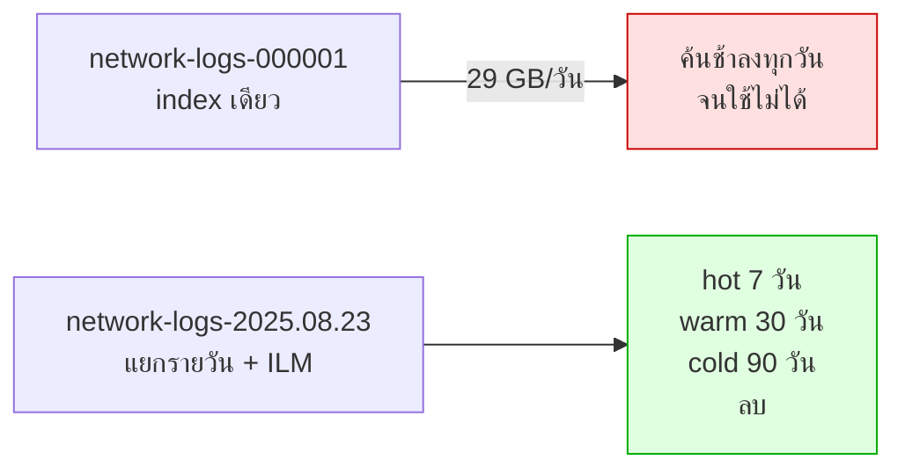

# บันทึกเรื่อง Scale · 10 อุปกรณ์ vs 2,600 อุปกรณ์

**หัวข้อ 15 นาทีในช่วงสรุป** · เป้าหมาย: ไม่ให้ผู้เรียนคิดว่าโค้ดในห้องยกไป production ได้ตรงๆ

---

## 1. ระยะห่างที่ต้องรู้

| | Workshop | Production (NT) | ต่างกัน |
|---|---|---|---|
| อุปกรณ์ | 10 | 2,600+ | 260× |
| Log | 2,000 บรรทัด / 30 วัน | **29 GB / วัน** | ~10,000× |
| พื้นที่ | 2 | ทั่วประเทศ | |
| ผู้ใช้พร้อมกัน | 1-20 | ทั้งศูนย์ NOC | |

---

## 2. สิ่งที่ใช้ไม่ได้เมื่อขึ้น scale

### 2.1 วน health score ทีละอุปกรณ์

```python
# ใช้ได้กับ 10 ตัว · ใช้ไม่ได้กับ 2,600 ตัว
for device in all_devices:
    score = calculate_health_score(device)
```

**ต้องเปลี่ยนเป็น**: pre-compute เป็น batch ทุก 15 นาที เก็บผลไว้ แล้ว tool แค่ไปอ่าน

### 2.2 Log index เดียว



### 2.3 Python script โหลด log

`docker/loader/load_logs.py` อ่านง่ายและสอนได้ดี แต่ไม่ทน 29 GB/วัน

| | สคริปต์ในห้อง | Production |
|---|---|---|
| เครื่องมือ | Python + bulk API | **Filebeat / Fluent Bit** |
| back-pressure | ไม่มี | มี |
| ทน restart | ไม่ | จำตำแหน่งได้ |
| rotation | ไม่รองรับ | รองรับ |

### 2.4 Embed ทุกอย่าง

29 GB/วัน = ประมาณ 30-60 ล้านบรรทัด embed ไม่ไหวและไม่คุ้ม

**หลักการแบ่ง**

| ประเภทข้อมูล | ทำอย่างไร |
|---|---|
| Log | **ไม่ embed** — filter ด้วยเวลา/อุปกรณ์/ระดับ เร็วกว่าและแม่นกว่า |
| Runbook, คู่มือ, config | **embed** — ปริมาณน้อย เปลี่ยนไม่บ่อย ต้องการความหมาย |
| Ticket | **embed เฉพาะ title + สรุป** ไม่ใช่ทุกข้อความในบทสนทนา |

### 2.5 Memory เก็บใน RAM

`SessionMemory` เก็บใน dict ของกระบวนการ — restart แล้วหาย และ scale หลาย instance ไม่ได้

**ต้องเปลี่ยนเป็น**: Redis สำหรับ short-term · pgvector สำหรับ long-term

---

## 3. สิ่งที่ยกไปใช้ได้เลย

| สิ่งที่สร้างในห้อง | ใช้ได้จริงเพราะ |
|---|---|
| โครงสร้าง MCP Server | ไม่ขึ้นกับปริมาณข้อมูล |
| Guardrail ทั้ง 5 ชั้น | ยิ่ง scale ใหญ่ยิ่งสำคัญ |
| Intent Gate | ยิ่งผู้ใช้เยอะยิ่งประหยัดมาก |
| Memory management | ยิ่งจำเป็นเมื่อบทสนทนายาว |
| Plan validation | ป้องกัน query ที่ผิดตั้งแต่ก่อนรัน |
| ชุดคำถามมาตรฐาน | ใช้เป็น regression test ได้ตลอดโครงการ |

---

## 4. เรื่อง GPU ที่ต้องวางแผน

| ประเด็น | ผลกระทบ |
|---|---|
| 27B ต้องการ VRAM มาก | ต้องเป็นเซิร์ฟเวอร์กลาง ไม่ใช่โน้ตบุ๊ก |
| ผู้ใช้พร้อมกันหลายคน | **vLLM ทำ continuous batching ได้ดีกว่า Ollama มาก** |
| context ยาว = VRAM มาก | KV cache โตตาม → รองรับคนพร้อมกันได้น้อยลง |
| GPT-OSS 120B | ต้องการทรัพยากรมากกว่า 27B หลายเท่า ต้องวางแผน GPU ล่วงหน้า |

> เชื่อมกับแผนติดตามผลครั้งที่ 1: การจัดสรร Cloud GPU ควรเริ่มขนานไปกับการอบรม ไม่ใช่รอวันที่ 30

---

## 5. เช็คลิสต์ก่อนขึ้น production

- [ ] ILM policy ของ log index
- [ ] pre-compute health score เป็น batch
- [ ] เปลี่ยนตัวโหลด log เป็น Filebeat / Fluent Bit
- [ ] Redis สำหรับ session memory
- [ ] vLLM แทน Ollama เมื่อมีผู้ใช้พร้อมกันหลายคน
- [ ] OAuth บน MCP Server ที่เปิดบนเครือข่าย
- [ ] Monitoring: latency, tokens/sec, GPU utilisation, อัตราการปฏิเสธของ intent gate
- [ ] เก็บ metric ตั้งแต่วันแรกเพื่อรายงานผลวันที่ 90
