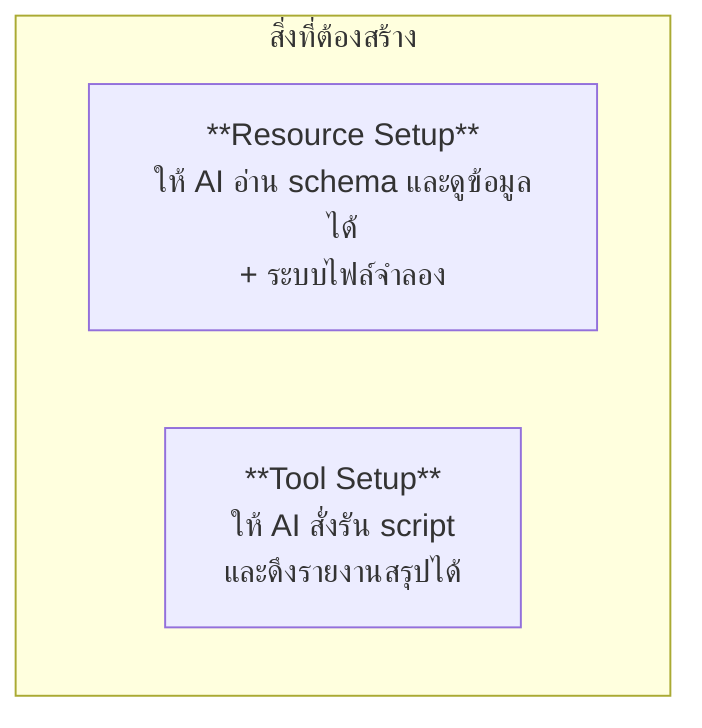

# Workshop 3A · สร้าง MCP Server ของตัวเอง

**13:00 – 14:00** (60 นาที)

---

## โจทย์

สร้าง MCP Server ที่เปิดให้ AI เข้าถึงฐานข้อมูลภายในองค์กรได้อย่างปลอดภัย แบ่งเป็น 2 ส่วนตามหลักสูตร



> **ไม่ต้องเขียนจากศูนย์** — โครงและ tool ตัวอย่าง 1 ตัวมีให้แล้ว
> ที่เหลือมี `# TODO` กำกับไว้ ให้เติมตาม pattern เดิม
> (เขียนจากศูนย์ทั้งหมดไม่ทันใน 2 ชั่วโมง และไม่ได้สอนอะไรเพิ่ม)

---

## ขั้นที่ 1 · รัน server ที่มีอยู่ก่อน (5 นาที)

```bash
uv run python apps/mcp-server/server.py --transport streamable-http --port 9000
```

```bash
npx @modelcontextprotocol/inspector python apps/mcp-server/server.py
```

ทำความเข้าใจโครงสร้างก่อนแก้:

```
apps/mcp-server/
├── server.py              ประกอบทุกอย่างเข้าด้วยกัน
├── config.py              ตั้งค่าจาก environment
├── clock.py               นิยาม "ตอนนี้" จากข้อมูล
├── db.py                  การเชื่อมต่อฐานข้อมูล
├── tools/                 ← เติมงานส่วนใหญ่ที่นี่
├── resources/             ← และที่นี่
├── prompts/
└── security/guardrails.py
```

---

## ขั้นที่ 2 · Resource Setup (20 นาที)

### 2.1 เปิด schema ให้ AI อ่าน

```python
@mcp.resource("schema://postgres")
def postgres_schema() -> str:
    """Tables, columns and comments in the ticket database."""
```

**ต้องมี**: ชื่อตาราง, column, ชนิดข้อมูล, comment, จำนวนแถว

**ทำไมต้องมี comment** — comment ในฐานข้อมูลคือคำอธิบายที่โมเดลใช้ตัดสินใจ ถ้า column ชื่อ `mtu` ไม่มี comment โมเดลอาจไม่รู้ว่ามันสำคัญกับ adjacency

### 2.2 `clock://now`

```python
@mcp.resource("clock://now")
def now() -> str:
    """Current time as this system defines it, plus the data coverage window."""
```

**ทดสอบ**: ถามระบบว่า *"log ปีที่แล้วเป็นยังไง"* — ต้องตอบว่าข้อมูลมีแค่ 30 วัน ไม่ใช่แต่งขึ้น

### 2.3 ระบบไฟล์จำลอง

```python
@mcp.resource("files://index")
@mcp.resource("files://read/{path}")
```

**3 กติกาที่ต้องมี**

| กติกา | ทำอย่างไร |
|---|---|
| root เดียว | `Path(root).resolve()` แล้วเทียบด้วย `is_relative_to()` |
| allowlist นามสกุล | เฉพาะ `.md .txt .cfg .conf .json .yaml` |
| จำกัดขนาด | ตัดที่ 40,000 ตัวอักษรพร้อมบอกว่าตัด |

**ทดสอบว่ากันได้จริง**:
```
files://read/../../.env
files://read/../../../etc/passwd
```

---

## ขั้นที่ 3 · Tool Setup (25 นาที)

### 3.1 Tool ดึงข้อมูล (มีตัวอย่างให้แล้ว)

ดู `tools/tickets.py` → `search_tickets` เป็นแม่แบบ แล้วเติมที่เหลือตาม `# TODO`

### 3.2 Tool รันสคริปต์ — จุดที่อันตรายที่สุด

```python
ALLOWED_SCRIPTS = {
    "open_tickets_summary": {...},
    "device_inventory": {...},
    "weekly_incident_report": {...},
}

@mcp.tool()
def run_report_script(name: str, params: dict | None = None) -> dict:
    guardrails.assert_allowlisted_script(name, set(ALLOWED_SCRIPTS), "run_report_script")
    ...
    subprocess.run(argv, shell=False, timeout=30, capture_output=True)
```

**กฎ 4 ข้อ ห้ามละเมิด**

| กฎ | เหตุผล |
|---|---|
| allowlist เท่านั้น | "ชื่อสคริปต์" ต้องเป็นชุดปิดที่เรากำหนด |
| `shell=False` เสมอ | `shell=True` = เปิดช่องให้ประกอบคำสั่งใหม่ |
| มี timeout | สคริปต์ค้างจะกินทรัพยากรตลอดไป |
| จำกัด output | output ยาวจะท่วม context |

### 3.3 Tool สร้างรายงาน

```python
@mcp.tool(annotations={"readOnlyHint": False, "destructiveHint": False})
def generate_report(title: str, format: str = "markdown", range: str = "last_7d") -> dict:
```

**สังเกต `readOnlyHint: False`** — tool นี้เขียนไฟล์ จึงต้องประกาศตามจริง client อย่าง Claude Desktop ใช้ค่านี้ตัดสินใจว่าต้องขออนุญาตผู้ใช้ก่อนไหม

---

## ขั้นที่ 4 · เพิ่ม Guardrail (10 นาที)

ต้องมีครบทั้ง 5 ชั้นตาม Module 8:

- [ ] ใช้บัญชี `mcp_reader` เท่านั้นในการต่อ PostgreSQL
- [ ] `assert_read_only()` ก่อนส่ง query ทุกครั้ง
- [ ] `cap_rows()` และ `clamp_limit()` กับทุก tool ที่คืน list
- [ ] `redact()` ครอบทุก output
- [ ] `AuditEvent` ทุกครั้งที่ปฏิเสธ

---

## เกณฑ์ผ่าน

- [ ] `tools/list` คืน tool อย่างน้อย 12 ตัว ทุกตัวมี description ที่มีประโยค "ห้ามใช้เมื่อ..."
- [ ] `resources/list` คืน `schema://`, `clock://`, `files://` ครบ
- [ ] ทุก tool มี `annotations` ครบ 4 ฟิลด์
- [ ] `files://read/../../.env` ถูกปฏิเสธและมี audit log
- [ ] `run_report_script` ปฏิเสธชื่อที่ไม่อยู่ใน allowlist
- [ ] ทดสอบผ่าน MCP Inspector ได้ทุก tool
- [ ] `uv run pytest tests/test_mcp_tools.py` ผ่าน

---

## ต่อไป

→ [Workshop 3B: ต่อ Agent API](workshop3b-agent-api.md)
