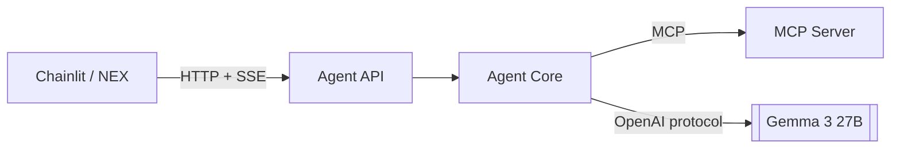
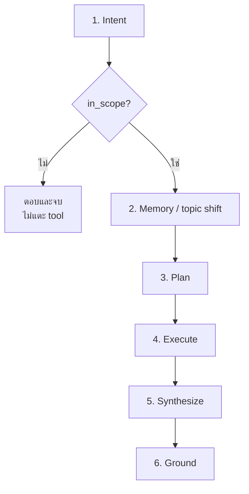

# Workshop 3B · ห่อ Agent เป็น API

**14:00 – 14:30** (30 นาที)

---

## โจทย์

ทำให้ agent จากวันที่ 2 เรียกใช้ MCP Server จากขั้นที่แล้ว และเปิดออกเป็น REST API ที่ frontend ใดก็เรียกได้



---

## 1. เปลี่ยนจากเรียกฟังก์ชันตรง เป็นเรียกผ่าน MCP

เมื่อวาน agent เรียกฟังก์ชัน Python ตรงๆ วันนี้ต้องเรียกผ่าน MCP apps/agent-api/agent/executor.py

```python
# เดิม
result = search_tickets(site_code="NBI")

# ใหม่
result = await mcp_client.call_tool("search_tickets", {"site_code": "NBI"})
```

**สิ่งที่ได้มาฟรีจากการเปลี่ยน**: tool ชุดเดียวกันนี้ใช้ได้กับ Claude Desktop ทันทีโดยไม่ต้องเขียนอะไรเพิ่ม

### รายการ tool ต้องมาจาก MCP ไม่ใช่ hardcode apps/agent-api/agent/planner.py

```python
async def create_plan(
    question: str,
    context: list[dict] | None = None,
    stats: llm.LLMStats | None = None,
    model: str | None = None,
) -> Plan:
    client = mcp_client.get()
    tools = await client.list_tools()
```

เพิ่ม tool ใน MCP Server → planner รู้จักทันที ไม่ต้องแก้ agent

---

## 2. Endpoint ที่ต้องมี

| Endpoint | ทำอะไร |
|---|---|
| `POST /chat` | รับคำถาม คืน **stream ของ event** |
| `GET /health` | ตรวจว่า MCP และฐานข้อมูลพร้อม |
| `GET /sessions/{id}/memory` | ดูความจำปัจจุบัน |
| `DELETE /sessions/{id}` | ล้างเซสชัน |
| `GET /tools` | รายการ tool ที่มี |

---

## 3. Stream เป็น Event ไม่ใช่แค่ข้อความ

**นี่คือจุดตัดสินว่า UI จะดีหรือไม่ดี** รันตามนี้เพื่อทดสอบ

`uv run apps/agent-api/main.py `

`uv run uvicorn apps.agent-api.main:app --reload --port 8080`

`uv run pytest tests/test_agent_flow.py -v`

```
intent_checked → memory_updated → plan_created
→ step_started → step_result (วนซ้ำ)
→ token ... → grounding_checked → usage → done
```

ถ้า API คืนแค่ข้อความสุดท้าย UI จะทำได้แค่แสดง spinner
ถ้าคืน event ครบ UI จะแสดงกระบวนการคิดทั้งหมดได้ apps/agent-api/agent/events.py

```python
def sse(event_type: EventType, data: Any) -> str:
    """Format one Server-Sent Event.

    The blank line at the end is required by the SSE spec; leaving it out
    produces a stream that appears to hang.
    """
    payload = json.dumps({"type": event_type.value, "data": data},
                         ensure_ascii=False, default=str)
    return f"event: {event_type.value}\ndata: {payload}\n\n"
```

> ลืมบรรทัดว่างสองบรรทัดท้าย = stream ค้าง เป็นบั๊กที่เจอบ่อยที่สุด

---

## 4. ลำดับที่ห้ามสลับ



**Intent ต้องมาก่อน Memory เสมอ** — ไม่งั้นคำถามนอกขอบเขตจะไปกระตุ้นการเปลี่ยนหัวข้อ ทำให้ context ที่ผู้ใช้กำลังใช้อยู่ถูกล้างทิ้ง (ดูโจทย์ที่ 4 turn 5)

---

## เกณฑ์ผ่าน

- [ ] `GET /health` บอกจำนวน tool ที่เชื่อมได้
- [ ] `POST /chat` คืน event ครบทุกประเภท
- [ ] คำถามนอกขอบเขต: `tool_calls == 0`
- [ ] `GET /sessions/{id}/memory` แสดง `context_tokens` ที่เปลี่ยนตามจริง
- [ ] เพิ่ม tool ใน MCP Server แล้ว planner ใช้ได้โดยไม่แก้ agent
- [ ] `uv run pytest tests/test_agent_flow.py` ผ่าน

---

## ต่อไป

→ [Workshop 3C: ต่อ Chainlit](workshop3c-chainlit.md)
