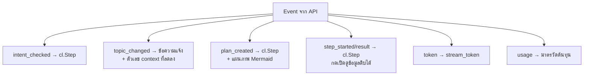

# Workshop 3C · ต่อ Chainlit เข้ากับ Agent API

**14:30 – 14:45** (15 นาที)

---

## โจทย์

ทำให้ UI แสดง **กระบวนการคิดของ agent** ไม่ใช่แค่คำตอบ

---

## สิ่งที่ต้องแสดง



---

## 1. รับ SSE และแยก event apps/chainlit-ui/app.py 

```python
async with client.stream("POST", f"{API}/chat", json={...}) as response:
    buffer = ""
    async for chunk in response.aiter_text():
        buffer += chunk
        while "\n\n" in buffer:
            raw, buffer = buffer.split("\n\n", 1)
            ...
```

> **ต้อง buffer เอง** — `aiter_text()` ไม่รับประกันว่าจะได้ครบหนึ่ง event ต่อครั้ง
> โค้ดที่ parse ทีละ chunk จะพังเมื่อ event ถูกหั่นกลางทาง

---

## 2. แสดง Step

```python
step = cl.Step(name=f"[{n}] {tool}", type="tool")
await step.__aenter__()
step.input = json.dumps(arguments, ensure_ascii=False, indent=2)
# ...
step.output = f"สำเร็จใน {ms} ms\n\n```json\n{result}\n```"
await step.__aexit__(None, None, None)
```

---

## 3. แสดงแผนเป็นแผนภาพ

Chainlit เรนเดอร์ Mermaid ได้ ทำให้ dependency ของแผนเห็นได้ทันที apps/chainlit-ui/elements.py

```python
lines = ["```mermaid", "flowchart TD"]
for s in plan["steps"]:
    lines.append(f'    S{s["step"]}["{s["step"]}. {s["tool"]}"]')
for s in plan["steps"]:
    for d in s.get("depends_on", []):
        lines.append(f"    S{d} --> S{s['step']}")
lines.append("```")
```

**ขั้นที่วางเรียงกันแนวนอน = รันขนาน · ขั้นที่ต่อกันเป็นสาย = ต้องรอ**

---

## 4. มาตรวัดต้นทุน

| รายการ | ทำไมต้องแสดง |
|---|---|
| prompt / completion tokens | เห็นว่าอะไรกิน token |
| **ขนาด context ปัจจุบัน** | เห็นผลของ memory management |
| tokens/sec | เห็นว่า GPU แน่นแค่ไหน |
| จำนวน tool ที่เรียก | เห็นว่าแผนซับซ้อนแค่ไหน |

> Local LLM ไม่มีค่า API ต่อ token ต้นทุนจริงคือ **เวลา GPU** จึงต้องแสดงตัวเลขเหล่านี้แทนเงิน

---

## 5. ปุ่มคำถามตัวอย่าง apps/chainlit-ui/app.py 

```python
@cl.set_starters
async def starters():
    return [cl.Starter(label="หาสาเหตุร่วม",
                       message="ทำไมช่วงสองสัปดาห์นี้ถึงมีลูกค้าแจ้งเน็ตหลุดซ้ำๆ หลายราย")]
```

---

## เกณฑ์ผ่าน

- [ ] เห็น step ของ intent, plan และทุก tool call
- [ ] แผนแสดงเป็นแผนภาพ Mermaid ที่เห็น dependency
- [ ] คำตอบ stream ทีละตัวอักษร
- [ ] มาตรวัดต้นทุนแสดงครบ รวม context tokens
- [ ] ตอนเปลี่ยนเรื่อง มีข้อความแจ้งพร้อมตัวเลข context ที่ลดลง
- [ ] กดเปิด step แล้วเห็นข้อมูลดิบจากฐานข้อมูลจริง

---

## ต่อไป

→ [Workshop 3D: ต่อกับ Claude Desktop / Cursor](workshop3d-connect-clients.md)
