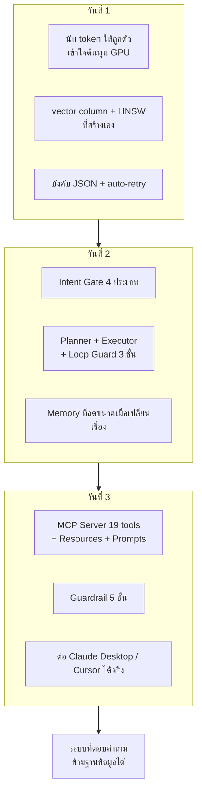

# สรุปผลการอบรม และแบ่งงานสำหรับ MPLS LLM

**15:30 – 16:30**

---

## 1. สิ่งที่สร้างได้ใน 3 วัน

---

## 2. แบบจำลองย่อส่วนของ production

| สิ่งที่สร้างในห้อง | คู่ของมันใน MPLS LLM |
|---|---|
| MCP Server 3 ฐานข้อมูล | ตัวกลางให้ AI ดึงข้อมูลจาก Neo4j / PostgreSQL / OpenSearch |
| S1 หาสาเหตุร่วม | ลดเวลา troubleshooting โครงข่ายจริง |
| S2 Health Score | Equipment Health Check |
| S4 แยก maintenance ออกจากเหตุเสีย | Real-time Log Alert ที่ไม่แจ้งเตือนผิด |
| S5 ตอบว่าไม่พบ | Hallucination reduction |
| Chainlit | NMS NEX Integration |
| MailHog | Telegram Alert |
| `make verify` | Health Check ทั้ง 3 ฐาน |
| Guardrail 5 ชั้น | กันข้อมูลวงจรลูกค้ารั่วไหล |
| `data/questions/` | ชุดวัดผลร่วมกับ สจล. |

---

## 3. งานที่ต้องทำต่อ แบ่งตามช่วงติดตามผล

### ก่อนติดตามผลครั้งที่ 1 (30 วัน)

| งาน | ผู้รับผิดชอบ | หมายเหตุ |
|---|---|---|
| จัดสรร Cloud GPU | ร่วมกับ นธย.2 | **ต้องเริ่มทันที ไม่ใช่รอวันที่ 30** |
| ติดตั้ง Ubuntu + Docker + Ollama/vLLM | ทีม infra | ทั้ง dev และ prod |
| แปลงเอกสารโครงข่ายเป็น Markdown | ทีมเอกสาร | ใช้ pipeline จาก lab ingestion |
| ต่อท่อข้อมูลจาก API / NEX | ทีม integration | log Core/PE/APE/LPE, CDP, ISIS, ticket |
| ตั้ง 3 ฐานข้อมูลจริง | ทีม DB | ใช้ `make verify` เป็นต้นแบบ acceptance test |
| ขยาย MCP Server ให้ครอบข้อมูลจริง | **ผู้เรียนทุกคน** | ต่อยอดจากที่สร้างวันนี้ |

### ก่อนติดตามผลครั้งที่ 2 (60 วัน)

| งาน | หมายเหตุ |
|---|---|
| RAG pipeline ครบ: embed → rerank → generate | ตาม Lab 6 |
| Grounding กับ Neo4j + PostgreSQL | ลด hallucination |
| Real-time Log Alert ผ่าน Telegram | เปลี่ยน backend ของ notifier |
| Equipment Health Score | pre-compute เป็น batch ไม่ใช่วนทีละตัว |
| NEX Chatbot + ปุ่ม Super Search | ใช้ event stream แบบเดียวกับ Chainlit |
| ชุดวัดผล BLEU / ROUGE / satisfaction | ร่วมกับ สจล. — ใช้ `data/questions/` เป็นฐาน |

### ก่อนติดตามผลครั้งที่ 3 (90 วัน)

| งาน | หมายเหตุ |
|---|---|
| สรุปสถิติเวลา troubleshooting ที่ลดลง | **ต้องเก็บ metric ตั้งแต่วันแรก** ไม่งั้นวันที่ 90 จะไม่มีตัวเลข |
| ประเมินความพึงพอใจของเจ้าหน้าที่ | |
| สรุปผลด้าน security ของ Local LLM | ใช้ audit log เป็นหลักฐาน |
| รายงานฉบับสมบูรณ์ + สื่อนำเสนอ | diagram ใน `00-architecture.md` ใช้ต่อได้ |

---

## 4. เรื่องที่ต้องตัดสินใจในระดับโครงการ

| ประเด็น | ทางเลือก |
|---|---|
| Ollama หรือ vLLM | vLLM เมื่อมีผู้ใช้พร้อมกันหลายคน |
| Gemma 27B หรือ GPT-OSS 120B | 120B ต้องการ GPU มากกว่ามาก ต้องวางแผนล่วงหน้า |
| Fine-tuning ทำโดยใคร | หลักสูตรนี้ไม่ครอบคลุม — ต้องชัดเจนว่า สจล. รับผิดชอบ |
| Frontend สุดท้าย | NEX integration หรือ UI แยก |

---

## 5. เก็บ metric ตั้งแต่วันนี้

**ถ้าไม่เริ่มเก็บตั้งแต่ต้น วันที่ 90 จะไม่มีอะไรรายงาน**

| Metric | วิธีเก็บ |
|---|---|
| เวลา troubleshooting ก่อนใช้ระบบ | **เก็บ baseline ตอนนี้เลย** จากประวัติ ticket |
| เวลา troubleshooting หลังใช้ระบบ | เวลาจาก ticket เปิดถึงปิด |
| ความถูกต้องของคำตอบ | ชุดคำถามมาตรฐาน + LLM-as-judge |
| ความพึงพอใจ | แบบสอบถามสั้นท้ายทุกการใช้งาน |
| ต้นทุน GPU | tokens/sec, utilisation |
| อัตราการปฏิเสธของ intent gate | บอกว่าผู้ใช้ถามนอกขอบเขตแค่ไหน |

---

## 6. แหล่งอ้างอิง

| เรื่อง | ไฟล์ |
|---|---|
| ความต่างเมื่อขึ้น scale | [scale-notes.md](scale-notes.md) |
| เทียบกับ production | [../reference/production-mapping.md](../reference/production-mapping.md) |
| ตัวอย่าง prompt และผลการวางแผน | [../reference/prompt-examples.md](../reference/prompt-examples.md) |
| การวัดผล | [../reference/evaluation-metrics.md](../reference/evaluation-metrics.md) |
| Ollama vs vLLM | [../reference/local-llm-ollama-vllm.md](../reference/local-llm-ollama-vllm.md) |
