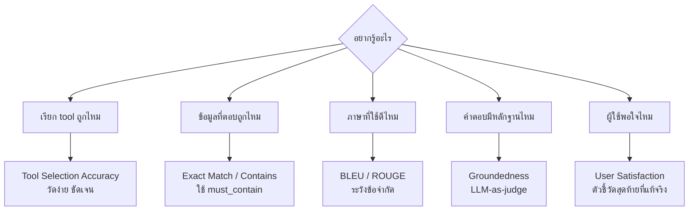
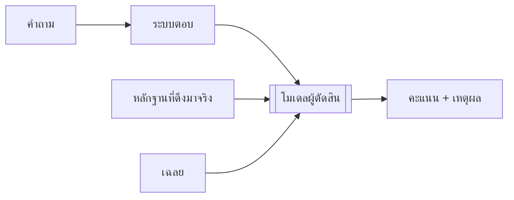

# การวัดผลคุณภาพคำตอบ

> ใช้กับการติดตามผลครั้งที่ 2 (ประเมินร่วมกับ สจล.) และครั้งที่ 3 (สรุป KPI)

---

## 1. เลือกตัวชี้วัดให้ตรงกับสิ่งที่อยากรู้



---

## 2. ตัวชี้วัดที่ใช้ในโปรเจกต์นี้

| ตัวชี้วัด | วัดอะไร | ข้อดี | ข้อจำกัด |
|---|---|---|---|
| **Tool Selection Accuracy** | เรียก tool ถูกตัวไหม | ชัดเจน วัดอัตโนมัติได้ | ไม่บอกว่าคำตอบดีไหม |
| **Contains / must_not_contain** | มีข้อเท็จจริงที่ต้องมีไหม | ตรงประเด็น | ต้องเขียนเฉลยเอง |
| **Groundedness** | ทุกข้ออ้างมีหลักฐานไหม | **ตรงกับเป้าหมายลด hallucination** | ต้องใช้ LLM ตัดสิน |
| **Citation Rate** | อ้างอิงแหล่งครบไหม | วัดง่าย | ไม่ได้บอกว่าอ้างถูก |
| BLEU | ตรงกับคำตอบอ้างอิงแค่ไหน | มาตรฐานสากล | **คำตอบที่ถูกแต่เขียนคนละแบบได้คะแนนต่ำ** |
| ROUGE | ครอบคลุมเนื้อหาอ้างอิงแค่ไหน | เหมาะกับงานสรุป | เหมือน BLEU |
| **User Satisfaction** | เจ้าหน้าที่พอใจไหม | ตัวชี้วัดที่แท้จริง | เก็บยาก มี bias |

---

## 3. ข้อควรระวังเรื่อง BLEU และ ROUGE

BLEU/ROUGE ออกแบบมาสำหรับงานแปลภาษาและงานสรุป ซึ่งมีคำตอบอ้างอิงที่ค่อนข้างตายตัว

**แต่งานนี้ไม่ใช่แบบนั้น** — สองคำตอบที่ถูกต้องเท่ากันอาจเขียนคนละแบบสิ้นเชิง

| คำตอบ | ถูกไหม | BLEU |
|---|---|---|
| *"สาเหตุคือ interface flapping ที่ APE-NBI-03"* | ✅ | สูง |
| *"APE-NBI-03 มี Te0/1/2 ที่ขึ้นลงซ้ำ 40 ครั้ง ทำให้ลูกค้าใต้มันหลุด"* | ✅ **ดีกว่า** | **ต่ำ** |

**ข้อเสนอ**: ใช้ BLEU/ROUGE เป็นตัวประกอบตามที่หลักสูตรกำหนด แต่**ให้น้ำหนักหลักกับ Groundedness + Tool Accuracy + Satisfaction** และอธิบายเหตุผลนี้ในรายงาน

---

## 4. LLM-as-judge



**กติกาที่ทำให้เชื่อถือได้**

| กติกา | เหตุผล |
|---|---|
| ให้เกณฑ์ที่วัดได้ ไม่ใช่ "ดีไหม" | ผู้ตัดสินที่ไม่มีเกณฑ์จะให้คะแนนสูงเกินจริงเสมอ |
| **ต้องให้เหตุผลพร้อมคะแนน** | ทำให้ตรวจสอบผู้ตัดสินได้ |
| temperature 0 | ให้ผลคงเส้นคงวา |
| สุ่มตรวจด้วยคนอย่างน้อย 10% | ยืนยันว่าผู้ตัดสินไม่เพี้ยน |

---

## 5. ชุดข้อมูลทดสอบ

`data/questions/` เป็นชุดที่ใช้ได้ทันที

| ระดับ | จำนวน | วัดอะไร |
|---|---|---|
| L0 | 5 | Intent Gate ปฏิเสธถูกไหม |
| L1 | 9 | เลือก tool ถูกไหม |
| L2 | 8 | วางแผน 2 ขั้นได้ไหม |
| L3 | 5 | วางแผนข้ามระบบได้ไหม |
| L4 | 10 turn | Memory ทำงานไหม |
| L5 | 4 | ถามกลับเมื่อกำกวมไหม |
| L6 | 5 | **กล้าตอบว่าไม่รู้ไหม** |
| L7 | 5 | Guardrail ทำงานไหม |

> **L6 สำคัญเป็นพิเศษ** — เป็นชุดเดียวที่วัด hallucination โดยตรง

---

## 6. รัน

```bash
make eval
```

ผลลัพธ์แยกตามระดับ พร้อมรายการข้อที่ตก

### เพื่อให้เทียบข้ามครั้งได้

```
DEMO_NOW=2026-01-15T10:00:00+07:00
SEED_RANDOM_SEED=42
```

**ตรึงเวลาและ seed** ไม่งั้นข้อมูลเปลี่ยนทุกครั้ง แล้วจะแยกไม่ออกว่าคะแนนที่เปลี่ยนมาจากการปรับปรุงระบบ หรือมาจากข้อมูลที่ต่างกัน

---

## 7. เก็บ Baseline ตั้งแต่วันนี้

**ถ้าไม่มี baseline วันที่ 90 จะไม่มีอะไรรายงาน**

| Metric | เก็บอย่างไร | เก็บเมื่อไหร่ |
|---|---|---|
| เวลา troubleshooting เดิม | จากประวัติ ticket (`closed_at - opened_at`) | **ตอนนี้** |
| เวลา troubleshooting ใหม่ | เดียวกัน หลังใช้ระบบ | ต่อเนื่อง |
| ความถูกต้อง | `make eval` | ทุกครั้งที่แก้ระบบ |
| ความพึงพอใจ | แบบสอบถามสั้นท้ายการใช้งาน | ต่อเนื่อง |
| ต้นทุน GPU | tokens/sec, utilisation | ต่อเนื่อง |
