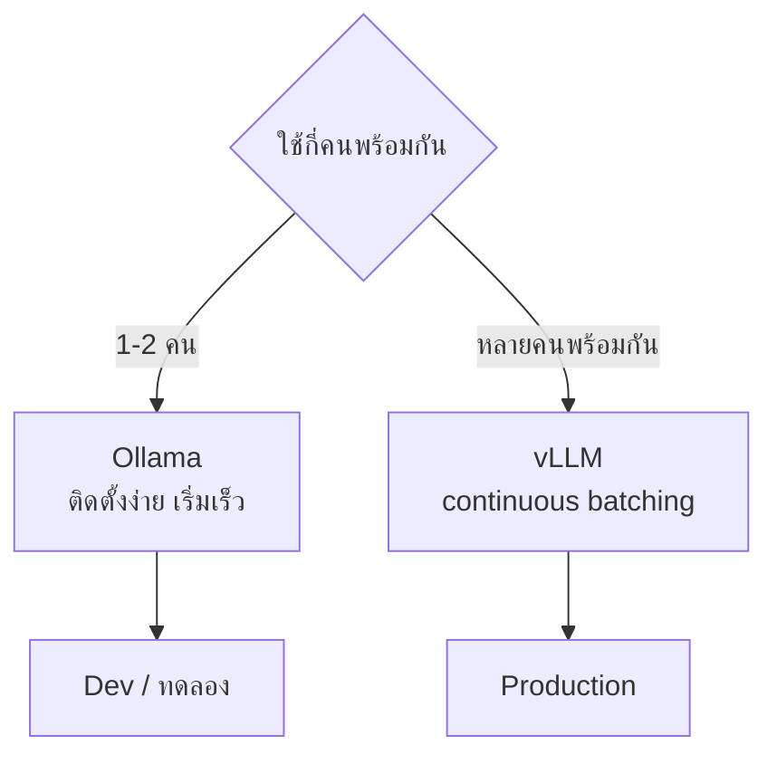
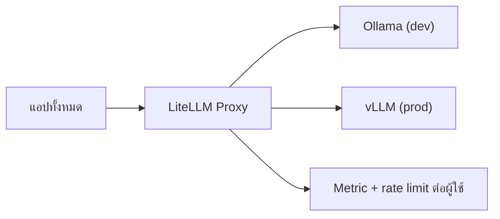

# รัน LLM ในองค์กร — Ollama vs vLLM

---

## 1. เลือกตัวไหน



| | Ollama | vLLM |
|---|---|---|
| ติดตั้ง | ง่ายมาก | ต้องตั้งค่ามากกว่า |
| หลายคนพร้อมกัน | จำกัด | **ดีกว่ามาก (continuous batching)** |
| Throughput | ปานกลาง | **สูง** |
| Quantization | GGUF ในตัว | AWQ / GPTQ / FP8 |
| Guided decoding | `format` รับ JSON Schema | `guided_json` / `response_format` |
| OpenAI-compatible | ✅ | ✅ |
| เหมาะกับ | dev, ทดลอง, เดโมคนเดียว | **production, ห้องอบรม 20 คน** |

> **สำหรับ workshop 20 คน แนะนำ vLLM** — Ollama จัดคิวได้จำกัด ทำให้คนที่ 15 รอนานมาก

---

## 2. Ollama

```bash
docker compose -f docker/docker-compose.yml --profile llm up -d ollama
```

```bash
docker exec mpls-ollama ollama pull gemma3:27b
docker exec mpls-ollama ollama pull gemma3:4b
docker exec mpls-ollama ollama pull embeddinggemma:300m
```

```
LLM_BASE_URL=http://localhost:11434/v1
LLM_API_KEY=not-needed
```

| ตัวแปรที่ควรตั้ง | ทำอะไร |
|---|---|
| `OLLAMA_KEEP_ALIVE=24h` | ไม่ให้ unload โมเดล — คำถามแรกจะไม่ช้า |
| `OLLAMA_NUM_PARALLEL=4` | จำนวนคำขอที่ทำพร้อมกัน |

---

## 3. vLLM

```bash
docker run --gpus all -p 8000:8000 \
  vllm/vllm-openai:latest \
  --model google/gemma-3-27b-it \
  --max-model-len 8192 \
  --gpu-memory-utilization 0.90
```

```
LLM_BASE_URL=http://localhost:8000/v1
```

| ตัวเลือกสำคัญ | ผล |
|---|---|
| `--max-model-len` | ยิ่งยาว KV cache ยิ่งกิน VRAM → รองรับคนพร้อมกันได้น้อยลง |
| `--gpu-memory-utilization` | สัดส่วน VRAM ที่ยอมให้ใช้ |
| `--tensor-parallel-size` | กระจายข้าม GPU หลายใบ |
| `--quantization awq` | ลด VRAM แลกกับคุณภาพเล็กน้อย |

---

## 4. VRAM ที่ต้องการโดยประมาณ

| โมเดล | FP16 | 8-bit | 4-bit |
|---|---|---|---|
| Gemma 3 4B | ~9 GB | ~5 GB | ~3 GB |
| Gemma 3 12B | ~25 GB | ~13 GB | ~7 GB |
| **Gemma 3 27B** | **~55 GB** | **~28 GB** | **~16 GB** |

**บวก KV cache** ซึ่งโตตามความยาว context และจำนวนคำขอที่ทำพร้อมกัน

> โน้ตบุ๊กทั่วไปรัน 27B ไม่ได้ ต้องเป็นเซิร์ฟเวอร์กลางที่ทุกคนยิงเข้าไป

---

## 5. ทดสอบว่าใช้ได้จริง — 3 ข้อที่ต้องผ่านก่อนวันอบรม

### 5.1 ยิงถึงไหม

```bash
curl -s $LLM_BASE_URL/models -H "Authorization: Bearer $LLM_API_KEY"
```

### 5.2 รองรับ guided decoding ไหม ← **สำคัญที่สุด**

```bash
curl -s $LLM_BASE_URL/chat/completions \
  -H 'Content-Type: application/json' \
  -d '{"model":"gemma3:27b",
       "messages":[{"role":"user","content":"severity ของเหตุการณ์ link down"}],
       "response_format":{"type":"json_schema","json_schema":{"name":"r","schema":
         {"type":"object","properties":{"severity":{"type":"string",
          "enum":["low","medium","high","critical"]}},"required":["severity"]}}}}'
```

ถ้าไม่รองรับ → ตั้ง `LLM_GUIDED_DECODING=false` แล้วพึ่ง auto-retry (จะช้าลงและเปลือง token มากขึ้น)

### 5.3 คืน usage ตอน stream ไหม

```bash
curl -s $LLM_BASE_URL/chat/completions \
  -H 'Content-Type: application/json' \
  -d '{"model":"gemma3:27b","messages":[{"role":"user","content":"hi"}],
       "stream":true,"stream_options":{"include_usage":true}}' | tail -3
```

ถ้าไม่มี `usage` ในก้อนสุดท้าย → มาตรวัดจะนับเองด้วย `agent/tokenizer.py`

---

## 6. ปรับให้รองรับหลายคนพร้อมกัน

| ปัญหา | วิธีแก้ |
|---|---|
| คำถามแรกช้ามาก | อุ่นเครื่องด้วยคำขอเปล่าตอนเริ่มระบบ |
| คนที่ 10 ขึ้นไปรอนาน | ใช้ vLLM · เพิ่ม instance · ลด `--max-model-len` |
| VRAM เต็ม | ลด context length · quantize · ใช้โมเดลเล็กสำหรับงานง่าย |
| ระหว่าง lab ช้าเกินทน | ให้ทุกคนใช้ `LLM_MODEL_FAST` แล้วสลับเป็น 27B ตอนส่งงาน |

---

## 7. LiteLLM Proxy — เมื่อมีหลาย backend



ข้อดี: จำกัดโควตาต่อผู้เรียนได้ · เก็บสถิติการใช้รวมศูนย์ · สลับ backend โดยไม่แก้โค้ดแอป
