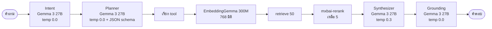

# Model Stack — โมเดลแต่ละตัวทำหน้าที่อะไร



---

## ตารางบทบาท

| บทบาท | โมเดล | temperature | ทำไมเลือกแบบนี้ |
|---|---|---|---|
| Intent | `gemma3:27b` | 0.0 | การจำแนกต้องคงเส้นคงวา คำถามเดิมต้องได้ผลเดิม |
| Planner | `gemma3:27b` | 0.0 | แผนที่เปลี่ยนไปมาทำให้ทดสอบไม่ได้ |
| Synthesizer | `gemma3:27b` | 0.3 | ต้องการภาษาที่อ่านรื่น แต่ไม่ให้แต่งเรื่อง |
| Grounding | `gemma3:27b` | 0.0 | การตรวจสอบต้องเข้มงวด |
| Embedding | `embeddinggemma:300m` | — | 768 มิติ · **ตรงกับ production** |
| Rerank | `mxbai-rerank` | — | cross-encoder · ตรงกับ production |
| ระหว่างทำ lab | `gemma3:4b` | ตามงาน | วนแก้โค้ดได้เร็วกว่ามาก |

---

## ทำไม Gemma 3 27B

| เหตุผล | รายละเอียด |
|---|---|
| ขนาดที่ขอ | ~30B — Gemma 3 มี 1B/4B/12B/**27B** ตัว 27B ใกล้ที่สุด |
| ตระกูลเดียวกับ embedding | EmbeddingGemma 300M มาจากตระกูลเดียวกัน |
| รันในองค์กรได้ | ไม่มีข้อมูลออกนอกองค์กร |
| OpenAI-compatible | ทั้ง Ollama และ vLLM เสิร์ฟผ่าน protocol เดียวกัน |

### ข้อจำกัดที่ต้องรู้

| ข้อจำกัด | ทางออกในโปรเจกต์นี้ |
|---|---|
| **ไม่มี native function calling** | ใช้ structured output + parse เอง (Module 3, 5) |
| tokenizer เป็น SentencePiece | `agent/tokenizer.py` ห้ามใช้ tiktoken |
| ต้องการ VRAM มาก | ต้องเป็นเซิร์ฟเวอร์กลาง ไม่ใช่โน้ตบุ๊ก |

---

## สลับโมเดลระหว่างทำงาน

```bash
# ระหว่าง lab - เร็วกว่ามาก
LLM_MODEL=gemma3:4b make api
```

```bash
# ตอนส่งงานและเดโม
LLM_MODEL=gemma3:27b make api
```

**ควรทดสอบด้วยทั้งสองตัว** — โมเดลเล็กพลาดในจุดที่โมเดลใหญ่ไม่พลาด ซึ่งบอกเราว่า prompt ตรงไหนยังเปราะ

---

## เส้นทางไป GPT-OSS 120B

| ประเด็น | ต้องทำอะไร |
|---|---|
| Tokenizer เปลี่ยน | `agent/tokenizer.py` ต้องเปลี่ยนตาม — ตัวเลข token ทั้งหมดจะเปลี่ยน |
| Embedding **ไม่ต้องเปลี่ยน** | ยังใช้ EmbeddingGemma 300M ได้ ไม่ต้อง re-embed |
| VRAM | ต้องการมากกว่า 27B หลายเท่า วางแผน GPU ล่วงหน้า |
| Guided decoding | ตรวจว่า runtime ใหม่ยังรองรับ |
| Prompt | ต้องรันชุดคำถามมาตรฐานซ้ำเพื่อดูว่าคุณภาพเปลี่ยนไหม |

> **โมเดลเปลี่ยนได้ แต่ตัวชี้วัดต้องเป็นชุดเดิม** ไม่งั้นเทียบไม่ได้ว่าดีขึ้นหรือแย่ลง
