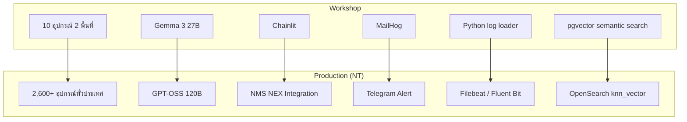

# เทียบ Workshop กับระบบ Production (MPLS LLM)

Workshop นี้ออกแบบเป็น **แบบจำลองย่อส่วนของสถาปัตยกรรมจริง** ไม่ใช่ระบบสมมติ
ทุกชิ้นที่สร้างในห้องมีคู่ของมันในระบบจริง เพื่อให้การติดตามผลวันที่ 30/60/90 มีของให้ตรวจ

---

## 1. ภาพเทียบ

---

## 2. ตารางเทียบรายชิ้น

| Workshop | Production | สถานะ |
|---|---|---|
| MCP Server 19 tools | ตัวกลางให้ AI ดึงข้อมูลจาก 3 ฐาน | ✅ ยกไปใช้ได้เลย |
| Guardrail 5 ชั้น | กันข้อมูลวงจรลูกค้ารั่วไหล 100% | ✅ ยกไปใช้ได้เลย |
| Intent Gate | ประหยัด GPU + กันใช้ผิดวัตถุประสงค์ | ✅ ยกไปใช้ได้เลย |
| Memory management | บทสนทนายาวในกะงานจริง | ✅ ต้องเปลี่ยนที่เก็บเป็น Redis |
| `data/questions/` 8 ระดับ | ชุดวัดผลร่วมกับ สจล. | ✅ ใช้เป็นฐานได้ |
| `make verify` | Health Check 3 ฐาน (ติดตามผลครั้งที่ 1) | ✅ ใช้เป็นต้นแบบ |
| Health Score วนทีละตัว | Equipment Health Check | ⚠️ ต้อง pre-compute เป็น batch |
| Python log loader | ingest 29 GB/วัน | ❌ ต้องเปลี่ยนเป็น Filebeat/Fluent Bit |
| pgvector | vector store หลัก | ⚠️ production ใช้ OpenSearch |
| Chainlit | NEX Chatbot | ⚠️ เป็นต้นแบบ ต้องทำ integration จริง |
| MailHog | Telegram Alert | ⚠️ เปลี่ยน backend ของ notifier |

---

## 3. เหตุการณ์จำลอง → Use case จริง

| Scenario | Use case ใน MPLS LLM | ตัวชี้วัด |
|---|---|---|
| **S1** หา upstream ร่วมของ ticket หลายใบ | ลดเวลาวิเคราะห์เหตุเสีย | **Troubleshooting Time Reduction** |
| **S2** ตรวจอุปกรณ์เสื่อมก่อนมีคนแจ้ง | Equipment Health Check | ความแม่นของ Health Score |
| **S3** เทียบ config สองฝั่งข้ามพื้นที่ | ตรวจ config drift กับ ISIS/CDP neighbor | จำนวน config drift ที่พบ |
| **S4** แยก maintenance ออกจากเหตุเสีย | Real-time Log Alert | อัตรา false positive |
| **S5** ตอบว่าไม่พบเมื่อไม่มีข้อมูล | Hallucination reduction | ความถูกต้องของคำตอบ |

---

## 4. เชื่อมกับแผนติดตามผล

### ครั้งที่ 1 (30 วัน) — โครงสร้างพื้นฐาน

| หัวข้อตรวจ | สิ่งที่ workshop เตรียมให้ |
|---|---|
| Cloud GPU / Ollama / vLLM | [local-llm-ollama-vllm.md](local-llm-ollama-vllm.md) |
| แปลงเอกสารเป็น Markdown + embed | pipeline ใน `seed_opensearch.py` และ lab ingestion |
| ท่อข้อมูลจาก API / NEX | `docker/loader/` เป็นต้นแบบ (ต้องเปลี่ยนเป็น Filebeat) |
| Health Check 3 ฐาน | **`make verify` ใช้เป็น acceptance test ได้ตรงๆ** |
| MCP เป็นตัวกลาง | **แกนของ Workshop 3 ทั้งหมด** |

### ครั้งที่ 2 (60 วัน) — Integration & Evaluation

| หัวข้อตรวจ | สิ่งที่ workshop เตรียมให้ |
|---|---|
| RAG ขั้นสูง | [day3/lab6-rerank-pipeline.md](../day3/lab6-rerank-pipeline.md) |
| embed → rerank → generate | `agent/rerank.py` |
| ลด hallucination ด้วย grounding | `agent/grounding.py` + scenario S4, S5 |
| Real-time Log Alert (Telegram) | `tools/notifier.py` เปลี่ยน backend ได้ |
| Health Score | `tools/logs.py` → `calculate_health_score` |
| NEX Chatbot | Chainlit + event stream เป็นต้นแบบ |
| BLEU / ROUGE / satisfaction | [evaluation-metrics.md](evaluation-metrics.md) + `eval/` |

### ครั้งที่ 3 (90 วัน) — สรุปผล

| หัวข้อ | สิ่งที่ workshop เตรียมให้ |
|---|---|
| สถิติเวลาที่ลดลง | **ต้องเก็บ baseline ตั้งแต่วันนี้** — วิธีอยู่ใน wrap-up |
| ผลด้าน security | audit log จาก guardrails เป็นหลักฐาน |
| diagram สำหรับรายงาน | `00-architecture.md` ยกไปใช้ได้เลย |
| ข้อจำกัดด้าน hardware | [day3/scale-notes.md](../day3/scale-notes.md) |

---

## 5. สิ่งที่ workshop **ไม่ครอบคลุม**

| เรื่อง | หมายเหตุ |
|---|---|
| **Fine-tuning โมเดล** | เป็นคนละศาสตร์กับ prompt/agent/MCP — ต้องชัดเจนว่า สจล. รับผิดชอบ |
| OAuth / SSO บน MCP | รู้หลักการใน Module 8 แต่ไม่ได้ลงมือทำ |
| การจัดสรร GPU | งาน infra ที่ต้องทำขนานไปกับการอบรม |
| NEX integration จริง | ต้องรู้ API ของ NEX ก่อน |
| High availability | ระบบ workshop เป็น single node ทั้งหมด |
