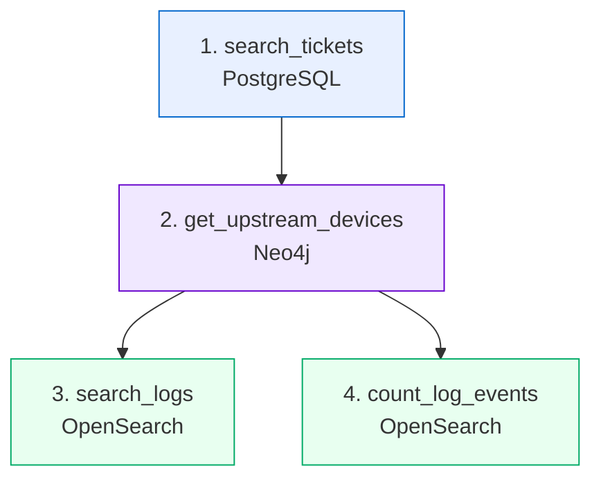

# ตัวอย่าง Prompt → Plan → การเรียกข้อมูล → คำตอบ

เอกสารนี้แสดง **การทำงานเต็มวงจร** ของระบบ ตั้งแต่คำถามจนถึงคำตอบ พร้อมข้อมูลจริงที่ดึงออกมาจากแต่ละระบบ

> ค่าตัวเลขและ timestamp จะต่างจากเครื่องของคุณ เพราะข้อมูลถูกสร้างใหม่ทุกครั้งที่ seed
> แต่ **โครงสร้างของ plan และลำดับการเรียกต้องเหมือนกัน**

---

## ตัวอย่างที่ 1 · แหล่งเดียว

### Prompt
```
ticket ที่ยังไม่ปิดตอนนี้มีอะไรบ้าง เรียงตามความรุนแรง
```

### Intent
```json
{
  "label": "in_scope",
  "confidence": 0.9,
  "reason": "พบคำเฉพาะทางในโดเมน: ticket, ปิด",
  "decided_by": "fast_path"
}
```
> ตัดสินโดย fast path ไม่ต้องเรียก LLM เลย

### Plan
```json
{
  "goal": "แสดง ticket ที่ยังไม่ปิด เรียงตามความรุนแรง",
  "reasoning": "คำถามนี้ตอบได้จากฐานข้อมูล ticket โดยตรง ไม่ต้องใช้แหล่งอื่น",
  "steps": [
    {"step": 1, "tool": "search_tickets",
     "arguments": {"status": "open", "range": "last_30d", "limit": 20},
     "purpose": "ดึง ticket ที่ยังไม่ปิดทั้งหมด", "depends_on": []}
  ],
  "expected_sources": ["postgres"]
}
```

### การเรียกข้อมูล
```
[1] search_tickets  →  PostgreSQL  →  142 ms
```
```json
{
  "total_matches": 14, "returned": 14, "truncated": false,
  "tickets": [
    {"ticket_id": "TK-25-00003", "severity": "high", "status": "open",
     "site_code": "NBI", "device_id": "LPE-NBI-13",
     "customer_name": "บริษัท ไทยโลจิสติกส์ เอ็กซ์เพรส",
     "title": "circuit drop ซ้ำๆ กระทบระบบ POS"},
    {"ticket_id": "TK-25-00001", "severity": "high", "status": "open",
     "site_code": "NBI", "device_id": "LPE-NBI-11",
     "title": "อินเทอร์เน็ตหลุดเป็นช่วงๆ ตั้งแต่เมื่อวาน"}
  ]
}
```

### ต้นทุน
| | |
|---|---|
| เรียก LLM | 2 ครั้ง (plan + สรุป) |
| เรียก tool | 1 |
| token รวม | ~1,850 |
| เวลา | 4.2 วินาที |

---

## ตัวอย่างที่ 2 · ข้ามสามระบบ ← ตัวอย่างหลัก

### Prompt
```
ทำไมช่วงสองสัปดาห์นี้ถึงมีลูกค้าแจ้งเน็ตหลุดซ้ำๆ หลายราย
```

> **สังเกตว่าคำถามไม่บอกพื้นที่และไม่บอกอุปกรณ์เลย** ระบบต้องค้นพบเอง

### Plan ที่ระบบคิดเอง
```json
{
  "goal": "หาสาเหตุร่วมของ ticket เน็ตหลุดหลายรายในช่วง 14 วัน",
  "reasoning": "ลูกค้าหลายรายที่อยู่คนละอุปกรณ์แจ้งอาการเดียวกัน มักเกิดจากอุปกรณ์ upstream ที่เป็นจุดร่วม จึงต้องหา ticket ก่อน แล้วไล่ขึ้นไปดู topology และตรวจ log ของจุดร่วมในช่วงเวลาเดียวกัน",
  "steps": [
    {"step": 1, "tool": "search_tickets",
     "arguments": {"category": "intermittent", "range": "last_14d"},
     "purpose": "หา ticket ที่มีอาการหลุดเป็นช่วงในรอบ 2 สัปดาห์",
     "depends_on": []},
    {"step": 2, "tool": "get_upstream_devices",
     "arguments": {},
     "argument_from": {"device_ids": "step.1.tickets.*.device_id"},
     "purpose": "หาว่าอุปกรณ์จาก ticket เหล่านั้นมี upstream ร่วมกันหรือไม่",
     "depends_on": [1]},
    {"step": 3, "tool": "search_logs",
     "arguments": {"range": "last_14d", "severity": "error"},
     "argument_from": {"device_id": "step.2.shared_by_all.0.device_id"},
     "purpose": "ตรวจ log ของอุปกรณ์จุดร่วมในช่วงเวลาเดียวกับ ticket",
     "depends_on": [2]},
    {"step": 4, "tool": "count_log_events",
     "arguments": {"group_by": "event_type", "range": "last_14d"},
     "purpose": "นับว่าเหตุการณ์เกิดถี่แค่ไหน",
     "depends_on": [2]}
  ],
  "expected_sources": ["postgres", "neo4j", "opensearch"]
}
```


> ขั้นที่ 3 และ 4 ไม่ขึ้นต่อกัน จึงรันขนานได้

### ผลจากแต่ละระบบ

**ขั้นที่ 1 — PostgreSQL** (168 ms)
```json
{"total_matches": 5,
 "tickets": [
   {"ticket_id":"TK-25-00001","device_id":"LPE-NBI-11","severity":"high","status":"open"},
   {"ticket_id":"TK-25-00002","device_id":"LPE-NBI-12","severity":"medium","status":"closed",
    "resolution":"ทดสอบแล้ว ping ปกติ throughput เต็ม ปิดเคสชั่วคราว"},
   {"ticket_id":"TK-25-00003","device_id":"LPE-NBI-13","severity":"high","status":"open"},
   {"ticket_id":"TK-25-00004","device_id":"LPE-NBI-11","severity":"medium","status":"closed"},
   {"ticket_id":"TK-25-00005","device_id":"LPE-NBI-12","severity":"high","status":"open"}
 ]}
```
> **จุดสำคัญ**: ticket ทั้ง 5 ใบ **ไม่มีคำว่า APE อยู่เลย** ถ้าหยุดตรงนี้จะสรุปผิดว่าเป็นปัญหาฝั่งลูกค้าแต่ละราย

**ขั้นที่ 2 — Neo4j** (54 ms)
```json
{"queried_devices": ["LPE-NBI-11","LPE-NBI-12","LPE-NBI-13"],
 "shared_by_all": [
   {"device_id":"APE-NBI-03","role":"APE","hops":1,
    "depends_on_it":["LPE-NBI-11","LPE-NBI-12","LPE-NBI-13"],"dependent_count":3}
 ],
 "interpretation":"อุปกรณ์ APE-NBI-03 เป็นจุดร่วมที่ใกล้ที่สุดของอุปกรณ์ทั้ง 3 ตัวที่ถามมา"}
```
> **นี่คือขั้นที่พลิกคำตอบ** — ข้อมูลนี้ไม่มีทางได้จาก ticket

**ขั้นที่ 3 — OpenSearch** (211 ms)
```json
{"total_matches": 320, "returned": 30,
 "logs": [
  {"@timestamp":"...T03:41:18+07:00","device_id":"APE-NBI-03","severity":"error",
   "event_type":"LINK-UPDOWN","interface":"Te0/1/2",
   "message":"Interface Te0/1/2, changed state to down"},
  {"@timestamp":"...T03:41:52+07:00","device_id":"APE-NBI-03","severity":"notice",
   "event_type":"LINK-UPDOWN","message":"Interface Te0/1/2, changed state to up"}
 ]}
```

**ขั้นที่ 4 — OpenSearch** (89 ms)
```json
{"results":[
  {"key":"LINK-UPDOWN","count":80},
  {"key":"LINEPROTO-UPDOWN","count":80},
  {"key":"ISIS-ADJCHANGE","count":80},
  {"key":"LDP-NBRCHG","count":80}
]}
```
> 80 ครั้ง = down 40 + up 40 → **interface flap 40 รอบใน 14 วัน**

### คำตอบสุดท้าย

> **สาเหตุคือ interface `Te0/1/2` ของ `APE-NBI-03` เกิด flapping ซ้ำ 40 ครั้งในรอบสองสัปดาห์**
>
> ลูกค้า 5 รายที่แจ้งเข้ามาอยู่บนอุปกรณ์ LPE คนละตัวกัน (LPE-NBI-11, -12, -13) จึงดูเหมือนเป็นปัญหาแยกกัน (PostgreSQL: TK-25-00001 ถึง TK-25-00005) แต่ทั้งสามตัว uplink ไปที่ `APE-NBI-03` ตัวเดียวกัน (Neo4j: topology)
>
> log ของ `APE-NBI-03` แสดง `LINK-UPDOWN` 80 รายการ คือ down 40 ครั้งและ up 40 ครั้ง แต่ละครั้งกินเวลาประมาณ 30 วินาที ตามด้วย ISIS adjacency down/up ทุกครั้ง (OpenSearch: network-logs)
>
> ระยะเวลาที่ลิงก์ล่มสั้นเกินกว่าที่การทดสอบหลังรับแจ้งจะจับได้ ซึ่งอธิบายว่าทำไม TK-25-00002 และ TK-25-00004 ถึงถูกปิดด้วยเหตุผลว่า "ทดสอบแล้วปกติ"
>
> **สิ่งที่ควรทำต่อ**: ตรวจสอบ optical power และ SFP ของ `Te0/1/2` บน `APE-NBI-03` และเปิด ticket ที่ผูกกับอุปกรณ์ตัวนี้โดยตรงแทนการปิดเคสรายลูกค้า

### ต้นทุน
| | |
|---|---|
| เรียก LLM | 3 ครั้ง (plan + สรุป + grounding) |
| เรียก tool | 4 |
| token รวม | ~7,400 |
| เวลา | 18.6 วินาที |
| แหล่งข้อมูล | PostgreSQL + Neo4j + OpenSearch |

---

## ตัวอย่างที่ 3 · นอกขอบเขต

### Prompt
```
ช่วยเขียนอีเมลลาพักร้อนให้หน่อย
```

### Intent
```json
{"label": "out_of_scope", "confidence": 0.95,
 "reason": "คำถามเกี่ยวกับ 'ลาพักร้อน' ซึ่งอยู่นอกขอบเขตงานโครงข่าย",
 "decided_by": "fast_path"}
```

### คำตอบ
> ขออภัยครับ คำถามนี้อยู่นอกขอบเขตของระบบ
>
> ระบบนี้ตอบได้เฉพาะเรื่องโครงข่าย IP-MPLS ได้แก่ ประวัติ ticket และเหตุเสีย, การตั้งค่าอุปกรณ์, โครงสร้างการเชื่อมต่อ, log ของอุปกรณ์, คะแนนสุขภาพอุปกรณ์ และวงจรของลูกค้า โดยครอบคลุมพื้นที่ BKK และ NBI
>
> ลองถามใหม่ เช่น *"ตอนนี้มี ticket อะไรค้างอยู่บ้าง"*

### ต้นทุน
| | |
|---|---|
| เรียก LLM | **0 ครั้ง** |
| เรียก tool | **0** |
| token | ~120 |
| เวลา | 0.03 วินาที |

> **นี่คือคุณค่าที่วัดได้ของ Intent Gate** — คำถามแบบนี้ไม่กิน GPU และไม่แตะฐานข้อมูลเลย

---

## ตัวอย่างที่ 4 · กับดัก Maintenance

### Prompt
```
log ที่ APE-BKK-05 เมื่อ 3 วันก่อนเป็นเหตุเสียจริง หรือเป็นงานที่แจ้งไว้ล่วงหน้า
```

### Plan
```json
{"steps": [
  {"step":1,"tool":"search_logs",
   "arguments":{"device_id":"APE-BKK-05","range":"last_3d"},
   "purpose":"ดูว่ามี log อะไรเกิดขึ้นบ้าง","depends_on":[]},
  {"step":2,"tool":"search_tickets",
   "arguments":{"device_id":"APE-BKK-05","category":"maintenance","range":"last_7d"},
   "purpose":"ตรวจว่ามีงานบำรุงรักษาที่แจ้งไว้ครอบคลุมช่วงเวลานั้นหรือไม่",
   "depends_on":[]}
]}
```
> ขั้นที่ 2 ไม่ขึ้นกับขั้นที่ 1 จึงรันขนาน — และ **ขั้นที่ 2 คือขั้นที่ป้องกันการรายงานผิด**

### ผลลัพธ์
```json
// ขั้น 1: log ที่ดูรุนแรงมาก
{"total_matches": 150, "logs":[
  {"severity":"critical","event_type":"SYS-RELOAD",
   "message":"System reload requested by admin - reason: firmware upgrade"}]}

// ขั้น 2: มี ticket maintenance ครอบคลุม
{"tickets":[{"ticket_id":"TK-25-00006","category":"maintenance","status":"closed",
  "title":"แผนงานอัปเกรด firmware APE-BKK-05"}]}
```

### คำตอบ
> **ไม่ใช่เหตุเสีย เป็นงานบำรุงรักษาตามแผน**
>
> log ระดับ critical จำนวน 150 รายการที่ `APE-BKK-05` เกิดจากการ reload เพื่ออัปเกรด firmware (OpenSearch: `SYS-RELOAD`) ซึ่งอยู่ในหน้าต่างงานที่แจ้งไว้ล่วงหน้าตาม ticket **TK-25-00006** (PostgreSQL) หัวข้อ "แผนงานอัปเกรด firmware APE-BKK-05" สถานะปิดงานเรียบร้อยแล้ว
>
> ISIS adjacency ทุกเส้นกลับมาสถานะ Up หลังจบงาน ไม่ต้องดำเนินการใดเพิ่ม

> **หากไม่มีขั้นที่ 2 ระบบจะรายงานว่าเป็นเหตุเสียร้ายแรง** ซึ่งเป็น hallucination ที่อันตรายที่สุด เพราะมีหลักฐานจริงรองรับแต่ตีความผิด

---

## ตัวอย่างที่ 5 · ข้อมูลที่ไม่มีอยู่จริง

### Prompt
```
สถานะของ PE-CNX-99 ตอนนี้เป็นยังไง
```

### Plan
```json
{"steps":[{"step":1,"tool":"list_devices","arguments":{},
  "purpose":"ตรวจว่าอุปกรณ์นี้มีอยู่ในระบบหรือไม่ก่อน","depends_on":[]}]}
```

### คำตอบ
> **ไม่พบอุปกรณ์ `PE-CNX-99` ในระบบครับ**
>
> ระบบครอบคลุมอุปกรณ์ 10 ตัวใน 2 พื้นที่:
> - **BKK**: CR-BKK-01, CR-BKK-02, PE-BKK-02, APE-BKK-05
> - **NBI**: PE-NBI-01, PE-NBI-04, APE-NBI-03, LPE-NBI-11, LPE-NBI-12, LPE-NBI-13
>
> หากต้องการตรวจสอบอุปกรณ์ตัวอื่น กรุณาระบุจากรายการข้างต้น

> การตอบว่า "ไม่พบ" พร้อมบอกว่ามีอะไรบ้าง มีประโยชน์กว่าการปฏิเสธเฉยๆ มาก

---

## สรุปเปรียบเทียบต้นทุน

| คำถาม | เรียก LLM | เรียก tool | token | เวลา |
|---|---|---|---|---|
| นอกขอบเขต | 0 | 0 | ~120 | 0.03 วิ |
| แหล่งเดียว | 2 | 1 | ~1,850 | 4.2 วิ |
| กับดัก maintenance | 3 | 2 | ~3,900 | 9.1 วิ |
| ข้ามสามระบบ | 3 | 4 | ~7,400 | 18.6 วิ |

> ระยะห่าง 60 เท่าระหว่างคำถามนอกขอบเขตกับคำถามซับซ้อน คือเหตุผลที่ Intent Gate คุ้มค่ามาก
