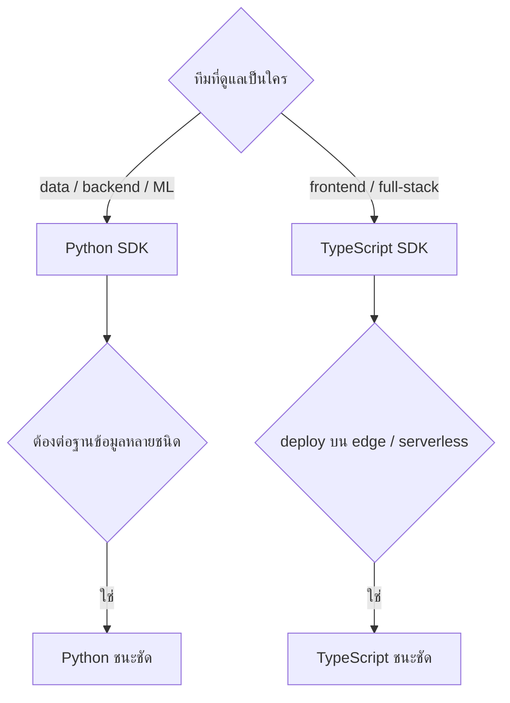

# Python SDK vs TypeScript SDK

หลักสูตรระบุให้ครอบคลุมการเลือกใช้ SDK ทั้งสองภาษา
โปรเจกต์นี้ใช้ **Python เป็นภาษาหลัก** เอกสารนี้อธิบายว่าทำไม และ TS ต่างกันอย่างไร

---

## 1. เลือกอย่างไร



| | Python | TypeScript |
|---|---|---|
| driver ฐานข้อมูล | ครบและโตเต็มที่ | ครบพอใช้ |
| งาน ML / embedding | **แข็งแรงที่สุด** | ต้องพึ่งบริการภายนอก |
| deploy serverless / edge | ทำได้ | **ดีกว่า** |
| type safety | type hint | **แข็งแรงกว่า** |
| ทีม NT ที่ดูแล MPLS LLM | **ใช้ Python** | — |

---

## 2. เหตุผลที่โปรเจกต์นี้เลือก Python

1. ต้องต่อ PostgreSQL + Neo4j + OpenSearch — driver Python โตเต็มที่ทั้งสามตัว
2. งาน embedding, tokenizer, evaluation อยู่ในระบบนิเวศ Python
3. โค้ดวันที่ 1-2 เป็น Python ทั้งหมด ต่อกับวันที่ 3 ได้ทันที
4. Chainlit เป็น Python ทำให้ทั้ง stack ใช้ภาษาเดียว

---

## 3. Tool เดียวกัน สองภาษา

### Python (ที่ใช้จริง)

```python
from mcp.server.fastmcp import FastMCP

mcp = FastMCP(name="nt-network")

@mcp.tool(annotations={"readOnlyHint": True, "openWorldHint": False})
def search_tickets(status: str | None = None, range: str = "last_30d",
                   limit: int = 20) -> dict:
    """ค้นหา ticket ที่ถูกแจ้งเข้ามา

    อย่าใช้เพื่อดูว่าอุปกรณ์กำลังทำอะไรอยู่ — ให้ใช้ search_logs แทน
    """
    rows = pg_query(...)
    return {"total": len(rows), "tickets": rows}

mcp.run(transport="stdio")
```

type hint กลายเป็น `inputSchema` และ docstring กลายเป็น `description` โดยอัตโนมัติ

### TypeScript (เทียบให้ดู)

```typescript
import { McpServer } from "@modelcontextprotocol/sdk/server/mcp.js";
import { StdioServerTransport } from "@modelcontextprotocol/sdk/server/stdio.js";
import { z } from "zod";

const server = new McpServer({ name: "nt-network", version: "1.0.0" });

server.registerTool(
  "search_tickets",
  {
    description:
      "ค้นหา ticket ที่ถูกแจ้งเข้ามา\n\n" +
      "อย่าใช้เพื่อดูว่าอุปกรณ์กำลังทำอะไรอยู่ — ให้ใช้ search_logs แทน",
    inputSchema: {
      status: z.enum(["open", "in_progress", "closed"]).optional(),
      range: z.enum(["last_24h", "last_7d", "last_30d"]).default("last_30d"),
      limit: z.number().int().min(1).max(200).default(20),
    },
    annotations: { readOnlyHint: true, openWorldHint: false },
  },
  async ({ status, range, limit }) => {
    const rows = await pgQuery(/* ... */);
    return {
      content: [{ type: "text", text: JSON.stringify({ total: rows.length, tickets: rows }) }],
    };
  },
);

await server.connect(new StdioServerTransport());
```

### สิ่งที่ต่างกันจริง

| | Python | TypeScript |
|---|---|---|
| นิยาม schema | type hint | **Zod** (ชัดเจนกว่าและบังคับ runtime ได้) |
| description | docstring | ต้องเขียนแยก |
| validate ตอน runtime | Pydantic | Zod |
| async | `async def` | native |
| ผลลัพธ์ | คืน dict ตรงๆ | ต้องห่อเป็น `content` array |

---

## 4. เมื่อไหร่ควรเลือก TypeScript

- ทีม frontend เป็นเจ้าของ MCP server
- ต้อง deploy บน Cloudflare Workers / Vercel Edge
- ระบบที่ต่อด้วยเป็น Node.js อยู่แล้ว
- ต้องการ type safety ระดับ compile-time

---

## 5. เขียนสองภาษาพร้อมกันได้ไหม

ได้ และเป็นเรื่องปกติ — MCP client ต่อได้หลาย server พร้อมกัน

```json
{
  "mcpServers": {
    "nt-network":   { "command": "uv",  "args": ["run", "python", "..."] },
    "nt-dashboard": { "command": "node","args": ["dist/server.js"] }
  }
}
```

> แต่สำหรับโปรเจกต์เดียวที่ต่อฐานข้อมูลชุดเดียวกัน **ใช้ภาษาเดียวจะดูแลง่ายกว่ามาก**
