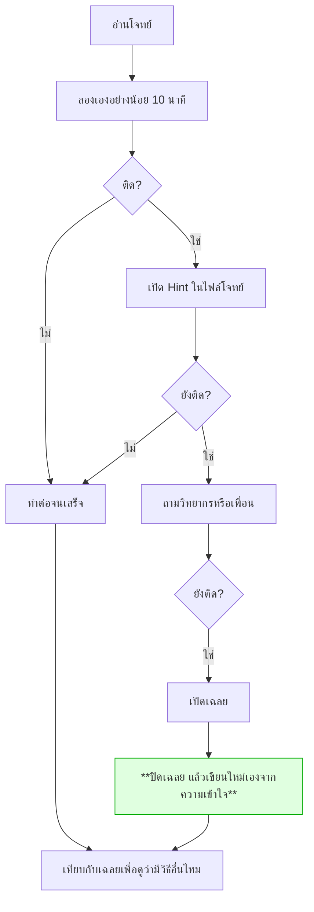

# เฉลย

> ## อ่านก่อนลอง = เสียโอกาสเรียนรู้
>
> เฉลยอยู่ใน repo เดียวกันโดยตั้งใจ **เราบอกให้รู้ตรงๆ ดีกว่าซ่อนแล้วมีคนหาเจอเอง**
>
> แต่ขอให้เข้าใจว่า: สิ่งที่ทำให้คนเขียน agent เป็น ไม่ใช่การได้เห็นโค้ดที่ทำงานได้
> แต่คือ **ช่วงเวลาที่ติดแล้วหาทางออกเอง** ซึ่งเป็นสิ่งเดียวที่เฉลยแย่งไปจากคุณได้

---

## ใช้เฉลยอย่างไรให้ยังได้เรียนรู้

**ขั้นที่สำคัญที่สุดคือขั้นสีเขียว** — การลอกโค้ดไม่ทำให้เข้าใจ แต่การอ่านแล้วปิดแล้วเขียนใหม่ทำให้เข้าใจ

---

## สารบัญ

| โจทย์ | เฉลยอยู่ที่ |
|---|---|
| Lab 1 · vector column | [`day1/lab1_embed.py`](day1/lab1_embed.py) |
| Workshop 1 · JSON + auto-retry | [`day1/workshop1_extractor.py`](day1/workshop1_extractor.py) |
| โจทย์ 1 · Thai Token Audit | [`challenges/challenge1_token_audit.py`](challenges/challenge1_token_audit.py) |
| โจทย์ 2 · Schema Under Pressure | [`challenges/challenge2_robust_extractor.py`](challenges/challenge2_robust_extractor.py) |
| Lab 2 · Intent Gate | `apps/agent-api/agent/intent.py` |
| Lab 3 · Context Memory | `apps/agent-api/agent/memory.py` |
| Workshop 2 · Agent Loop | [`day2/workshop2_agent.py`](day2/workshop2_agent.py) |
| โจทย์ 3 · Tool Description | [`challenges/challenge3_descriptions.json`](challenges/challenge3_descriptions.json) |
| โจทย์ 4 · Topic Shift | [`challenges/challenge4_topic_shift.py`](challenges/challenge4_topic_shift.py) |
| Workshop 3 · MCP Server | `apps/mcp-server/` |
| โจทย์ 5 · Guardrail Red-team | `tests/test_guardrails.py` |
| โจทย์ 6 · Cross-Service | `make eval` |

อ่านคำอธิบายแต่ละวันที่ [day1/README.md](day1/README.md) · [day2/README.md](day2/README.md) · [challenges/README.md](challenges/README.md)

---

## หมายเหตุสำคัญ

**`apps/` คือเฉลยของ Workshop 3 อยู่แล้ว**

โค้ดใน `apps/mcp-server/`, `apps/agent-api/` และ `apps/chainlit-ui/` เป็นระบบที่ทำงานได้จริง
และเป็นสิ่งเดียวกับที่ container เดโมใช้

ดังนั้นถ้าจะทำ Workshop 3 ให้ได้ประโยชน์เต็มที่ ให้:
1. อ่านโครงสร้างเพื่อเข้าใจภาพรวม
2. **ลบไฟล์ที่จะเขียนเองออกไปก่อน** หรือสร้างโฟลเดอร์ใหม่แล้วเขียนจากศูนย์
3. เทียบกับของเดิมตอนจบ

---

## เฉลยไม่ใช่คำตอบเดียวที่ถูก

หลายโจทย์มีวิธีแก้ที่ดีกว่าเฉลย ถ้าคุณคิดวิธีที่ต่างออกไปได้ **นั่นดีกว่าการทำตามเฉลย**

สิ่งที่ต้องเทียบคือ *เกณฑ์ผ่าน* ในไฟล์โจทย์ ไม่ใช่ความเหมือนกับโค้ดเฉลย
